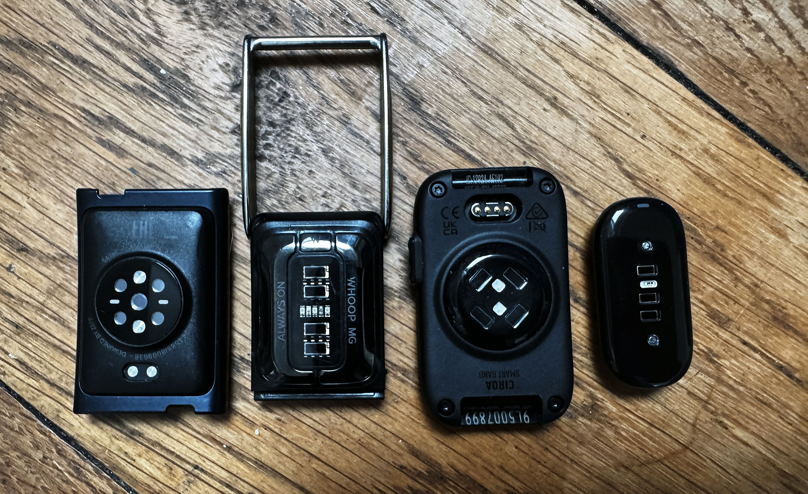

La Garmin CIRQA mide la frecuencia cardiaca en el bíceps con una precisión comparable a la de una banda pectoral, pero varios propietarios están perdiendo entrenos completos por un fallo en el flujo de guardado. El problema aparece al combinar el botón físico de la pulsera con la aplicación Garmin Connect, y Garmin ya ha reconocido los casos en sus foros oficiales mientras investiga una corrección.

## Qué pasó con los entrenos de la Garmin CIRQA

El fallo más repetido sigue siempre la misma secuencia: el usuario inicia la actividad con el botón físico de la CIRQA y, al terminar, abre Garmin Connect, donde aparece el aviso «Actividad en curso» con dos opciones, Reanudar y Finalizar. Pulsar Finalizar cierra el aviso, la pulsera vibra como si hubiera recibido la orden… y la sesión no aparece nunca en Garmin Connect. La opción que parece la lectura correcta de la interfaz es precisamente la que descarta los datos.

Un representante de Garmin confirmó en el hilo oficial de los foros de la compañía que Finalizar desde ese aviso inicial no guarda la actividad. La única vía segura, según esa misma respuesta, es pulsar Reanudar, abrir la pantalla de grabación y detener y guardar la sesión desde allí; una vez guardada y completada la sincronización, el entreno aparece en Connect. El representante añadió que varios usuarios del hilo habían perdido datos por esa vía y que la información se había trasladado al equipo interno para su revisión, que además está contactando con algunos afectados para recabar más detalles. No hay fecha anunciada para una corrección.

El caso no es aislado. Un propietario asegura haber perdido más de ocho entrenos antes de entender que no se trataba de un retraso de sincronización. Los reportes describen además otras vías hacia el mismo resultado: sesiones iniciadas en la app y terminadas en ese mismo aviso, inicios y paradas mezclados entre botón y app, pulsaciones del botón que no se registran al final de una sesión de fuerza y bloqueos de la aplicación que obligan a forzar su cierre con la sesión perdida. El autor de la prueba original en the5krunner perdió tres sesiones importantes con el botón mientras grababa también con una banda HRM-600 o un Forerunner 970, y la detección automática de actividad tampoco se activó en sus pruebas cuando llevaba además un reloj Garmin. Medios como TechRadar y Gadgets & Wearables han contrastado el mismo patrón y confirman que Garmin lo tiene en investigación sin haberlo calificado públicamente como error ni indicado qué versiones de firmware o de la app están afectadas. Los reportes son anteriores al firmware 3.20, por lo que nada indica que esa actualización sea la causa.

## Por qué importa más que un simple error de sincronización

La precisión nunca estuvo en discusión. En la prueba de intervalos del análisis original, la CIRQA en el bíceps quedó a +0,2 ppm del WHOOP MG, a +0,3 ppm del Polar Verity Sense y a −0,3 ppm de la banda pectoral Garmin HRM 600, con márgenes de acuerdo estrechos; el propio autor concluye que, en el brazo, la pulsera rinde al nivel de una banda de pecho. El fallo está en que esos datos lleguen a Garmin Connect.

Para una pulsera sin pantalla cuya única misión es registrar la actividad en segundo plano, perder la sesión es el peor modo de fallo posible: no hay copia en el dispositivo que revisar ni forma de recuperarla después, porque nunca llegó a escribirse en Connect. Cada entreno perdido desaparece también de la carga de entrenamiento y de todas las métricas de recuperación que se calculan a partir de ella. El propio analista que destapó el caso ha dejado de usar la CIRQA como sensor de referencia en sus comparativas y ha vuelto al Polar Verity Sense hasta que Garmin lo corrija, porque una sesión de referencia que falta invalida la comparativa completa y esos entrenos no se pueden repetir en igualdad de condiciones.

## Qué cambia para el lector si tiene una CIRQA

De momento no hay parche, así que la precaución pasa por los hábitos de uso. Si aparece el aviso «Actividad en curso» en Garmin Connect, hay que pulsar Reanudar y detener y guardar la sesión desde la pantalla de grabación, aunque resulte contraintuitivo hacerlo con un entreno ya terminado. Conviene iniciar y detener cada sesión siempre por la misma vía, las dos veces con el botón o las dos veces en la app, sin mezclarlas, y comprobar que cada sesión importante haya aparecido en Connect antes de darla por registrada. Para una carrera o cualquier prueba irrepetible, lo prudente es grabar además en un segundo dispositivo.

También conviene mantener actualizados tanto el firmware de la pulsera como la aplicación Garmin Connect, que es la recomendación pública de la compañía mientras continúa la investigación, aunque ninguna de las dos actualizaciones actuales corrige el problema de forma confirmada. Y si la sesión ya se perdió pulsando Finalizar, no hay nada que recuperar: la actividad nunca se escribió y no está esperando en ninguna cola de sincronización.
