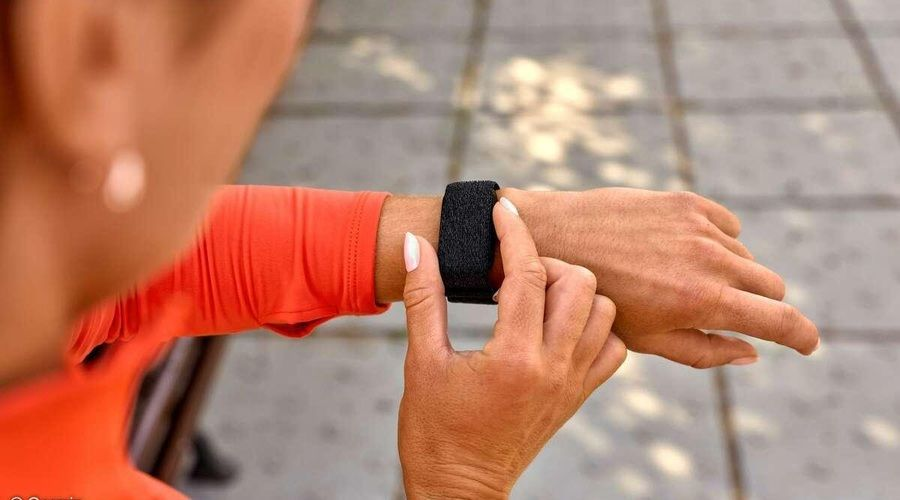
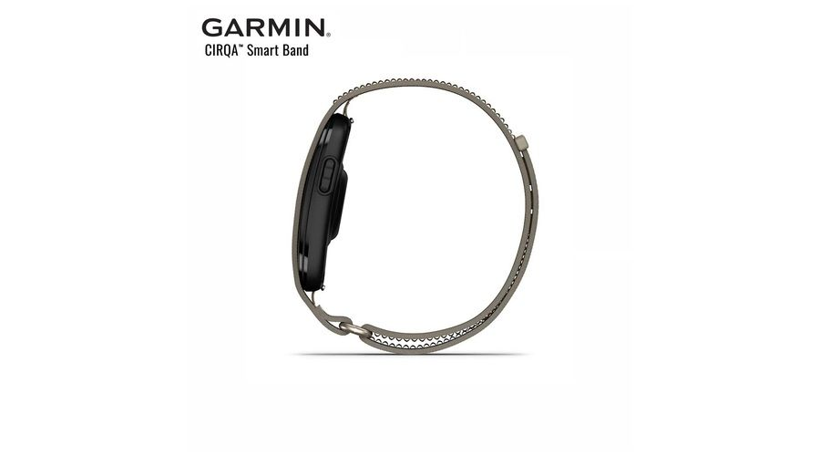

Garmin ha presentado la **Garmin CIRQA Smart Band**, su primera pulsera inteligente sin pantalla, un formato que la compañía no había explorado hasta ahora y que rompe con la trayectoria de sus relojes deportivos. El dispositivo está diseñado para llevarlo puesto durante todo el día y registrar la salud y la actividad sin que el usuario tenga que consultar continuamente una pantalla: los datos se revisan después desde el móvil, a través de Garmin Connect.

La novedad más llamativa no es técnica, sino comercial. La idea recuerda inevitablemente a dispositivos como Whoop, pero Garmin introduce una diferencia que puede resultar clave para muchos usuarios: no es necesario pagar una suscripción para acceder a sus métricas. En Amazon, la pulsera aparece por **199,99 euros**.

## Garmin CIRQA renuncia a la pantalla y a la cuota mensual

Eliminar la pantalla no es solo una decisión de diseño. Garmin busca con ello que el usuario se olvide de mirar la muñeca y deje atrás las notificaciones y distracciones habituales de un reloj inteligente. Quien quiera ver sus datos tendrá que sacar el teléfono, lo que convierte a CIRQA en un dispositivo de registro pasivo más que en una extensión del móvil.

El movimiento también tiene lectura de mercado. Garmin sostiene que las funciones de seguimiento de actividad y bienestar, así como el acceso a ellas desde Garmin Connect, no requieren ningún pago recurrente. Sí existe **Garmin Connect+**, pero es completamente opcional: añade herramientas premium como actividades en directo, determinados planes de Garmin Coach, seguimiento nutricional o Garmin Active Intelligence, entre otras. Es decir, la suscripción se plantea como un extra, no como el peaje obligatorio para usar la pulsera.

Para el lector español acostumbrado a los relojes con pantalla, la comparación natural es con propuestas como el [OPPO Watch S2](https://www.techspain24.com/noticias/oppo-watch-s2-coloros-watch-17/), que siguen apostando por la pantalla y por la conectividad constante con el teléfono. CIRQA va en la dirección opuesta: menos dispositivo, menos interrupciones y más peso en la aplicación.

## Qué mide CIRQA: salud las 24 horas y 80 actividades

Prescindir de la pantalla no ha supuesto renunciar a las herramientas de salud de la marca. La pulsera controla de forma continua la **frecuencia cardíaca**, los niveles de estrés, la saturación de oxígeno en sangre, la temperatura de la piel y la energía disponible mediante **BodyBattery**.

El sueño ocupa un lugar central: analiza sus fases, registra automáticamente las siestas y ofrece una puntuación del descanso. A ello se suma la medición del **estado de VFC**, la detección de variaciones en la respiración y el estudio de la alineación con el ritmo circadiano. Todos esos datos alimentan después funciones orientadas al entrenamiento y la recuperación, como **Training Readiness**, el VO2 máximo, el estado de entrenamiento, los beneficios de cada sesión y el tiempo de recuperación.

En el apartado deportivo, CIRQA registra **más de 80 actividades diferentes**, entre ellas carrera, ciclismo o yoga, y es capaz de detectar automáticamente buena parte de los ejercicios. La ausencia más relevante es la del **GPS propio**: para registrar ubicación, distancia y ritmo con precisión durante una carrera o un paseo hay que apoyarse en el GPS del teléfono. Es, probablemente, la principal diferencia frente a un reloj deportivo tradicional de Garmin.

## Peso, autonomía y qué cambia para el usuario

Al no llevar pantalla, el conjunto es ligero: el módulo pesa **14,8 gramos** y el total se queda en **20,7 o 21,2 gramos** según el tamaño de correa elegido. Garmin utiliza una correa de tela ComfortFit, pensada para llevarla cómodamente durante periodos prolongados.

La autonomía es otro de sus argumentos: alcanza **hasta 10 días de batería**, una cifra relevante en un dispositivo que debe permanecer en la muñeca también por la noche para registrar el descanso. Además, cuenta con resistencia al agua de **5 ATM**.

En conjunto, CIRQA plantea una propuesta distinta a la de los relojes deportivos de la propia marca: se compra una vez, se consulta desde el móvil y no obliga a sumar otro pago mensual. Sus 199,99 euros quedan por debajo de otros modelos de Garmin con GPS integrado que la fuente lista por encima de los 290 euros, como el Forerunner 265 o el Instinct 3 Solar. Quien necesite ese GPS tendrá que seguir mirando, por tanto, hacia la gama de relojes.
