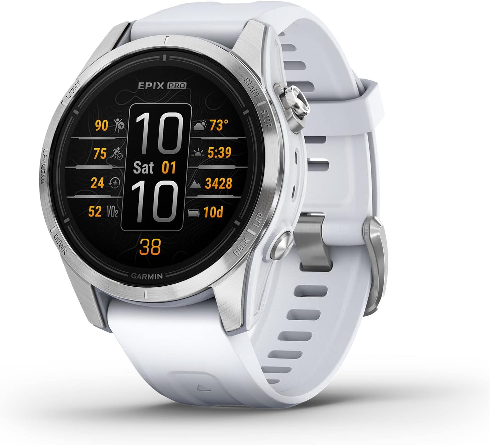

El Garmin Epix Pro (Gen 2) Sapphire Edition está de oferta en Amazon Australia por 849 dólares australianos, la mitad de los 1.699,01 dólares australianos que marcaba como precio de referencia. La rebaja llega antes de que arranque la campaña Prime Big Day Deals de Amazon en ese mercado, y deja al reloj como una vía de entrada a la gama alta de Garmin sin pagar el precio de un smartphone de gama alta.

El movimiento importa porque el Garmin Fénix 9 y el Fénix 9 Pro, presentados en agosto de 2026, parten desde 1.599 dólares australianos. Quien no necesite las novedades de la última generación puede cubrir buena parte de sus necesidades por bastante menos, siempre que asuma que se trata de una oferta por tiempo limitado y que el precio puede cambiar en cualquier momento.

## Qué conserva el Epix Pro del Fénix 9

El atractivo del Epix Pro (Gen 2) Sapphire Edition está en lo que comparte con la gama insignia. Mantiene el GPS multibanda, la linterna LED integrada, los datos de cartografía básicos y materiales premium como la lente de zafiro, resistente a los arañazos, y el bisel de titanio.

A eso se suman funciones de seguimiento propias de un reloj multideporte de gama alta: puntuación de sueño, VO2 máximo, notificaciones, control de música, almacenamiento de música integrado, predicciones de tiempos de carrera y mapas de campos de golf y estaciones de esquí, entre otras.

## Qué se queda por el camino

El Fénix 9 juega con ventaja en varios frentes. Incorpora un procesador más rápido, pantallas más brillantes, más almacenamiento de archivos, cartografía mejorada, certificación de buceo hasta 40 metros, altavoz y micrófono integrados para llamadas, y nuevos perfiles deportivos.

Lanzado en 2023, el Epix Pro (Gen 2) fue descrito en su momento como una versión con pantalla AMOLED del Garmin Fénix 7 Pro, y aun así se ganó 4,5 estrellas sobre 5 en la review de TechRadar. Entre sus aportaciones figuran el sensor de frecuencia cardíaca Elevate Gen 5, las funciones Up Ahead, Hill y Endurance, y soporte de carga rápida.

## Qué tener en cuenta antes de comprar

- **Mercado y moneda**: la oferta corresponde a Amazon Australia y los precios están en dólares australianos; no se trata de una promoción en euros.
- **Es temporal**: la campaña Prime Big Day Deals todavía no ha comenzado y el descuento del 50 % puede desaparecer o variar.
- **Ya ha estado más barato**: según TechRadar, el reloj llegó a los 684 dólares australianos en julio de este año, por lo que conviene comparar antes de decidir.

Si la prioridad es un reloj premium capaz para el día a día y no las mejoras de la última hornada, esta rebaja pone al Epix Pro (Gen 2) en una posición difícil de igualar. Para otra vía de ahorro en la familia Garmin, merece la pena revisar [la rebaja del Garmin Fénix 8](/noticias/garmin-fenix-8-price-drop/), que sigue apostando por el deportivo de gama alta a un precio más contenido.

Fuente: [TechRadar](https://www.techradar.com/health-fitness/smartwatches/forget-the-new-garmin-fenix-9-this-flagship-level-alternative-is-already-half-price-ahead-of-amazons-second-prime-day-sale).
