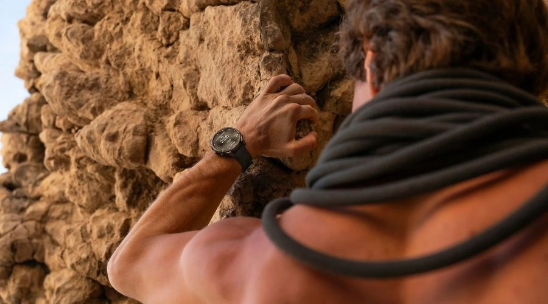
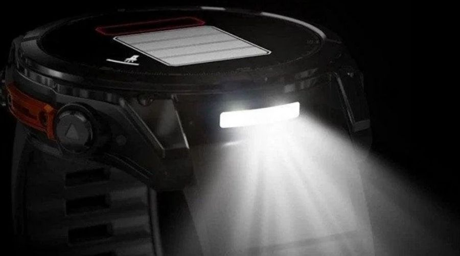

El anuncio del **Garmin Fénix 9** este verano tuvo un efecto secundario que interesa al bolsillo: el **Garmin Fénix 8** ha bajado de precio. En Amazon figura ahora rebajado de 799 € a **698 €**, un descuento de más de 100 € que lo sitúa entre las compras más sensatas del segmento deportivo en lo que va de 2026.

Y es que el reloj más nuevo no es forzosamente el mejor para todos. Para quien busca un equipamiento completo y no persigue la prima de la última generación, el Fénix 8 mantiene un nivel de prestaciones que no ha quedado desfasado.

## Qué ofrece el Garmin Fénix 8

Este modelo supuso un salto respecto a los Fénix anteriores. Uno de sus puntos fuertes es su **pantalla táctil AMOLED de 1,4 pulgadas**, con colores vibrantes y buena visibilidad bajo el sol directo, protegida por cristal **Corning Gorilla Glass**. Fue además el primer Fénix en incorporar **micrófono y altavoz integrados**, lo que permite responder llamadas y usar el control por voz desde la propia muñeca.

La **batería** es otro de sus argumentos: hasta **16 días de autonomía** en modo reloj inteligente y hasta **47 horas seguidas con el GPS activo**, pensadas para maratones, triatlones y rutas largas. En cuanto a **resistencia**, está diseñado bajo estándares militares y homologado para buceo recreativo con **certificación de 10 ATM**.

En navegación incorpora **SatIQ y GPS multibanda**, además de **mapas topográficos TopoActive precargados**, de modo que el usuario sabe dónde está en todo momento. Suma una **linterna LED** con luz blanca de intensidad variable y una **luz roja de seguridad** útil para entrenamientos nocturnos o situaciones de emergencia. En el apartado de salud, mide parámetros durante las 24 horas y tiene en cuenta los niveles de descanso antes del siguiente entrenamiento.

## Fénix 8 o Fénix 9: diferencias reales

Aquí está la clave de la oferta. Según Topes de Gama, las diferencias reales entre el Fénix 8 y el Fénix 9 son escasas: haría falta ser un deportista muy experimentado o exigente para notarlas de verdad. El Fénix 9 es el más reciente, sí, pero eso no lo convierte por sí solo en la mejor elección para cualquier usuario.

En otras palabras, quien no necesite estar a la última encontrará en el Fénix 8 la misma base de gama alta —pantalla AMOLED de calidad, micrófono y altavoz, linterna LED y medición continua de parámetros— a un precio bastante menor.

## Qué cambia para el comprador

Con el Fénix 8 a 698 €, la decisión se reduce a valorar qué se necesita de verdad. El desembolso es todavía de gama alta, pero más de 100 € por debajo del precio de referencia, y el modelo rebajado es la versión de **47 mm** que enlaza la oferta en Amazon. Las valoraciones de los compradores acompañan al producto, que Topes de Gama describe además como el más barato hasta la fecha.

Para el lector que venía siguiendo la gama Fénix, la conclusión es sencilla: el lanzamiento del Fénix 9 ha empujado al Fénix 8 a su punto más bajo, y ese es precisamente el momento en el que conviene decidir. El mercado de wearables no se detiene —sin ir más lejos, OPPO presentará su [Watch S2 con ColorOS Watch 17](/noticias/oppo-watch-s2-coloros-watch-17/) el 22 de septiembre—, pero para el deportista que busca un reloj completo, la rebaja del Fénix 8 es la oportunidad más clara del momento.

El descuento está activo en Amazon, con el precio de 698 € frente a los 799 € de referencia, según la información publicada por Topes de Gama.
