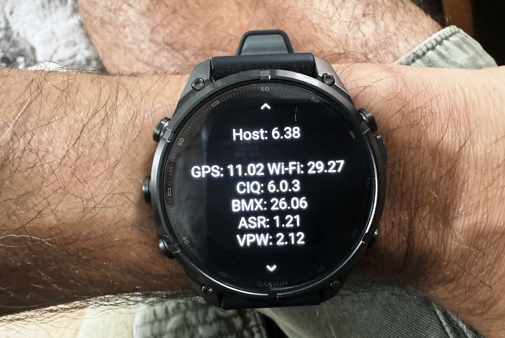

El Garmin Fenix 9 y el Fenix 9 Pro llevan un mes en las tiendas y ya acumulan 94 fallos documentados entre el foro oficial de Garmin, Reddit y los análisis de la prensa especializada. El recuento, publicado por the5krunner con enlace a cada fuente, indica que solo siete están corregidos con el software 6.48, mientras una treintena cuenta con reportes amplios y el resto procede de uno o dos usuarios cada uno. Ninguno ha dejado un reloj inservible, pero los más graves afectan al núcleo deportivo: reinicios durante la navegación, huecos en los registros y errores en natación.

## Qué ha pasado con el Fenix 9: un mes, 94 fallos y una sola actualización

Según el recuento original, de los 94 casos unos 30 aparecen reportados por tres o más propietarios o varios analistas, alrededor de 15 tienen dos reportes y unos 40 son avisos individuales, algunos atribuibles a una unidad defectuosa o a un ajuste. Otros 20 avisos quedaron fuera por tratarse de ajustes o decisiones de diseño, como el atenuado de la pantalla AMOLED. La única actualización en ese mes, la versión 6.48 del 15 de septiembre, corrige siete puntos centrados en inReach, llamadas y volumen, según las notas publicadas en el foro de Garmin, y ninguno de los reinicios en actividad figura entre ellos.

Los fallos con más respaldo son los reinicios en plena navegación —un propietario contó diez en una sola ruta y su hilo es el más comentado del Fenix 9 en Reddit—, los bloqueos al reanudar una carrera cuando entra una notificación, los registros con minutos perdidos y los reinicios al guardar una sesión de piscina. A ellos se suman consumos anómalos de batería (con hilos de 30 respuestas y miles de visitas en el foro), pérdidas de largos en piscina de entre el 10 y el 34 %, fallos de Pace Pro, cortes de música con auriculares Bluetooth, botones con dos o tres segundos de retardo y la imposibilidad de instalar mapas desde Garmin Express en Mac, el problema con más confirmaciones. Los datos de analistas citados en el recuento apuntan en la misma dirección: DC Rainmaker sufrió un reinicio corriendo y valora el mapa como claramente más lento que la competencia, y TechRadar midió un 17 % de gasto en una excursión de dos horas.

## Por qué importa: fallos básicos en un reloj de 1.000 euros

La gama Pro ronda los 1.000 dólares y más con inReach, un precio que invita a exigir un producto terminado. Un error en una esfera es una molestia; un reinicio navegando una ruta o un registro con huecos es un fallo funcional en un reloj de aventura. El propio recuento recuerda que el anterior Fenix 8 tuvo un estreno parecido y tardó la mayor parte de un año en estabilizarse, y que ambos modelos comparten software, por lo que heredan y corregirán fallos a la vez. Garmin, por su parte, participa en el foro, reproduce algunos casos y pide registros de error, aunque en otros responde que no logra replicarlos.

El contexto de compra también pesa: con el [Fenix 8 rebajado y ya maduro tras dos años de actualizaciones](/noticias/garmin-fenix-8-price-drop/), el comprador actual elige entre estrenar hardware o pagar menos por estabilidad. Para quien dependa del reloj en montaña o en competición, la diferencia no es menor.

## Qué cambia para el lector: comprar, esperar o reajustar

El análisis original propone tres caminos: comprar ahora si se busca la pantalla más brillante, la caja de titanio o inReach y se tolera algún reinicio; esperar dos o tres actualizaciones si el uso será navegación remota o competición; u optar por un Fenix 8 con descuento si se prefiere software asentado. Y deja un consejo práctico con respaldo en varios casos: muchos reinicios y consumos bajo «sistema» aparecen tras restaurar la copia de un Garmin anterior, y desaparecen con un restablecimiento de fábrica configurando el reloj desde cero. El orden sugerido es reiniciar, actualizar a la 6.48, restablecer sin restaurar copia y, si persiste, pedir un reemplazo a Garmin. No existe opción oficial de volver a la versión 6.38.

*Fuente original: recuento de the5krunner con 94 casos enlazados a foro de Garmin, Reddit y análisis; notas de la versión 6.48 en el foro oficial de Garmin.*
