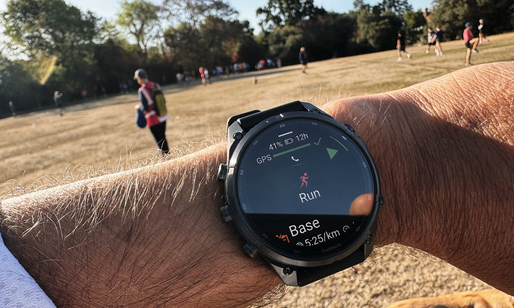
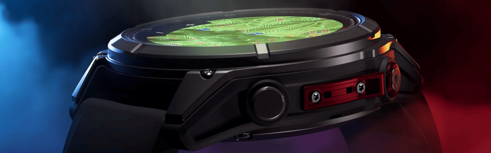

Cuando Garmin presentó el **Fenix 8 Pro MicroLED** lo vendió como el primer reloj inteligente del mundo con pantalla microLED: un panel de AUO de 1,4 pulgadas y 454 × 454 píxeles capaz de alcanzar 4.500 nits de brillo máximo. En septiembre de 2025, era la pantalla más luminosa puesta en una muñeca. Un año después, la nueva gama **Fenix 9 Pro** llega sin ese modelo. Los relojes vuelven al **AMOLED**, con un pico de 3.000 nits. La tecnología llamada a sustituir al OLED se queda, de momento, fuera del catálogo.

## Qué ha dicho Garmin

Hasta hace poco no estaba claro si la compañía pensaba mantener el microLED en la nueva generación. La respuesta llegó en una declaración de la propia Garmin recogida por DC Rainmaker: «El microLED es una tecnología emergente apasionante que sigue evolucionando. Aunque desempeñó un papel importante en la gama Fenix 8 Pro de 51 mm, nos entusiasma la oportunidad de llevar nuestra pantalla AMOLED más brillante y grande, de 1,5 pulgadas, al Fenix 9 Pro de 51 mm. Siempre vigilaremos los avances en tecnología de pantalla y los llevaremos a la gama Fenix cuando tenga sentido».

El mensaje deja entrever que Garmin considera que el AMOLED ya cubre las necesidades de sus relojes Fenix, incluido el apartado del brillo. Para que el microLED volviera a ser competitivo, el fabricante de paneles —AUO en este caso— tendría que desarrollar pantallas más finas, mucho más eficientes en consumo y más baratas.

## El brillo ya no es un argumento decisivo

Durante un tiempo, la luminosidad fue el gran argumento de venta del microLED frente al OLED. Ese margen se ha ido estrechando: el **Samsung Galaxy Watch Ultra 2** recurre a una pantalla OLED de 5.000 nits, por encima de los 4.500 nits del panel microLED del Fenix 8 Pro. Si un OLED convencional ya supera en brillo a la tecnología llamada a reemplazarlo, la ventaja diferencial se difumina.

## Grosor, batería y precio: el coste del microLED

El Fenix 8 Pro MicroLED se recibió bien: los análisis destacaron su pantalla muy luminosa y sus buenos ángulos de visión. Pero la tecnología traía contrapartidas importantes. El reloj es notablemente más grueso que la versión AMOLED, porque no integra la capa táctil en la propia pantalla, y consume más energía: la autonomía en modo reloj inteligente caía de 27 días a 10. A eso se sumaba un sobreprecio de 700 dólares en el lanzamiento.

Garmin rebajó después el precio del Fenix 8 Pro MicroLED: en febrero de 2026 lo recortó de forma discreta en 300 dólares. Ahora se vende por 1.699 dólares, frente a los 1.999 dólares de su precio de salida, aunque sigue costando unos 400 dólares más que el modelo AMOLED equivalente.

Conviene separar aquí el hecho de la interpretación. the5krunner sostiene que Garmin invirtió recursos internos notables en desarrollar esta tecnología de pantalla y merece crédito por experimentar con novedades, y apunta que la compañía podría volver a usarla en otros productos y accesorios. Su tesis, sin embargo, es que el verdadero motivo de la retirada estaría en el proveedor: AUO no habría cumplido sus propias promesas de que el microLED ahorraría energía frente al AMOLED. Esa es la lectura del medio, no una confirmación de Garmin.

## Qué cambia para el comprador

Para quien busca un reloj deportivo de gama alta, la conclusión es más tranquilizadora que decepcionante. Garmin no renuncia a la innovación —también ha explorado formatos alejados del reloj clásico, como su [banda sin pantalla Cirqa](/noticias/garmin-cirqa-screenless-band/)—, pero en esta generación prioriza los fundamentos que el usuario nota cada día: autonomía, grosor contenido y precio. El AMOLED de 3.000 nits es menos espectacular sobre el papel que el microLED de 4.500 nits, pero llega en un reloj más delgado, con más batería y más barato.

Para el lector que venía siguiendo la gama, la decisión práctica apenas cambia: el Fenix 9 Pro queda como la opción razonable del catálogo y la generación anterior sigue abaratándose. Quien esté sopesando comprar puede mirar también cómo ha quedado el [precio del Fenix 8](/noticias/garmin-fenix-8-price-drop/), que con la llegada del Fenix 9 ha tocado mínimos. Y para quien se preguntaba si el salto de generación merecía la pena por su pantalla, el microLED deja de ser un criterio: ya no está sobre la mesa.
