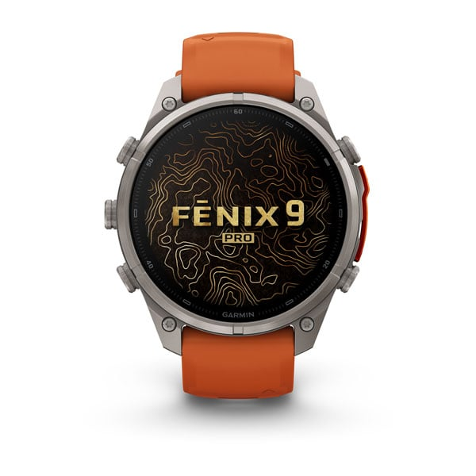

La elección entre el Garmin Fenix 9 y el Apple Watch Ultra 4 es más sencilla de lo que sugieren las hojas de especificaciones. Según la comparativa publicada por the5krunner, el Fenix 9 ofrece una autonomía muy superior y la mayoría de las funciones deportivas integradas de serie, mientras que el Ultra 4 es mejor smartwatch para el día a día, más fácil de usar y exige un iPhone. Casi todo lo demás sigue el mismo patrón: Garmin incluye la función en el reloj y Apple la deja en manos de una app que hay que buscar e instalar.

## Qué pasó: una comparativa que ordena la decisión

La publicación especializada the5krunner ha enfrentado a los dos relojes tope de gama y reduce el dilema a una idea central: lo que Garmin trae de fábrica, en Apple se consigue con apps, y lo que ninguna app puede solucionar es donde se decide la compra. El análisis trata juntos al Fenix 9 y al Fenix 9 Pro, ya que el Pro añade principalmente caja de titanio, pantalla más brillante, talla de 43 mm y conectividad inReach opcional por satélite.

El contraste con otras fuentes confirma el marco. El análisis en profundidad de DC Rainmaker describe la misma gama en tres tallas (43, 47 y 51 mm) y tres niveles (base, Pro y Pro inReach), con precios sin subidas respecto a la generación anterior, y Tom's Guide corrobora las cifras de autonomía del modelo de 47 mm. Por el lado de Apple, la sala de prensa oficial confirma las cifras de batería del Ultra 4 y sus funciones por satélite.

## Por qué importa: batería, recuperación y satélite en el Fenix 9 y el Ultra 4

La batería es la mayor diferencia entre ambos y ninguna app puede compensarla. Estas son las cifras que recoge la comparativa para el Ultra 4 y el Fenix 9 de 47 mm con pantalla AMOLED:

| Modo | Apple Watch Ultra 4 | Fenix 9 de 47 mm |
| --- | --- | --- |
| Uso normal como smartwatch | Hasta 50 horas | Hasta 18 días |
| Bajo consumo | Hasta 84 horas | Hasta 24 días |
| GPS en entrenamiento estándar | Hasta 18 horas | Hasta 32 horas |
| GPS en modo de máxima autonomía | Hasta 45 horas | Hasta 87 horas |

Apple confirma en su sala de prensa las cifras del Ultra 4, incluido el modo Max Extended Workout de 45 horas pensado para carreras de 100 millas, y una carga rápida que suma hasta 18 horas de uso en 15 minutos. Ambos relojes superan con holgura un triatlón de distancia completa, que se mueve entre 10 y 17 horas; todo lo que pase de 24 horas o varios días lejos del cargador es territorio exclusivo del Fenix.

En datos de recuperación se repite el patrón de serie frente a app. El Fenix 9 incluye ocho métricas sin instalar nada: Training Readiness, Training Status, Training Load, estado de variabilidad de frecuencia cardiaca, Body Battery, Endurance Score, Hill Score y Real-Time Stamina. El Ultra 4 ofrece una puntuación de Readiness de 0 a 10 con una recomendación sencilla, más fácil de leer pero con mucho menos detalle; apps como Bevel y Training Today añaden una profundidad similar en el reloj de Apple. La misma lógica se aplica a los mapas TopoActive sin conexión, los entrenamientos diarios sugeridos, los campos de golf integrados, la velocidad crítica de natación, el ritmo PacePro o el control de rodillos inteligentes: Garmin lo lleva de serie y en Apple lo cubre una app.

Hay, sin embargo, diferencias que ningún software cierra. El Ultra 4 lleva mensajería SOS de emergencia y mensajes bidireccionales por satélite integrados, gratis durante los dos primeros años tras la activación según Apple; el equivalente de Garmin exige la variante inReach del Fenix 9 Pro, más cara, más una suscripción desde el primer día, que a cambio suma partes meteorológicos por satélite y el centro de coordinación de respuesta de Garmin. El Fenix se vende en 43, 47 y 51 mm y el Ultra 4 solo en 49 mm. El Ultra 4 necesita un iPhone para funcionar; el Fenix se empareja tanto con iPhone como con Android. Y el Ultra 4 carece de radio ANT+, aunque la mayoría de los sensores actuales emiten también por Bluetooth y rara vez resulta decisivo.

## Qué cambia para el lector: cuál comprar

En precio, el Ultra 4 parte de 799 dólares (899 euros) y el Fenix 9 estándar parte de unos 999 dólares, con el Pro desde 1.099 dólares, así que el reloj de Apple es la opción más asequible. A este nivel, la decisión pesa más por el uso que por unos cientos de euros de diferencia:

- **Elige el Garmin Fenix 9 si** buscas la máxima autonomía, herramientas deportivas y de recuperación listas nada más sacarlo de la caja, o necesitas una talla de 43 o 51 mm.
- **Elige el Apple Watch Ultra 4 si** tienes un iPhone, quieres el mejor smartwatch diario con seguridad por satélite incluida y no te importa instalar unas cuantas apps para igualar la profundidad deportiva de Garmin.

Quien dude entre generaciones de Apple puede consultar la [guía para decidir si conviene actualizar desde el Ultra 2](/noticias/apple-watch-ultra-2-vs-ultra-4-guide/), y quien mire al Pro de Garmin debería saber que [el Fenix 9 Pro renuncia al microLED en favor del AMOLED](/noticias/garmin-fenix-9-pro-microled-skip/).
