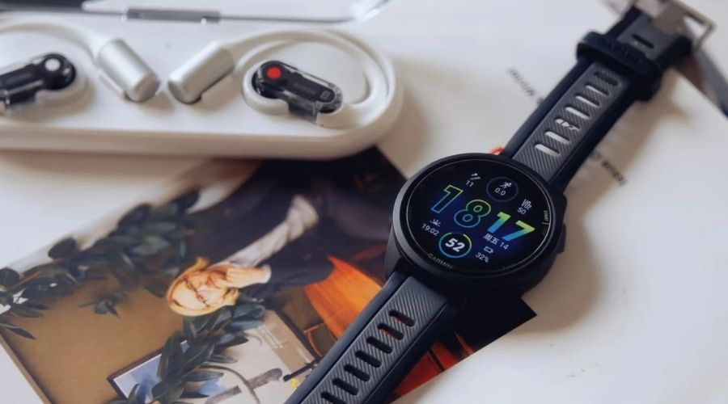
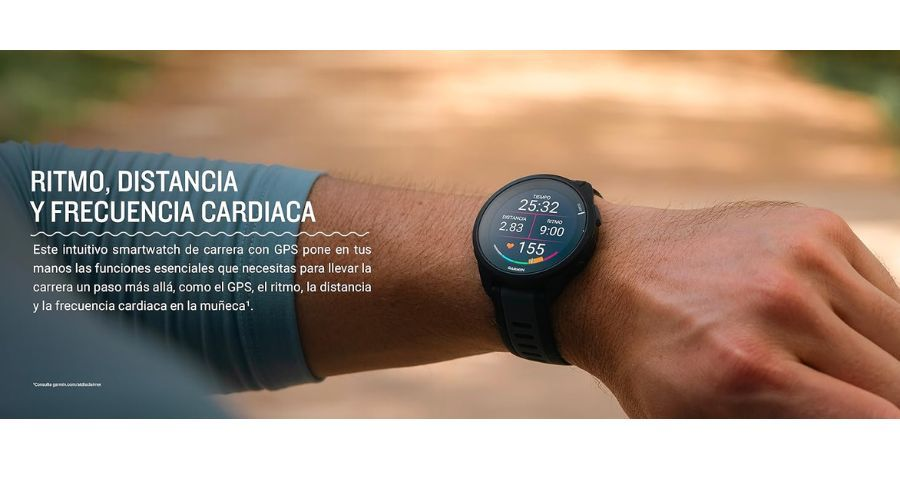

El Garmin Forerunner 165 vuelve a aparecer en un aviso de oferta en AliExpress como opción de entrada al catálogo deportivo de Garmin para corredores. El aviso, publicado por Topes de Gama el 26 de septiembre, lo presenta como un reloj con pantalla AMOLED, GPS integrado y una autonomía anunciada de hasta 11 días en modo smartwatch.

Conviene leer el aviso con prudencia: los precios de estos listados cambian con frecuencia y no ha sido posible verificar el importe exacto en el momento de redactar esta pieza. Lo sensato es comprobar el precio final y la disponibilidad en la ficha de AliExpress antes de decidir la compra.

## Qué pasó: un aviso de oferta para el Forerunner 165

Topes de Gama detectó el Garmin Forerunner 165 con descuento en AliExpress y lo comparó con los precios visibles en otros comercios españoles en el momento de su publicación. Según ese aviso, el listado de AliExpress quedaba por debajo de las referencias que el propio medio mostraba para MediaMarkt y Amazon, aunque esas cifras pueden haber variado desde entonces.

El propio medio advierte que se trata de la versión estándar del reloj, sin almacenamiento de música en la muñeca. Quien quiera salir a correr solo con el reloj y unos auriculares Bluetooth necesitaría el Forerunner 165 Music, un modelo distinto que no forma parte de este aviso.

## Por qué importa: AMOLED y métricas de carrera sin subir a la gama alta

El interés del Garmin Forerunner 165 está en que concentra lo esencial para correr varias veces por semana sin pedir el precio de un gama alta. Garmin lo anunció en febrero de 2024 como un GPS de carrera asequible con pantalla AMOLED de 1,2 pulgadas, combinación de táctil y cinco botones físicos, y más de 25 perfiles de actividad.

En autonomía, la ficha oficial de Garmin declara hasta 11 días en modo smartwatch y hasta 19 horas con GPS, cifras que coinciden con las citadas en el aviso. La caja mide 43 mm, pesa 39 gramos y cuenta con resistencia al agua de 5 ATM, por lo que sirve tanto para el uso diario como para entrenar bajo la lluvia o nadar en piscina.

En el plano deportivo ofrece GPS integrado para registrar distancia, ritmo y recorrido sin llevar el móvil, frecuencia cardíaca en muñeca, estimación del VO2 máximo, entrenamientos diarios sugeridos, planes adaptativos de Garmin Coach y sincronización con Garmin Connect para revisar la evolución de las marcas.

## Qué cambia para el lector: a quién le encaja y qué revisar antes de comprar

Este modelo encaja con quien da el salto desde una pulsera de actividad a un reloj deportivo con GPS: corredores que entrenan varias veces por semana, quieren planes de entrenamiento guiados y prefieren una pantalla legible sin cargar el reloj cada noche. Para un perfil que busca mapas avanzados o funciones de gama alta, tiene más sentido mirar hacia la familia Fénix, como en el caso del [Garmin Fénix 8 con descuento](/noticias/garmin-fenix-8-price-drop/), antes de decidir.

Antes de comprar conviene revisar tres puntos en la ficha del vendedor: que se trate de la versión estándar y no de la Music si no se necesita música offline, el precio final con gastos de envío aplicados y las condiciones de devolución. Como recuerda el medio que publicó el aviso, los importes se actualizan en el momento de publicar y pueden variar después, por lo que la cifra visible en la tienda prevalece siempre sobre la citada en el aviso.
