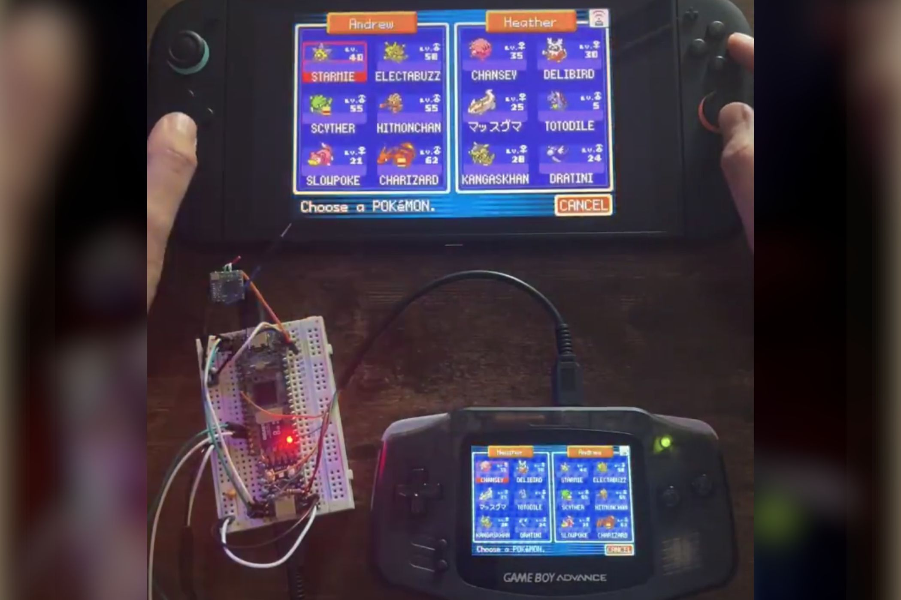

El cierre de Pokémon Bank, el servicio que durante años sirvió de puente entre las distintas generaciones de Pokémon, ha empujado a la comunidad a buscar sus propias soluciones. La última llega de la mano del usuario **ahenley17**, que ha publicado en X un adaptador capaz de conectar directamente una **Game Boy Advance** con una **Nintendo Switch 2** y realizar un intercambio de Pokémon entre ambas, sin depender de las herramientas oficiales de Nintendo.

Hasta ahora, quien quería trasladar un Pokémon desde la era de Game Boy Advance hasta la consola actual debía recorrer un camino largo: pasar primero a una Nintendo DS, usar la aplicación Pokémon Bank en esa consola para subir la criatura a la nube, transferirla después a Pokémon Home y, por último, recuperarla en la Switch 2. Es una cadena heredada de más de dos décadas de generaciones y servicios que Nintendo fue encadenando uno tras otro.

## Una ruta que Nintendo tiene fecha de caducidad

El problema es que ese recorrido no es eterno. Nintendo anunció hace aproximadamente un mes el cierre de Pokémon Bank, previsto para 2027, lo que sellará definitivamente la vía tradicional de rescate para los Pokémon atrapados en los cartuchos de Game Boy Advance y generaciones posteriores.

La propuesta de ahenley17 esquiva ese cuello de botella. Según el propio autor, basta con arrancar la versión de eShop de *FireRed* y *LeafGreen* en la Switch 2 y conseguir que el sistema ejecute un intercambio con una Game Boy Advance real. El resultado es un enlace directo entre dos plataformas separadas por más de veinte años de historia.

## Qué cambia para el jugador

La noticia importa porque toca uno de los debates más recurrentes del ecosistema Nintendo: la **preservación** de los datos de los jugadores. Durante años, la compañía ha ido cerrando servicios y plataformas digitales, y cada cierre deja atrás a usuarios cuyas partidas quedan atrapadas en hardware antiguo. Que un particular haya encontrado una forma de saltarse esa dependencia demuestra que la comunidad no está dispuesta a aceptar que sus Pokémon desaparezcan sin más.

Conviene, aun así, mantener la cautela. ahenley17 no ha publicado todavía instrucciones para fabricar el dispositivo en casa, por lo que de momento se trata de una demostración y no de una solución replicable. Además, sus Pokémon ya están a salvo en la Switch 2, pero para moverlos a Pokémon Home habrá que esperar a una actualización de *FireRed* y *LeafGreen* prevista para octubre, que podría habilitar esa ruta.

En conjunto, es un recordatorio de que los servicios en la nube tienen fecha de caducidad y de que el trabajo de preservación, muchas veces, acaba recayendo en los propios jugadores. Si la idea termina documentándose, podría convertirse en una alternativa real para todos aquellos que aún guardan una copia de *Rojo Fuego* o *Verde Hoja* y no quieren perder lo que hay dentro.
