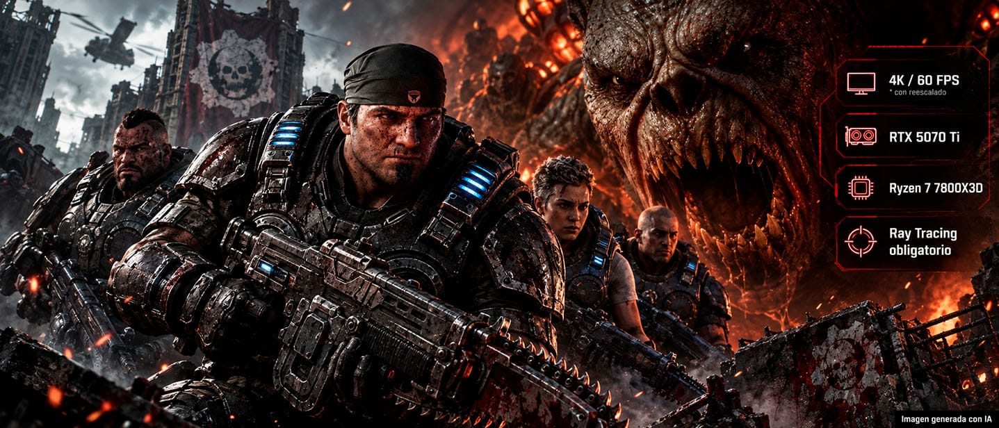

The Coalition, el estudio responsable de **Gears of War: E-Day**, confirmó que el juego alcanzó el estado Gold y aprovechó el anuncio para publicar las especificaciones definitivas de su versión para PC. El título llegará a Xbox Series X|S y PC el **6 de octubre de 2026**, mientras que quienes reserven la Premium Edition podrán empezar a jugar hasta cinco días antes, el **1 de octubre**. La tabla final mantiene una exigencia contenida en procesador y memoria, pero introduce una condición que define el resto de la ficha: la tarjeta gráfica debe contar con aceleración de Ray Tracing por hardware.

## Los requisitos completos para PC

Estas son las tres franjas que The Coalition ha fijado para el lanzamiento, tal y como figuran en su tabla oficial. El escalado de imagen (DLSS, FSR, TSR o XeSS) forma parte de la experiencia propuesta en los tres niveles.

| Apartado | Mínimo | Recomendado | Ultra |
| --- | --- | --- | --- |
| Preajuste gráfico | Medio | Alto | Ultra |
| Rendimiento | 1080p a 60 FPS con DLSS, FSR, TSR o XeSS | 1440p a más de 60 FPS con DLSS, FSR, TSR o XeSS | 4K a más de 60 FPS con DLSS, FSR, TSR o XeSS |
| GPU | NVIDIA GeForce RTX 5050 / RTX 2060, AMD Radeon RX 6600 / RX 9060 | NVIDIA GeForce RTX 5060 / RTX 3060 Ti, AMD Radeon RX 6700 XT / RX 9060 XT | NVIDIA GeForce RTX 5070 Ti, AMD Radeon RX 7900 XT |
| CPU | AMD Ryzen 5 2600X, Intel Core i7-6850K / i5-10400 | AMD Ryzen 5 5600, Intel Core i5-11600K | AMD Ryzen 7 7800X3D, Intel Core i7-14700K |
| VRAM | 6 GB | 8 GB | 12 GB |
| Memoria RAM | 12 GB | 16 GB | 16 GB |
| Almacenamiento | 115 GB en SSD | 115 GB en SSD | 115 GB en SSD |

La letra pequeña de la tabla oficial añade dos matices que conviene retener: el juego exige **una unidad SSD** para instalarse y el rendimiento real puede variar según el hardware, los ajustes gráficos, las tareas en segundo plano y la tecnología de superresolución elegida.

## Ray Tracing por hardware como línea divisoria

El aspecto más relevante para quien valore renovar su equipo es que E-Day **no da opción de desactivar el Ray Tracing**. La tabla oficial advierte de que se requiere una GPU con soporte dedicado para esta técnica y que las tarjetas sin esa capacidad directamente no están soportadas. Es el motivo por el que han quedado fuera generaciones antiguas que sí figuraban en listados previos.

El juego se ha construido desde cero sobre **Unreal Engine 5** y emplea trazado de rayos acelerado por hardware para reflejos, sombras e iluminación global. Además, es el primer título que estrena la tecnología **NVIDIA RTX Mega Geometry**, y también hace uso de **MegaLights**, el sistema de iluminación dinámica de Unreal Engine pensado para manejar grandes cantidades de luces capaces de proyectar sombras.

En el apartado de escalado, la versión de PC admite **NVIDIA DLSS 4.5, AMD FSR 4, Intel XeSS 3.0 y TSR**, además de incluir HDR, soporte para monitores ultrapanorámicos y un modo benchmark integrado con ajustes avanzados para medir el rendimiento antes de jugar.

## Qué cambia respecto a los primeros requisitos

La ficha definitiva introduce un par de variaciones frente a las filtraciones iniciales que aparecieron meses atrás en la página de Steam. El espacio en disco baja de **130 GB a 115 GB**, aunque se mantiene la obligación de instalarlo en un SSD.

El otro cambio llamativo es la desaparición de las **GPU Intel Arc** del listado final: los modelos Arc A580 (mínimo) y Arc B580 (recomendado) ya no aparecen, pese a que el juego sigue anunciando compatibilidad con XeSS 3.0. Se trata de una ausencia que el propio anuncio no explica, así que conviene tomarla como un dato a confirmar cuando el título se lance.

Para el jugador hispanohablante que siga la saga, la conclusión es sencilla: si el equipo tiene una gráfica con Ray Tracing por hardware de gama media desde 2020 en adelante, hay muchas probabilidades de entrar sin problemas en el nivel recomendado. El salto a 4K, en cambio, ya pide una RTX 5070 Ti o una RX 7900 XT junto a un procesador de ocho núcleos de alto rendimiento. El juego estará disponible el primer día en Game Pass Ultimate y PC Game Pass.
