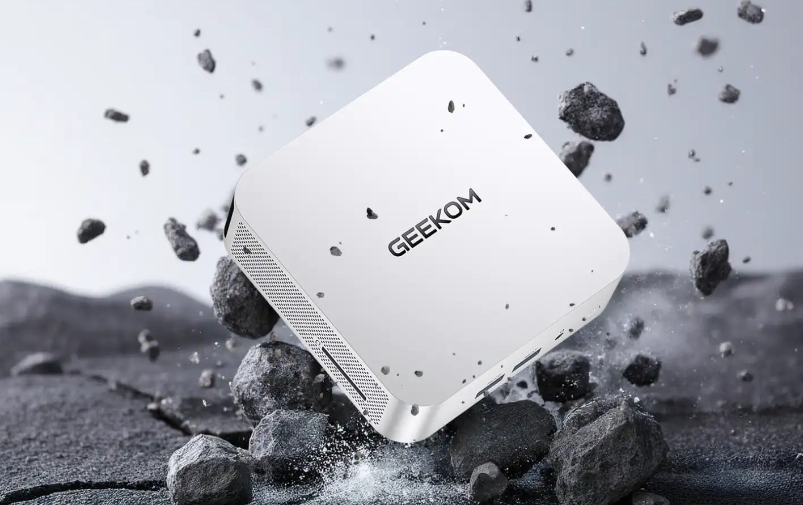

GEEKOM es una de las marcas consolidadas en el segmento de los mini PC, con equipos
que apuestan por rendimiento contenido en un chasis pequeño y a precio ajustado. Esta
vez la rebaja afecta al **GEEKOM A5 Pro 2026 Edition**, que según recoge Profesional
Review queda en **439 euros** en la web oficial del fabricante, una promoción activa
por tiempo limitado.

## El GEEKOM A5 Pro 2026 Edition a 439 euros con cupón

Para conseguir los 439 euros hay que introducir el cupón de descuento **PROA5110**
antes de finalizar la compra en la tienda del fabricante, donde el precio de venta
estándar es superior. Según el medio, la rebaja está activa hasta el **11 de octubre**.

Profesional Review publica la pieza como artículo patrocinado y con enlaces de afiliado,
condición que conviene tener en cuenta a la hora de valorar la oferta. El precio y el
plazo indicados son los que declara el propio medio; conviene comprobarlos en la tienda
antes de comprar, ya que las campañas de este tipo pueden cambiar sin aviso.

## Ficha técnica: Ryzen 7, 16 GB de RAM y SSD de 1 TB

El equipo está pensado para ofimática, productividad diaria y consumo multimedia, y su
ficha técnica se sostiene en tres pilares:

- **Procesador**: AMD Ryzen 7 7730U de 8 núcleos y 16 hilos, hasta 4,5 GHz, con gráficos
  integrados AMD Radeon. Un chip de consumo ajustado, orientado a mantener la temperatura
  bajo control sin perder respuesta.
- **Memoria y almacenamiento**: 16 GB de RAM DDR4 en doble canal de serie, ampliables hasta
  64 GB; SSD M.2 NVMe PCIe 4.0 de 1 TB, ampliable hasta 3 TB.
- **Conectividad y chasis**: Wi-Fi 6, Bluetooth 5.2 y Ethernet de 2,5 Gbps. La carcasa es de
  aleación de aluminio e incluye USB-A 3.2, USB 2.0, USB-C con soporte de vídeo, dos salidas
  HDMI para configuraciones multipantalla y lector de tarjetas SD de tamaño completo.

Además, el equipo llega con Windows 11 Pro preinstalado, de modo que está listo para usar
desde el primer arranque.

## Qué cambia para el lector

Una rebaja de este tipo interesa sobre todo a quien necesita un equipo de escritorio
compacto sin entrar en la gama alta: 439 euros por un Ryzen 7 de 8 núcleos, 16 GB ampliables
y un terabyte de SSD deja el mini PC en un tramo de precio difícil de igualar con un portátil
o un equipo de sobremesa equivalente. Si el objetivo es dejar la mesa libre y cubrir trabajo
ofimático, navegación y multimedia, la propuesta encaja.

Para quienes ya tienen uno de estos equipos, el caso de uso inverso también es habitual:
un mini PC sirve como alternativa de almacenamiento o de escritorio remoto frente a una
Raspberry Pi, cuyo [cuello de botella en disco](/noticias/raspberry-pi-storage-bottleneck-alternative/)
analizamos hace poco. El formato también compite en la gama alta con propuestas como el
[mini PC EdgeMesa N de MSI](/noticias/msi-edgemesa-n-rtx-spark/).

La oferta, recuerda el medio, es la del modelo con SSD de 1 TB y caduca el 11 de octubre.
