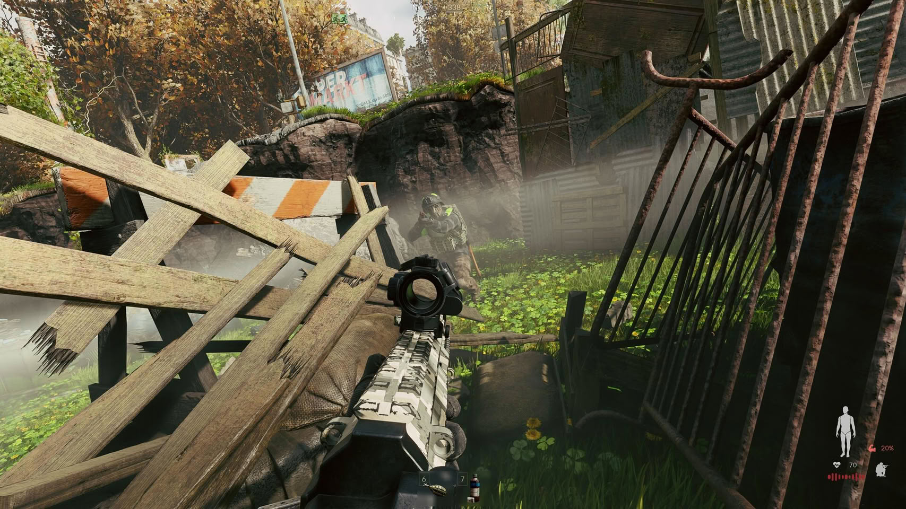
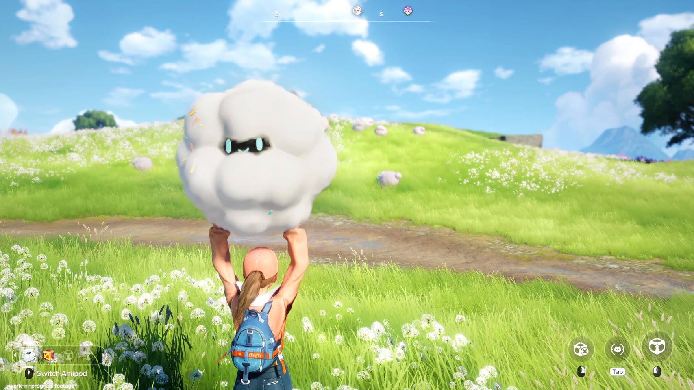

NVIDIA ha publicado su nueva versión de controladores **GeForce Game Ready 616.92 WHQL**, una
actualización centrada en preparar las tarjetas de la compañía para varios estrenos y en cerrar
algunos fallos arrastrados por versiones anteriores. El paquete ya está disponible a través del
canal habitual de descargas del fabricante.

El movimiento principal de esta entrega es la optimización para la actualización de **trazado de
rayos (path tracing) de 007 First Light**, el juego de espionaje de IO Interactive. Además, NVIDIA
adelanta el soporte para la próxima actualización de **DLSS Super Resolution de PUBG** y deja listo
el terreno para tres títulos que llegan en las próximas fechas: **Active Matter**, **Aniimo** y
**WARDOGS**.

## Los juegos que se benefician

| Juego | Tipo de soporte |
| --- | --- |
| 007 First Light | Actualización de path tracing |
| PUBG | Actualización de DLSS Super Resolution |
| Active Matter | Optimización Game Ready |
| Aniimo | Optimización Game Ready |
| WARDOGS | Optimización Game Ready |

El caso de **WARDOGS** merece una mención aparte. El shooter en primera persona de BULKHEAD y
Team17 se lanza el 10 de septiembre, y NVIDIA ha incluido optimizaciones previas al estreno para
que el título funcione sin sobresaltos desde el primer día.

## Correcciones y problemas conocidos

La lista de fallos resueltos es breve pero relevante para el uso diario del equipo:

- El **parpadeo intermitente** que aparecía en el navegador al visitar ciertas páginas web.
- La imposibilidad de **crear pantallas virtuales** después de actualizar al controlador 616.56.
- La **pantalla en negro** en sesiones de escritorio remoto (RDP) que también llegó con la 616.56.

Sin embargo, la actualización no cierra todos los frentes abiertos. NVIDIA reconoce que el modo de
gestión de energía **"Preferir máximo rendimiento"** puede no aplicarse correctamente y que
**Assassin's Creed Shadows** puede cerrarse de forma inesperada tras sesiones prolongadas. A ellos
se suma un fallo de arranque en **Judgement**, **Lost Judgement** y **Virtua Fighter 5 R.E.V.O.**
después de pasar por la versión 616.56.

## Qué significa para el usuario

Para quien tiene una GeForce, este tipo de lanzamiento es la razón por la que conviene no saltarse
las actualizaciones: el valor no está en un salto de rendimiento medible en todos los juegos, sino
en **corregir regresiones** que afectan al uso cotidiano del PC. El fallo de pantallas virtuales y
el de las sesiones RDP son especialmente molestos para quienes trabajan o juegan con escritorio
remoto, y verlos resueltos es más útil que cualquier cifra de marketing.

Dicho esto, la propia NVIDIA admite que arrastra problemas conocidos desde la versión anterior. La
recomendación de siempre sigue vigente: si no juegas a ninguno de los títulos optimizados y tu
equipo funciona bien, no hay urgencia por actualizar; si sufres el parpadeo en el navegador o usas
pantallas virtuales, esta versión es la que deberías instalar.
