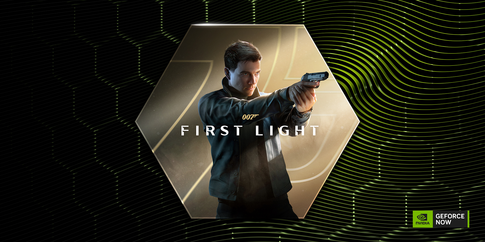
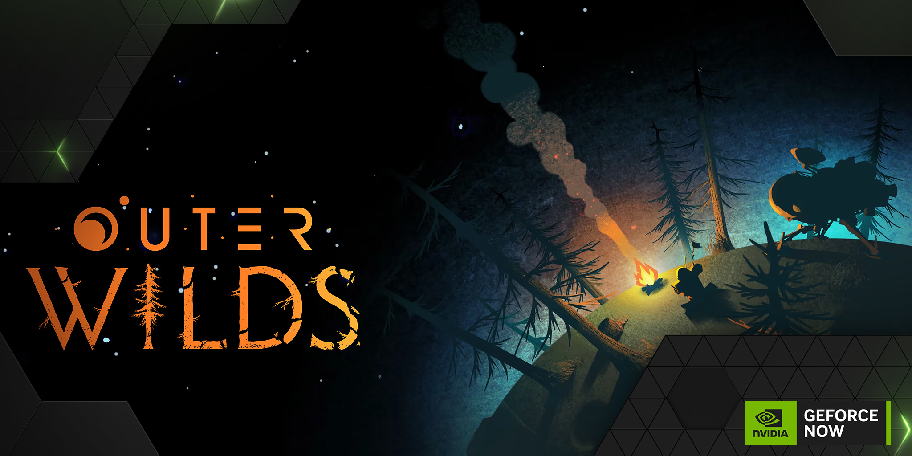

NVIDIA ha publicado su anuncio semanal de **GeForce NOW**, correspondiente al jueves 17 de septiembre, en el que detalla las incorporaciones al catálogo de su servicio de juego en la nube. Esta vez son **once títulos** los que se suman a la plataforma, con un estreno destacado: *Aniimo*, el nuevo juego de Pawprint Studio, llega a GeForce NOW el mismo día de su lanzamiento. A la lista se añaden también *Active Matter*, *Outer Wilds* y una actualización de *007 First Light* que incorpora trazado de trayectorias.

## Aniimo, el estreno de la semana

*Aniimo* es un juego de rol de mundo abierto y captura de criaturas, gratuito, ambientado en el continente de **Idyll**. La propuesta consiste en capturar criaturas con los llamados **Aniipods** y después fusionarse con ellas mediante una mecánica llamada *Twine*, que permite adoptar su forma y aprovechar sus habilidades para resolver puzles, combatir y superar desafíos.

El título también propone una vertiente de gestión y personalización: el jugador puede desplazarse por el mapa planeando, buceando y excavando, y volver después a una autocaravana propia para construir un **Hogar** interactivo junto a sus compañeras. NVIDIA subraya una ventaja práctica del juego en la nube: no es necesario descargar los **45 GB** del título ni liberar espacio de almacenamiento local. *Aniimo* puede transmitirse desde una **Steam Deck**, en el **navegador Firefox** —soporte recién añadido a GeForce NOW— y en el resto de dispositivos compatibles.

## 007 First Light añade trazado de trayectorias

La otra novedad técnica de la semana es el soporte de **trazado de trayectorias (path tracing)** en *007 First Light*, el juego de IO Interactive que reinterpreta los orígenes de James Bond como joven recluta del MI6. La actualización añade iluminación, sombras y reflejos más detallados en los escenarios, y se apoya en **DLSS 4.5 Ray Reconstruction** para reconstruir esas señales con mayor claridad.

Según NVIDIA, los miembros de la suscripción **Ultimate** pueden transmitir con un rendimiento en la nube equiparable a una **GeForce RTX 5080**, con hasta **5K de alto rango dinámico (HDR)** y calidad de streaming cinematográfica. A ello se suman **DLSS 4.5 Super Resolution** y **Dynamic Frame Generation**. La compañía recuerda además que la **Deluxe Edition** del juego está de oferta por tiempo limitado en Steam del **15 al 29 de septiembre** y en Epic Games Store del **3 al 18 de septiembre**.

## Active Matter, Outer Wilds y el resto del catálogo

Entre las incorporaciones también figuran *Active Matter*, el shooter militar de **Gaijin** ambientado en un multiverso fracturado en el que el jugador queda atrapado en un bucle temporal, y *Outer Wilds*, el misterio espacial de **Annapurna Interactive** en el que se explora un sistema solar cambiante atrapado, a su vez, en un bucle sin fin.

NVIDIA detalla así las once novedades de la semana, con la tienda de lanzamiento y la fecha de cada una:

- *Active Matter* (nuevo lanzamiento en Steam y Gaijin, 15 de septiembre)
- *Aniimo* (nuevo lanzamiento en Steam, 15 de septiembre)
- *RuneScape: Dragonwilds* (nuevo lanzamiento en Xbox, 15 de septiembre, disponible en Game Pass)
- *Train Sim World 7* (nuevo lanzamiento en Steam, 15 de septiembre)
- *The Guild 1 Remake: Europa 1410* (nuevo lanzamiento en Steam, 17 de septiembre)
- *The Blood of Dawnwalker* (GOG.com)
- *Mixtape* (Steam)
- *Neon White* (Steam)
- *Outer Wilds* (Steam)
- *Stray* (Steam)
- *What Remains of Edith Finch* (Steam)

La compañía aclara que las fechas corresponden al lanzamiento de cada juego en su tienda correspondiente y que la disponibilidad en GeForce NOW puede variar: los títulos se incorporan al servicio después de su estreno y se añaden a lo largo de la semana. Para seguir las altas, NVIDIA remite a sus canales de GeForce NOW y a las actualizaciones de los **GFN Thursdays**.

## Qué cambia para el jugador

El anuncio confirma que GeForce NOW sigue siendo una vía para acceder a estrenos recientes sin depender del hardware local ni de descargas pesadas, un punto relevante para quienes juegan desde equipos modestos, portátiles o dispositivos móviles. La contrapartida es que la disponibilidad real puede retrasarse respecto a la fecha de lanzamiento en tienda, por lo que conviene comprobar la lista del servicio antes de dar por hecho que un título concreto ya está operativo.

Para quienes quieran probar el servicio, NVIDIA recuerda que existe un **pase de un día** con el que acceder al juego en la nube de gama premium antes de contratar una suscripción, y que su coste puede descontarse de la primera mensualidad.
