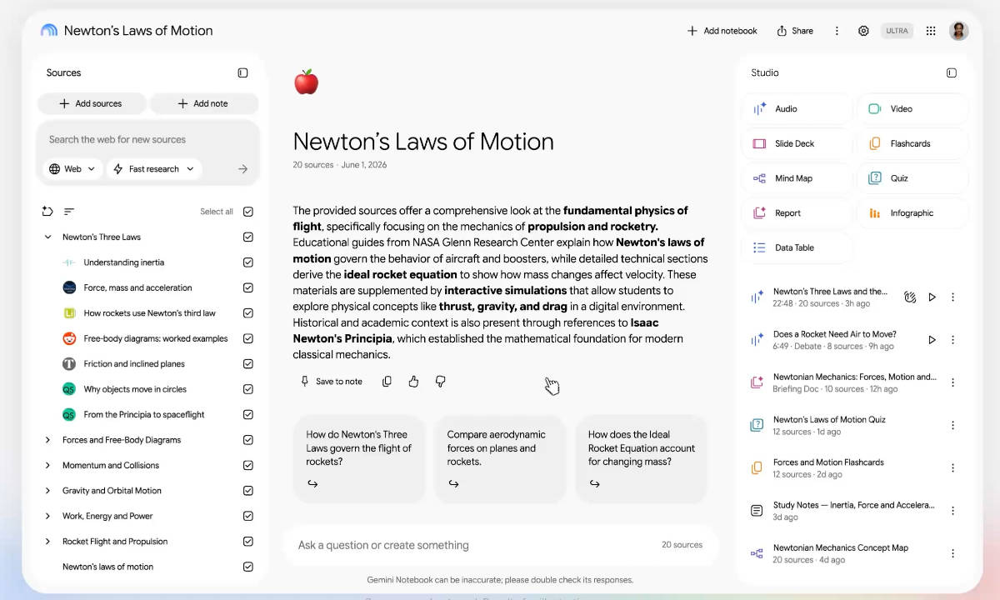
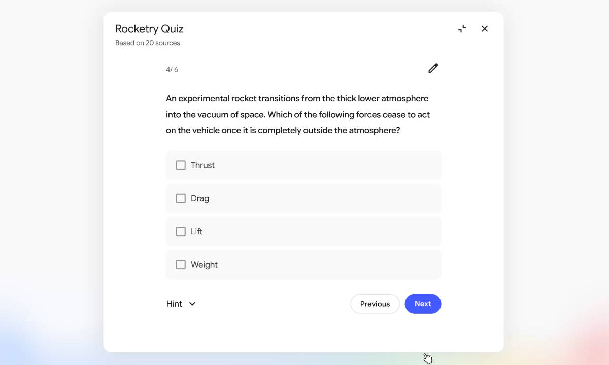

Google no quiere que Gemini Notebook sea solo un lugar donde se guardan apuntes y se
hacen preguntas sobre ellos. La compañía ha presentado un paquete de funciones de estudio
para el servicio que hasta hace poco se conocía como NotebookLM, con el objetivo de
acompañar todo el proceso de aprendizaje: desde capturar una clase hasta comprobar qué se
ha entendido y qué conviene repasar. No es un rumor: las nuevas capacidades aparecen
detalladas en el blog oficial de Google y ya se están desplegando de forma escalonada.

## Conversar con Gemini Notebook, también en voz alta

La novedad más llamativa es la posibilidad de mantener una conversación de voz en tiempo
real con el cuaderno desde la aplicación móvil (Android e iOS), disponible en casi 100
idiomas. El usuario puede pedir una explicación paso a paso, interrumpir la respuesta
mientras habla o plantear nuevas preguntas. La diferencia con un asistente conversacional
generalista es el fundamento de las respuestas: todo se apoya en las fuentes que se hayan
cargado en el cuaderno, no en el conocimiento general del modelo.

Google empezará a desplegar esta función entre suscriptores de Google AI Ultra mayores de
18 años y la extenderá después a Google AI Pro y a otros planes.

A esto se suma un grabador de audio en la aplicación móvil, disponible a partir de la
próxima semana, con el que se podrán registrar clases, explicaciones o ideas sueltas. Lo
grabado no queda aislado: se integra junto al resto de fuentes y notas, de modo que más
tarde se puede conversar con él, citarlo o generar material de estudio.

## Del resumen al examen: cuestionarios y vídeos breves

El segundo bloque de funciones gira en torno a los resúmenes interactivos (*Interactive
Learning Overviews*), que reunirán en una misma experiencia los resúmenes del cuaderno con
recursos como infografías, cuestionarios y tarjetas de memoria (flashcards). El despliegue
para todos los usuarios llegará en las próximas semanas.

Dentro de ese apartado se amplían los formatos de los cuestionarios con preguntas de
respuesta corta, selección múltiple y ejercicios para rellenar huecos. Además, una vez
completados, es posible preguntar al chat por el rendimiento para identificar en qué temas
se ha fallado y dónde conviene concentrar el siguiente repaso, así como editar o añadir
preguntas propias.

También llegan los *Short Video Overviews*: explicaciones de alrededor de un minuto, en
más de 80 idiomas, que combinan narración y animaciones educativas para condensar
fórmulas, diagramas y conceptos complejos. La idea de los vídeos ya existía en NotebookLM,
pero ahora se adapta a un formato mucho más breve y pensado para compartir.

## Qué cambia para el estudiante

La diferencia de fondo está en la relación con los materiales. Un chatbot al uso responde
desde su conocimiento general; Gemini Notebook parte siempre de los documentos, los
apuntes y las grabaciones que aporta el usuario. Con estas funciones, esos materiales
dejan de ser solo una fuente de consulta y pasan a convertirse en ejercicios,
conversaciones, resúmenes y pistas sobre lo que todavía no se domina. Google no sustituye
al profesor, pero construye un acompañante de estudio ajustado a los contenidos con los
que ya se trabaja.

Esta evolución de los productos de IA hacia el ámbito educativo no es un caso aislado en
la estrategia de la compañía, que ya ha llevado Gemini a otros formatos con los
[portátiles Googlebook y su Gemini Intelligence](/noticias/googlebook-preorders-september-21/).

En cuanto a disponibilidad, las funciones se despliegan de forma escalonada y algunas
dependen del plan contratado. Google ofrece además un año gratuito para estudiantes: en
Estados Unidos, doce meses de Google AI Pro (valorados en 19,99 dólares al mes y con
límites de uso cuatro veces mayores) y, en más de 140 mercados fuera del país, doce meses
de Google AI Plus con el doble de límites. La promoción puede canjearse hasta el 31 de
diciembre de 2026, exige un método de pago al registrarse y, si no se cancela antes, pasa
a cobrarse de forma automática al terminar el periodo.
