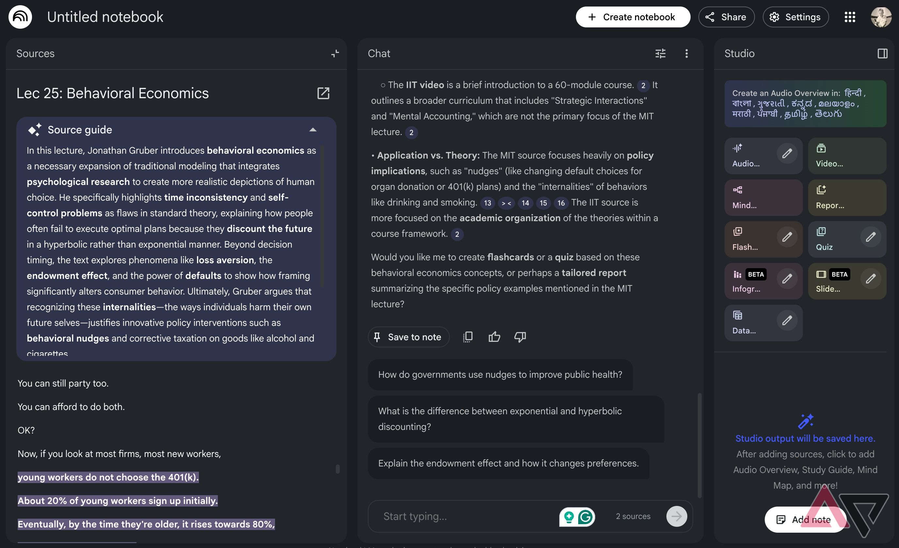
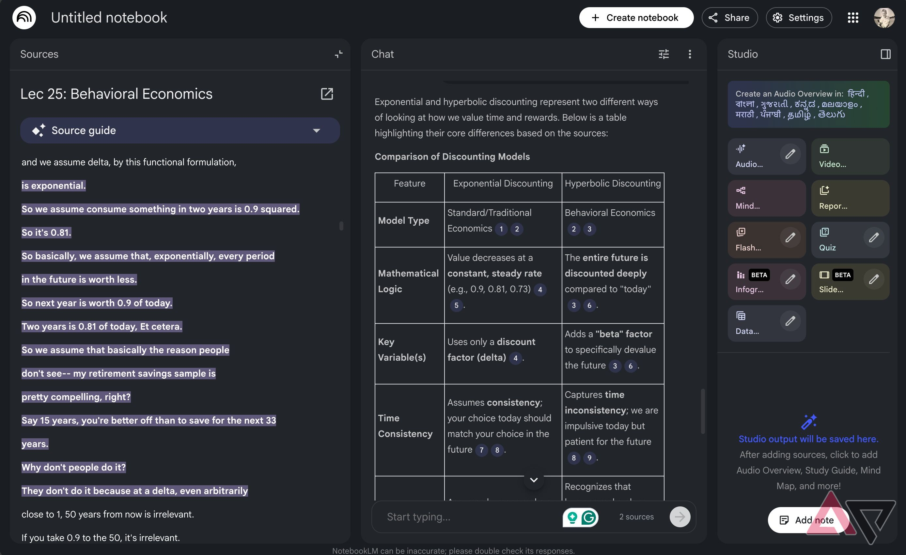

YouTube es una de las principales fuentes para aprender temas nuevos, pero ver varios vídeos largos sobre el mismo asunto y tomar apuntes lleva mucho tiempo. Gemini Notebook permite reunir esos vídeos como fuentes y trabajar sobre sus transcripciones: resume, responde preguntas con citas y genera materiales de estudio visuales y de audio.

Esta guía explica cómo pasar de una lista de vídeos pendientes a una guía de estudio con Gemini Notebook, siguiendo el método descrito por Android Police.

## Requisitos previos

- Una cuenta de Google para usar Gemini Notebook.
- Los enlaces de los vídeos de YouTube sobre el tema que se quiere estudiar.
- Un navegador web. La extensión de Chrome «YouTube to Gemini Notebook» es opcional, pero resulta útil para enviar una lista de reproducción completa sin copiar enlace por enlace.

## Pasos

### 1. Reúne los vídeos de YouTube sobre el tema

Elige varios vídeos sobre el mismo tema de distintas fuentes, como harías para contrastar puntos de vista antes de estudiar. Copia la URL de cada vídeo que quieras incluir.

### 2. Añade los enlaces como fuentes en Gemini Notebook

Abre Gemini Notebook, crea un cuaderno nuevo y pega cada URL de YouTube como fuente. Si tienes una lista de reproducción entera, la extensión «YouTube to Gemini Notebook» de Chrome la envía al cuaderno sin cambiar de pestaña por cada enlace.

### 3. Revisa el resumen y los puntos clave generados

Tras añadir los enlaces, Gemini Notebook analiza la transcripción de los vídeos y genera un resumen, respuestas y preguntas, además de destacar los puntos clave. Conviene saber cómo funciona: no ve ni escucha el vídeo como una persona, sino que trabaja sobre la transcripción. Sus respuestas incluyen citas numeradas que enlazan con el fragmento exacto de la transcripción en el que se apoyan.

### 4. Pide respuestas en el formato que necesites

Gemini Notebook puede presentar la información en formatos concretos. Pide tablas para comparar conceptos (por ejemplo, las diferencias entre dos teorías), listas de viñetas o listas numeradas para resumir ideas. El formato de tabla resulta especialmente útil para comparativas que, de otro modo, habría que elaborar a mano a partir de la transcripción completa.

### 5. Genera infografías o presentaciones de diapositivas

Para estudiar de forma visual, usa la función de infografías cuando necesites un resumen rápido del tema y la de presentaciones de diapositivas para una explicación detallada, similar a una presentación de PowerPoint que resume lo esencial.

### 6. Crea resúmenes de audio o vídeo y mapas mentales

Para los temas más complejos, genera un resumen de audio o de vídeo: se puede elegir su duración, el idioma y el tema concreto en el que deben centrarse los presentadores de IA, por ejemplo el punto que resulte más difícil de entender. Después se pueden escuchar o ver cuando convenga. Los mapas mentales sirven para ver las relaciones entre dos temas complejos y se pueden descargar en PDF. Estas funciones de voz y cuestionarios también son la base para [usar Gemini Notebook como tutor personal](/noticias/gemini-notebook-personal-tutor/).

## Cómo verificar que funcionó

Haz una pregunta concreta sobre algo que se explique en uno de los vídeos y comprueba que la respuesta incluye citas numeradas que enlazan con el fragmento correspondiente de la transcripción. Si las citas llevan al pasaje correcto, el cuaderno está trabajando sobre tus fuentes.

## Advertencias y limitaciones

Gemini Notebook responde a partir de las transcripciones de los vídeos, no del contenido visual: lo que solo aparezca en pantalla sin mencionarse en el audio puede quedar fuera. Además, filtra el «ruido» de los vídeos y se queda con la parte central, por lo que conviene contrastar los puntos importantes con la fuente original antes de darlos por definitivos. Algunas funciones avanzadas tienen un uso gratuito limitado.
