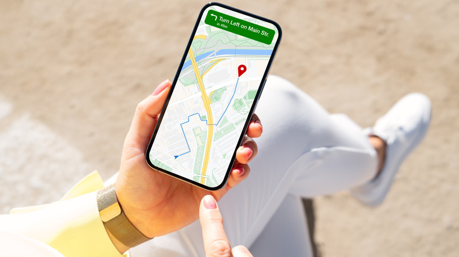

Google Maps lleva años registrando por dónde te mueves a través de su Cronología, el historial de ubicaciones que guarda los lugares que has visitado para poder consultarlos más tarde. Puede resultar útil para recordar el nombre de un restaurante que encontraste de casualidad, pero para mucha gente supone un registro constante de su ubicación en segundo plano que no compensa el beneficio. Google dejó de almacenar ese historial en la nube y ahora lo guarda localmente en el dispositivo, salvo que se active una copia de seguridad manual, pero eso no elimina el deseo de desactivar una de las vías de seguimiento más conocidas.

Esta guía explica cómo apagar la Cronología de Google Maps, cómo borrar los datos que ya existen y cómo limitar su conservación. Está pensada para quien quiere decidir por sí mismo qué información de ubicación conserva Google y no necesita herramientas externas.

> **Nota sobre los nombres de los ajustes:** las rutas se indican en español tal como aparecen en un teléfono configurado en ese idioma. La denominación exacta puede variar ligeramente según la versión de la aplicación y el idioma elegido.

## Antes de empezar

- La aplicación **Google Maps** instalada y actualizada en el teléfono.
- Una cuenta de Google con acceso a sus ajustes de actividad.
- Ten en cuenta que estos ajustes son **específicos de cada dispositivo**. Si también usas Maps en una tablet o en un segundo teléfono, tendrás que repetir el proceso en cada uno de ellos.

Google permite gestionar la ubicación de forma global desde el panel Mi actividad (en `myactivity.google.com/activitycontrols?settings=location`), pero como los datos de la Cronología proceden del teléfono y solo se pueden ver allí, lo más práctico es cambiar los ajustes desde el propio móvil.

## Paso 1: abrir tu perfil en Google Maps

Abre la aplicación **Google Maps** y toca tu foto de perfil, situada en el lado derecho de la barra de búsqueda.

## Paso 2: entrar en Tu cronología

En el menú que se despliega, selecciona **Tu cronología**.

## Paso 3: abrir los ajustes de ubicación y privacidad

Toca el **menú de tres puntos** de la esquina superior derecha y elige **Configuración de ubicación y privacidad**.

## Paso 4: seleccionar Cronología

En esa pantalla, toca **Cronología**.

## Paso 5: desactivar la Cronología y decidir qué pasa con los datos

En el menú desplegable tendrás que elegir entre dos opciones:

- **Desactivar**: deja de usar la función, pero conserva el historial que ya existe.
- **Desactivar y eliminar actividad**: además de apagarla, borra todo el historial de ubicaciones acumulado.

Si más adelante quieres volver a activarla, sigue la misma ruta y elige **Activar** en este último paso.

## Cómo limitar el historial de Google Maps en lugar de borrarlo

Si prefieres mantener accesibles las ubicaciones recientes pero limpiarlas cada cierto tiempo, la Cronología ofrece una eliminación automática en ese mismo menú:

1. Desplázate hasta el apartado **Eliminación automática**.
2. Selecciona **Elige una opción de eliminación automática**.
3. Elige si quieres borrar la actividad con más de **3**, **18** o **36 meses** de antigüedad.

En esa misma página verás también varios **subajustes** que controlan otros usos que se pueden dar a estos datos.

## Otras opciones de control

La ruta de acceso ofrece ajustes adicionales para afinar el control sobre la información:

- En la página principal de **Cronología**, toca el icono de **Copia de seguridad** (la nube) de la parte superior para activar o desactivar una copia cifrada de los datos de la Cronología en tu cuenta de Google.
- Con el icono del **lápiz** de la esquina inferior derecha puedes editar o eliminar un día concreto.
- En la página **Ubicación y privacidad** puedes **Exportar datos de Cronología** para guardarlos en otro dispositivo o **Eliminar intervalo de datos de Cronología** si necesitas borrar un periodo amplio de una sola vez.

## Cómo verificar que funcionó

- Recorre de nuevo la ruta hasta el último paso: si en el desplegable aparece la opción **Activar** en lugar de **Desactivar**, la Cronología ha quedado apagada.
- Si elegiste **Desactivar y eliminar actividad**, entra en **Tu cronología** y comprueba que ya no aparece ningún registro.
- Si usas Maps en más de un dispositivo, repite la comprobación en cada uno: el cambio no se propaga solo entre ellos.

## Advertencias y limitaciones

- **Desactivar no es borrar.** La opción **Desactivar** conserva el historial existente; solo **Desactivar y eliminar actividad** lo elimina por completo.
- **Los ajustes son por dispositivo.** Apagar la Cronología en el teléfono principal no la apaga en la tablet ni en un segundo móvil, así que hay que repetir el proceso en cada equipo.
- **La copia de seguridad es independiente.** El historial se guarda ahora de forma local salvo que actives una copia manual; desactivar esa copia no borra los datos que ya están en el teléfono.
- **Esta guía cubre solo la Cronología.** Google ofrece otros controles de actividad en el panel Mi actividad, que conviene revisar si el objetivo es ajustar con detalle qué información guarda la cuenta. Si buscas un caso equivalente en el iPhone, la guía para [desactivar Apple Intelligence en iOS 27](/noticias/disable-apple-intelligence-ios-27/) explica cómo apagar funciones de plataforma para limitar lo que hace un fabricante con tu dispositivo.
