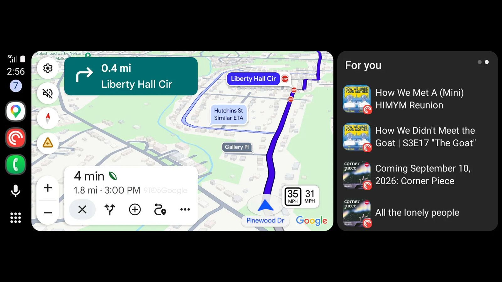
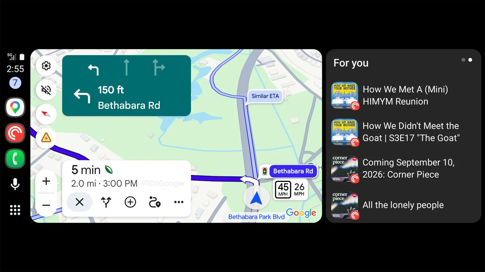

Google Maps ha comenzado a desplegar un cambio en **Android Auto** que reordena la forma en la que el navegador presenta los semáforos y las señales de stop. En lugar de repartirlos como elementos fijos sobre el mapa, el aviso se concentra en la intersección en la que toca decidir: cuando el conductor se aproxima a un cruce, la app resalta si se va a encontrar un semáforo o un stop justo antes del giro.

El movimiento es sutil, pero apunta a un objetivo concreto: reducir el tiempo que la mirada pasa en la pantalla del coche y devolverla a la calle. Google Maps lleva alrededor de seis años dibujando semáforos y señales de stop a lo largo de la ruta; ahora esos mismos datos se asocian al próximo cambio de dirección en vez de quedar dispersos por el trazado.

## Qué ha cambiado en las indicaciones de Google Maps

Hasta ahora, los semáforos y los stops formaban parte del fondo del mapa, como cualquier otro elemento de la vía. Con el nuevo comportamiento, Google Maps añade un aviso que aparece junto al nombre flotante de la calle del próximo giro e indica si en ese punto habrá un semáforo o una señal de stop.

El resultado es una lectura más limpia en los momentos que de verdad exigen atención —tomar un desvío, girar o cambiar de sentido— en lugar de una capa constante de iconos sobre el recorrido.

El cambio no se limita a la pantalla del coche: según las primeras observaciones, también aparece en el propio teléfono, por lo que es razonable esperar que llegue igualmente a CarPlay cuando el despliegue avance.

## Por qué importa

La información no es nueva, sino la manera de mostrarla. Al vincular el semáforo o el stop con la maniobra concreta que viene después, el conductor obtiene la misma advertencia con menos esfuerzo visual. En zonas poco conocidas, donde no se sabe de memoria qué espera en el próximo cruce, ese detalle puede marcar la diferencia entre anticiparse o reaccionar tarde.

También mejora la parte sonora: las indicaciones habladas resultan más fáciles de seguir cuando la orden de girar se acompaña de la mención al stop o al semáforo, un matiz que acerca el aviso a lo que diría un copiloto con la ruta delante.

## Qué cambia para el conductor

No hay nada que instalar. Se trata de una actualización del lado del servidor, así que no hace falta actualizar Android Auto ni Google Maps desde la tienda de aplicaciones: basta con contar con una de las últimas versiones instaladas y esperar a que el despliegue llegue al dispositivo, algo que puede tardar unos días.

El aviso aparece en las calles que Google Street View ya ha cubierto, tanto en grandes ciudades como en núcleos más pequeños, según recoge MovilZona. Si todavía no se ve, no es un fallo del teléfono: es cuestión de que el cambio se complete en los servidores de Google. Para sacarle partido, conviene tener claro [qué es Android Auto y cómo conectarlo](/noticias/android-auto-que-es/) antes de echarse a la carretera.
