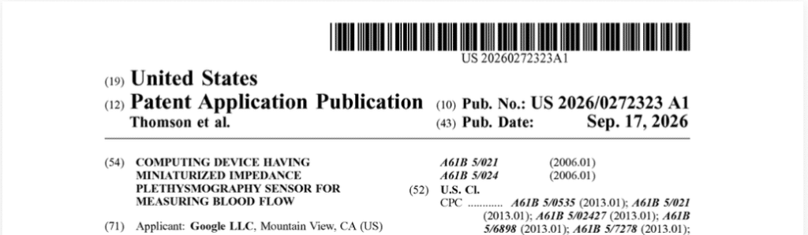
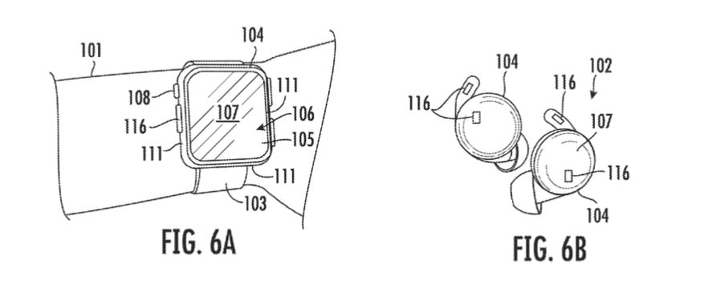
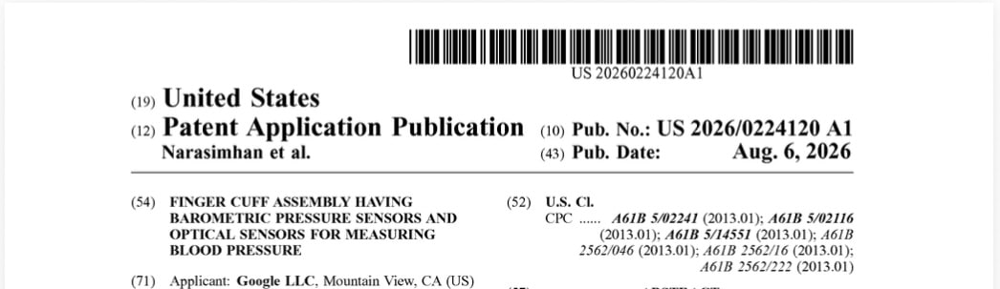
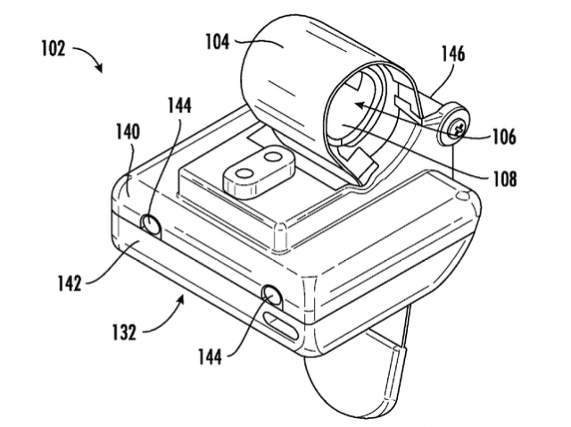

Google trabaja en varias vías para llevar la medición de la presión arterial a sus dispositivos, y la última pista llega en forma de solicitud de patente. El documento, publicado el 17 de septiembre y recogido por Gadgets & Wearables, describe un sensor de impedancia en miniatura que aprovecha la yema del dedo para captar la señal del pulso. No es el anuncio de un producto: es una solicitud que muestra qué está explorando la compañía, no lo que va a lanzar.

## Un sensor en miniatura que mide la presión arterial desde el dedo

La idea central es un sensor de pletismografía por impedancia (IPG, por sus siglas en inglés) miniaturizado. Bajo la yema del dedo se coloca un conjunto de electrodos: dos envían una señal eléctrica de excitación muy pequeña a través del tejido y otros dos miden la respuesta. Como la sangre que circula por el dedo altera su impedancia eléctrica, seguir esas variaciones permite reconstruir una onda pulsátil que refleja el latido y, a partir de ella, estimar la presión arterial o un valor aproximado a ella. El propio diagrama del proceso lo resume en tres pasos: generar los datos de IPG, derivar la señal pulsátil y calcular la presión.

Los dibujos de la solicitud apuntan a un uso vestible. La figura 6A muestra el sistema integrado en un reloj colocado en la muñeca, con la zona de detección en el cuerpo del reloj, justo donde el usuario apoyaría el dedo. Otras ilustraciones contemplan dispositivos pequeños para llevar en el dedo, auriculares e incluso teléfonos.

## El otro camino: un brazalete que se infla alrededor del dedo

No es la única solicitud reciente. Según la misma información, un documento publicado un mes antes describe un pequeño brazalete de dedo con una bolsa inflable, varios sensores de presión y sensores ópticos. El sistema se hincha alrededor del dedo mientras un conjunto de sensores barométricos registra la presión en torno a la arteria digital; en paralelo, los sensores ópticos miden el pulso, y el dispositivo combina ambas señales para calcular la presión arterial. El esquema del proceso detalla cuatro etapas: inflado, mapeo de presión, medición óptica y estimación final.

El propio material gráfico deja claro que no se trata de un anillo discreto: el brazalete es voluminoso. Aun así, la existencia de dos solicitudes con enfoques distintos sugiere que Google no descarta ninguna vía.

## Por qué importa

Ninguna de las dos solicitudes nombra un Pixel Watch ni un producto de Fitbit. Eso, unido a que son documentos de patente y no productos, obliga a leerlas como exploración y no como hoja de ruta. Las referencias publicadas en la base de la USPTO son US-20260272323-A1, para el documento de septiembre, y US-20260224120-A1, para el de agosto.

El contexto ayuda a situarlas. Google realizó en noviembre de 2025 un estudio del Fitbit Hypertension Lab con propietarios de Pixel Watch 3, y tiene previsto llevar Blood Pressure Trends a sus relojes este otoño dentro de Health Guardian. A ello se suma una patente anterior de Fitbit, de abril de este año, que ya apuntaba a lecturas de presión desde la muñeca. Sumadas, las piezas dibujan a una compañía que ataca el problema desde varios frentes a la vez.

## Qué cambia para el lector

En el plano práctico, hoy no cambia nada. Una solicitud de patente no confirma que la función vaya a llegar a un reloj a la venta, ni cuándo, ni con qué precisión; puede quedarse en el papel o tardar años en madurar.

Para quien busca medir la presión arterial de verdad, la referencia actual sigue siendo la de los relojes con brazalete mecánico, como el [Huawei Watch D3](/noticias/huawei-watch-d3-review/), que ofrece lecturas con un método semejante al de un tensiómetro de brazo. La propuesta de Google, si algún día se materializa, apuntaría a algo más cómodo: medir con un gesto del dedo sobre la caja del reloj, sin brazalete y sin inflado. Hasta entonces, conviene tratarla como lo que es, una pista sobre la dirección técnica y no una promesa de producto.
