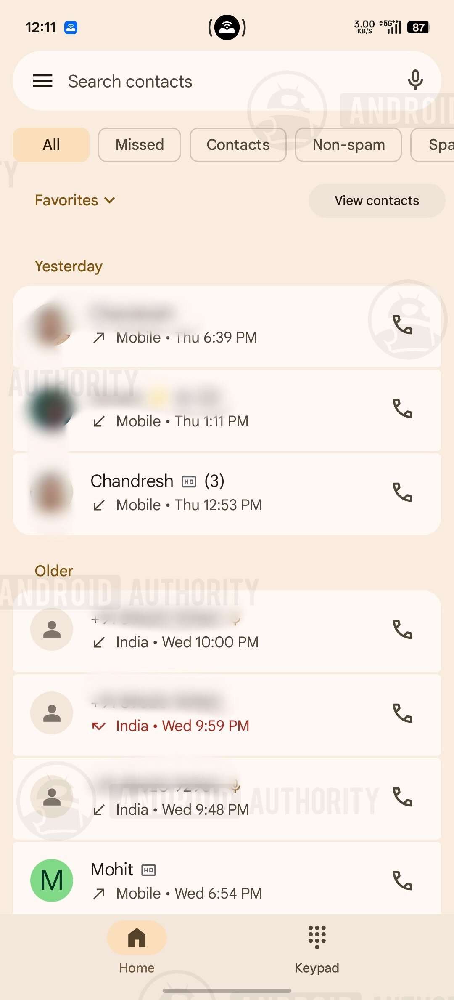
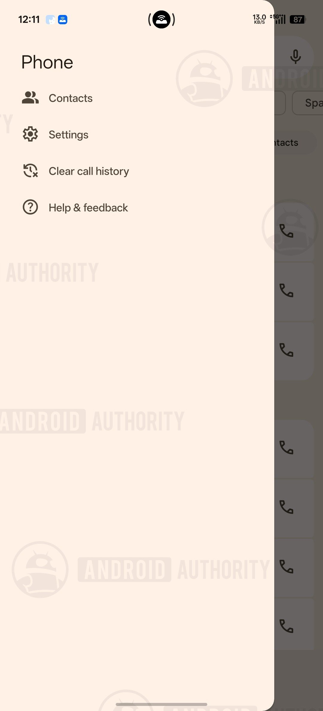
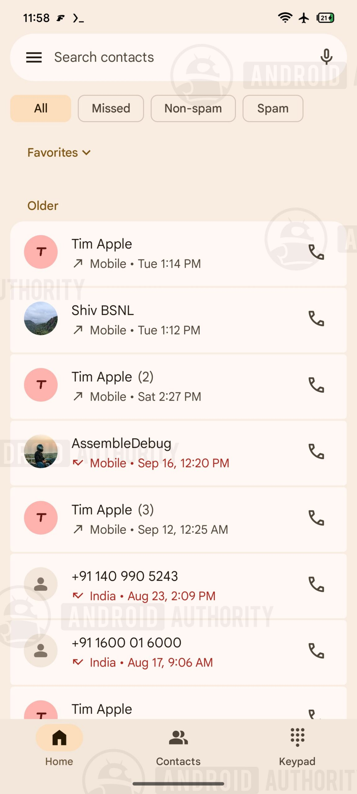
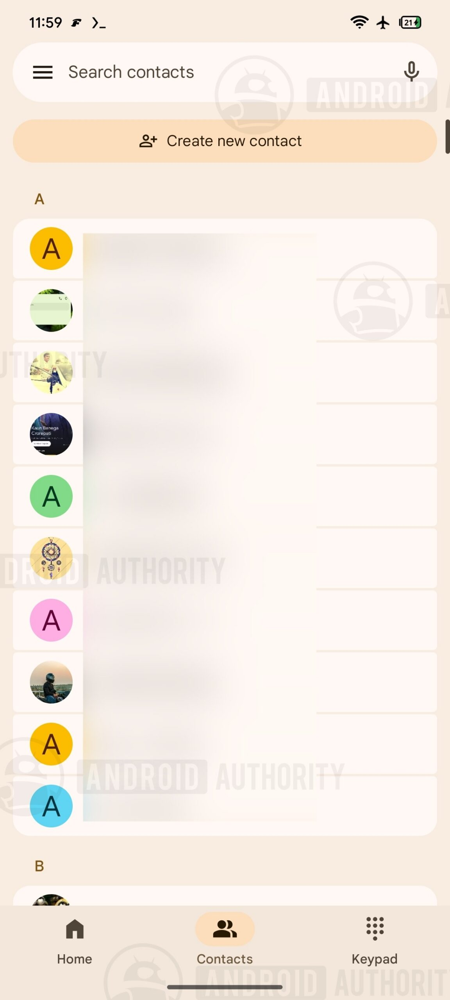
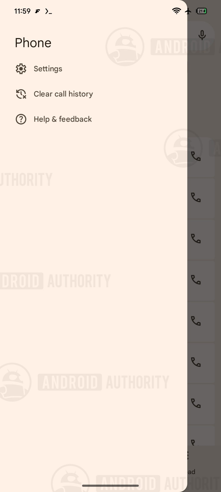

La aplicación Teléfono de Google trabaja en una corrección que muchos usuarios llevaban meses pidiendo: devolver la pestaña de Contactos a la barra de navegación inferior. Así lo apunta un análisis del APK de la última versión beta de la app realizado por Android Authority, que consiguió activar en un dispositivo de pruebas una interfaz aún no publicada.

Conviene tomarlo como un indicio y no como una función confirmada: se trata de código en desarrollo, y este tipo de hallazgos puede no llegar nunca a una versión estable para el público general.

## Qué ha aparecido en el teardown

El equipo de Android Authority revisó la versión beta v240.0.986973448 de Phone by Google y logró habilitar cambios en la barra de navegación inferior que la compañía todavía no ha anunciado. En las capturas obtenidas, la pestaña de Contactos vuelve a colocarse en la barra, presumiblemente entre las opciones de Inicio y Teclado.

Hoy la barra de la aplicación se limita a dos apartados, Inicio y Teclado, mientras que Contactos queda escondido en el menú lateral. En los países donde el buzón de voz está disponible, la app añade una tercera pestaña para esa función.

## De dos pestañas a tres: Contactos vuelve a la barra

La propuesta que se ha podido activar añade Contactos de nuevo a la barra inferior y, como consecuencia, elimina esa opción del menú lateral. La idea es dar acceso directo a la agenda sin tener que abrir primero el panel de navegación, que es precisamente lo que se perdió con el rediseño.

Los responsables del análisis describen la colocación como correcta y funcional en las pruebas, aunque reconocen que es difícil calcular cuánto falta para que Google la libere. Por el momento no hay fecha ni confirmación oficial.

## Por qué importa este cambio

El origen del problema está en la renovación visual que Google aplicó a la app el año pasado con el lenguaje Material 3 Expressive. Entre los ajustes de aquel rediseño, la empresa decidió sacar Contactos de la barra y confinarlo al menú lateral, una decisión que no sentó bien a parte de la base de usuarios. Recuperar la pestaña supondría revertir, al menos en parte, esa medida.

Para quien usa el móvil como teléfono principal, la diferencia es práctica: la agenda es una de las pantallas más consultadas y tenerla a un toque de distancia reduce la fricción diaria. Es un cambio pequeño, pero del tipo que se nota en el uso cotidiano.

## Qué cabe esperar

Este tipo de filtraciones procede de descompilar una versión beta y forzar la interfaz oculta, no de un anuncio de la compañía. Android Authority lo enmarca explícitamente en la categoría de *teardown* de APK, una técnica que sirve para anticipar funciones futuras basándose en código en progreso, pero que no garantiza que lleguen a publicarse.

En un terreno parecido se movió otro hallazgo reciente, el de la app de [Spotify y su límite de caché en Android](/noticias/spotify-cache-limit-android/), donde también apareció trabajo interno sin fecha de lanzamiento. En el caso de Teléfono, la lógica de la función parece cerrada y bien resuelta, así que el despliegue razonable es que llegue en una actualización de la app, sin que la empresa haya puesto todavía una fecha encima de la mesa.
