Profesional Review ha publicado su análisis del **Google Pixel 11 Pro XL**, el nuevo buque insignia de Google, después de adquirir una unidad y probarla a fondo. El veredicto deja una idea clara: el teléfono vuelve a sobresalir por sus cámaras y por la integración de la inteligencia artificial en Android, pero arrastra dos lastres ya conocidos en la familia Pixel, el rendimiento de su procesador y la autonomía de la batería, que pesan mucho en un precio de 1.399 euros.

La review repasa diseño, pantalla, hardware, software, cámaras y batería, y concluye con una nota global del 89 % y la medalla de platino del medio. Estas son las claves del análisis.

## Un diseño continuista con pantalla de referencia

El Pixel 11 Pro XL parte de la misma base de diseño que la generación anterior: cristal y aluminio, protección IP68 y un peso de 226 gramos, bien equilibrado. Los marcos son planos y los bordes prominentes, lo que se traduce en un agarre firme pese a su tamaño. La unidad analizada es la versión Arenisca, con marcos de aluminio pulido en tono dorado, y el medio advierte de que ese acabado tiende a marcar huellas.

En la parte trasera se mantiene la isla de cámaras circular y alargada que ocupa casi toda la anchura, con los sensores en fila. La esquina derecha pasa a ser de cristal negro y aloja el flash LED, que además funciona como luz de notificaciones para llamadas y para Gemini. El resto del panel trasero es de cristal con acabado mate, y el logotipo cromado queda centrado.

La caja prescinde del cargador y se limita al teléfono, un cable USB-C a USB-A, el extractor de la bandeja SIM y la documentación. En el lado derecho se sitúan el botón de encendido y los de volumen; en la parte superior, la bandeja NanoSIM y el micrófono; y abajo, el puerto USB-C 3.2 Gen1 con salida de vídeo, la rejilla del altavoz y un segundo micrófono.

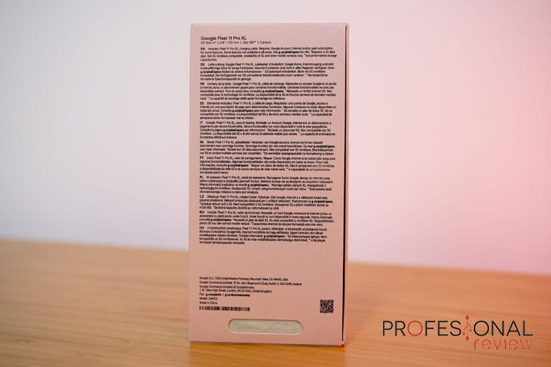

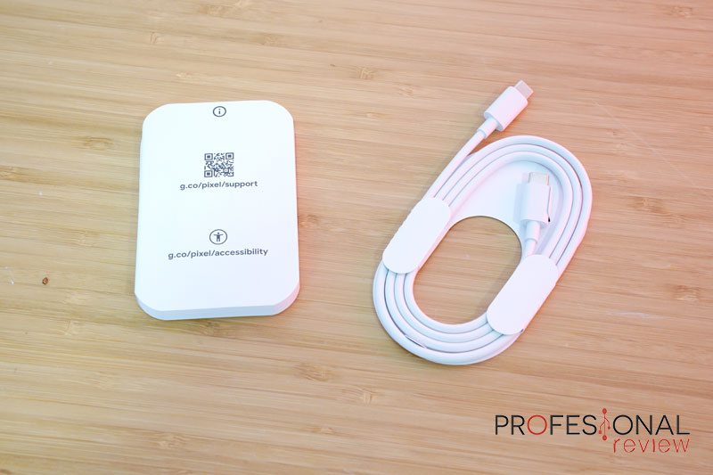

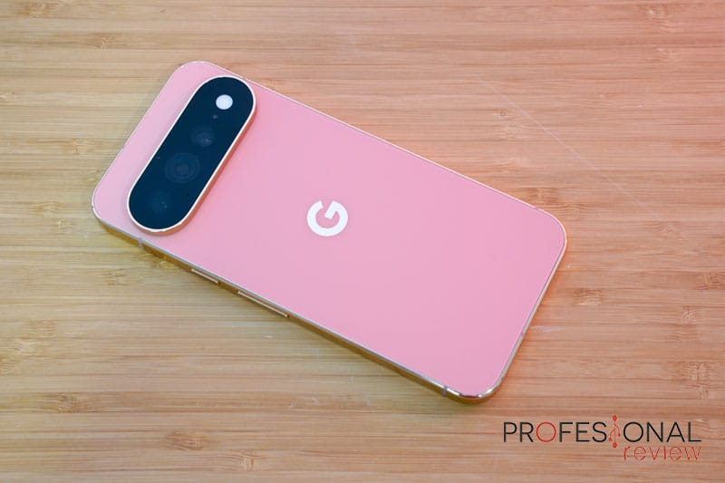

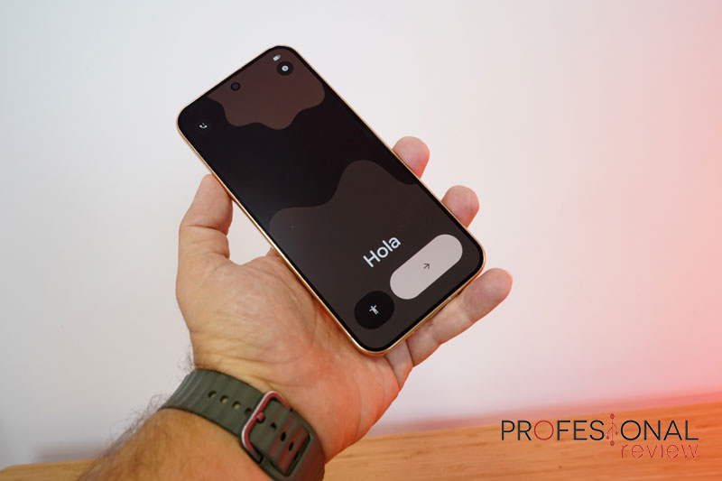

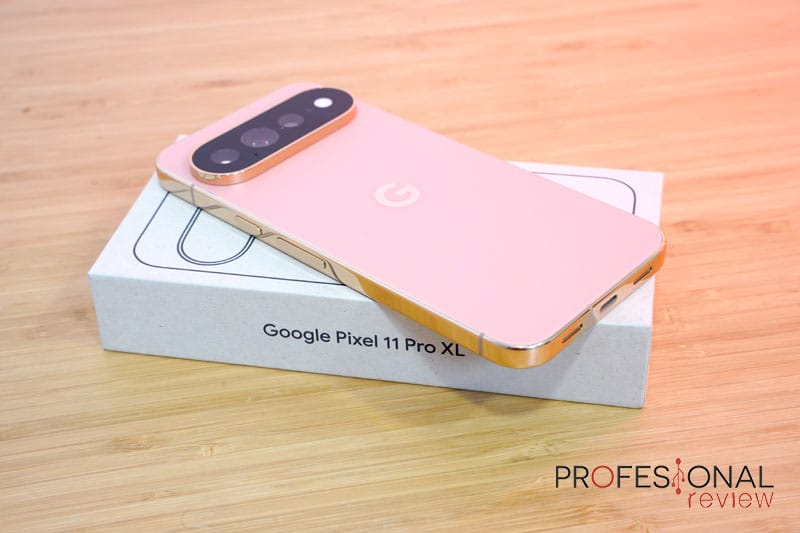

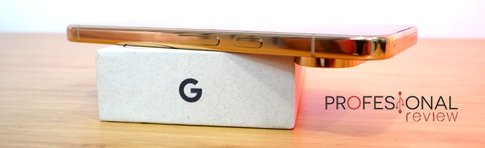

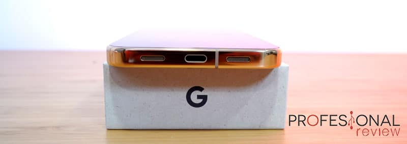

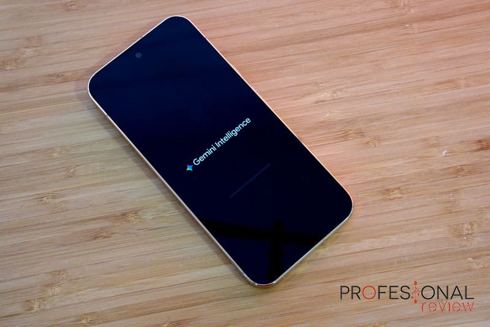

La pantalla sigue siendo una de las mejores de su segmento: un panel **Super Actua OLED LTPO de 6,8 pulgadas** en formato 20:9, con resolución de 2992 x 1344 píxeles y una densidad de 486 ppp. La tecnología LTPO permite mover la frecuencia de refresco entre 1 y 120 Hz, y el panel cubre la gama DCI-P3 con HDR10. En brillo, el medio mide 1800 nits en modo HBM, 2400 nits en HDR y picos de 3600 nits, con buen comportamiento en exteriores aunque con reflejos por el acabado pulido. El sonido corre a cargo de dos altavoces en estéreo que, según el análisis, ganan presencia de graves respecto a la generación previa.

## Tensor G6, software e IA: virtudes y límites

El apartado de rendimiento es el punto más discutido. El Pixel 11 Pro XL monta el **Google Tensor G6**, un SoC ARM de 2 nm y 64 bits con siete núcleos ARM C1 repartidos en dos a 2,65 GHz, cuatro a 3,4 GHz y uno a 4,1 GHz, gráficos PowerVR CXTP-48-1536 y un coprocesador de seguridad Titan M3. Según Profesional Review, queda por detrás del Snapdragon 8 Elite Gen5 y del Apple A19 Pro, hasta el punto de que algunas puntuaciones se acercan a la mitad de las de generaciones anteriores.

El medio lo considera suficiente para mover el sistema con fluidez, ejecutar juegos y, sobre todo, trabajar con funciones de IA en local, que es donde el Tensor se defiende mejor. También señala que el chip acusa calentamiento en escenarios exigentes, como grabación de vídeo o videollamadas. La memoria es LPDDR5X y la configuración se reparte en tres versiones: 12 GB + 256 GB, 16 GB + 512 GB y 16 GB + 1 TB.

En conectividad, el terminal suma Wi-Fi 7 2x2, Bluetooth v6, doble SIM con NanoSIM física y eSIM hasta 5G, GPS, Google Cast, NFC, red Thread para domótica y banda ultraancha, además de los sensores habituales (proximidad, luz ambiental, acelerómetro, giroscopio, magnetómetro y barómetro).

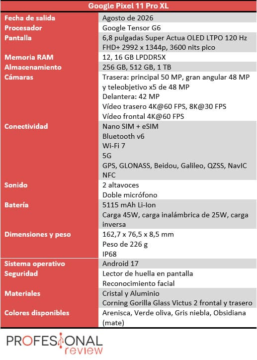

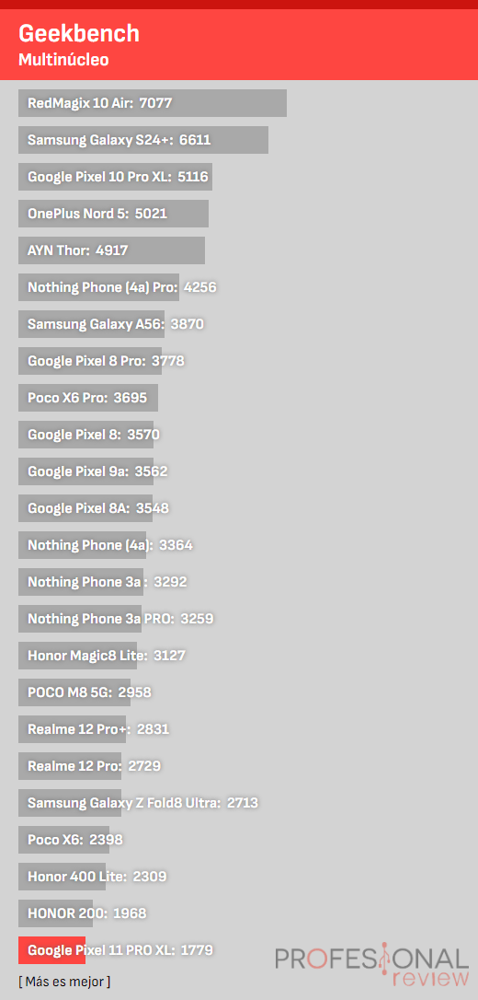

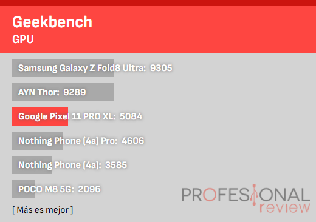

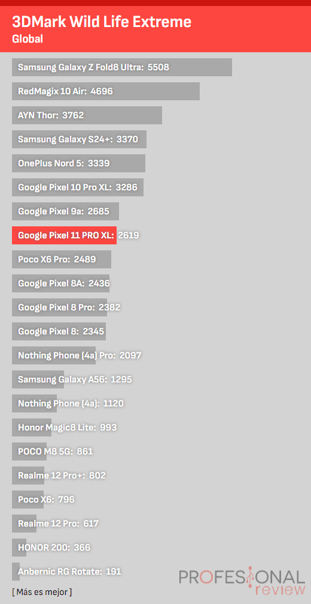

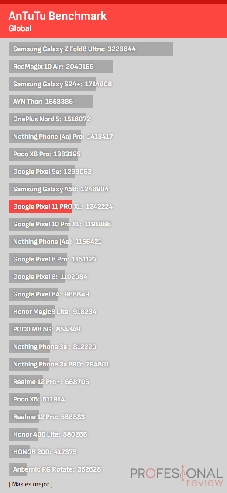

En software, el Pixel 11 Pro XL ofrece Android en su configuración nativa y Google promete **siete años de actualizaciones** de sistema y seguridad. El análisis destaca que es el terminal con más funciones de IA integradas y el que mejor las ejecuta: Gemini, cámara con inteligencia artificial, un modo creador de contenido con teleprompter y guía de encuadre para la cámara frontal, traducción instantánea de texto y vídeo manteniendo tono y pausas, escritura por voz integrada en el teclado, traducción de lengua de signos a texto (todavía no disponible en España) y la función de rodear la pantalla para buscar.

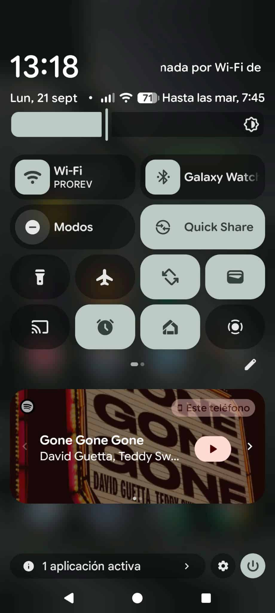

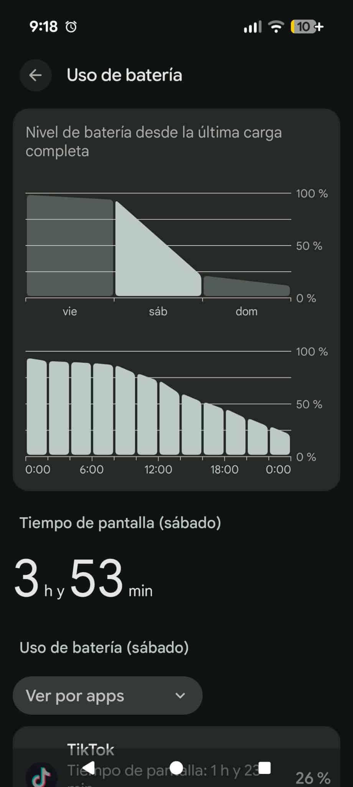

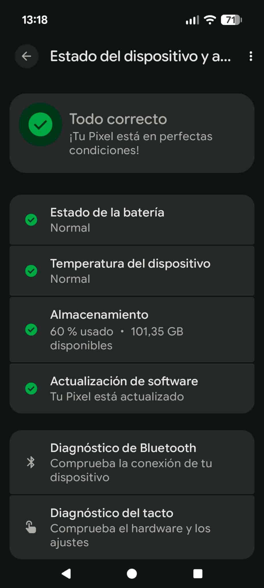

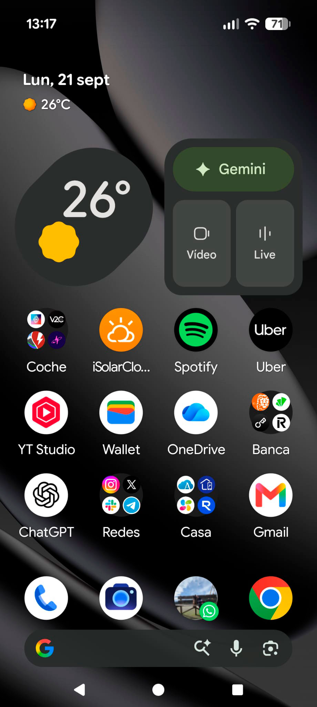

Para quien priorice el rendimiento en juegos por encima de la experiencia de software, conviene recordar [qué componentes determinan de verdad el rendimiento de un móvil Android para jugar](/noticias/android-gaming-phone-buying-guide/): el Pixel no compite en ese terreno, sino en el de la IA y la cámara.

## Cámaras: el apartado donde el Pixel 11 Pro XL marca diferencias

La fotografía es el terreno donde el Pixel 11 Pro XL brilla con más claridad. El conjunto trasero mantiene tres sensores, todos con enfoque automático por láser LDAF y sensores de espectro y parpadeo. El principal es un **sensor de 50 MP con apertura f/1,68**, tamaño de 1/1,3 pulgadas, campo de visión de 82 grados y estabilización óptica y electrónica. El gran angular sube a **48 MP con f/1,7** y un campo de 123 grados, con estabilización digital. El tercero es un **teleobjetivo periscópico de 48 MP con f/2,8**, sensor de 1/1,95 pulgadas, campo de 23 grados y **zoom óptico de 5 aumentos** que se extiende hasta 120 aumentos por vía digital, con estabilización óptica y electrónica.

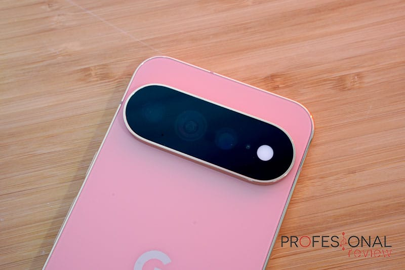

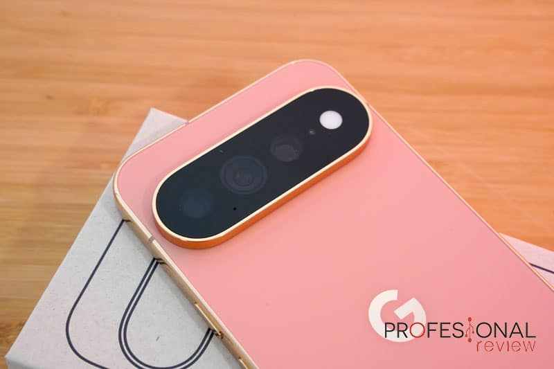

En el momento de la review, el medio sitúa al teléfono en el **top 5 del ranking de DXOMARK para la cámara trasera y en el top 2 en selfi**. El sensor principal destaca por una tonalidad de color natural y un HDR bien controlado en cualquier condición de luz, con buen rendimiento nocturno sin necesidad de forzar el modo noche. El gran angular iguala en interpretación al principal y sirve también para el modo macro, aunque genera algo más de ruido con poca luz. El teleobjetivo ofrece resultados excelentes a 5 aumentos, mantiene buena calidad a 10 aumentos sin IA y recurre a la inteligencia artificial a partir de 20 aumentos; Google guarda tanto la imagen procesada como la original. El análisis también celebra que por fin se puedan hacer retratos con el teleobjetivo.

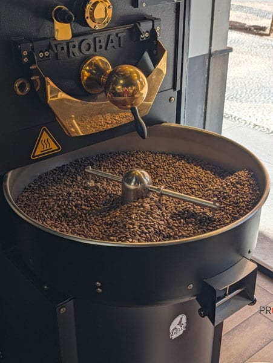

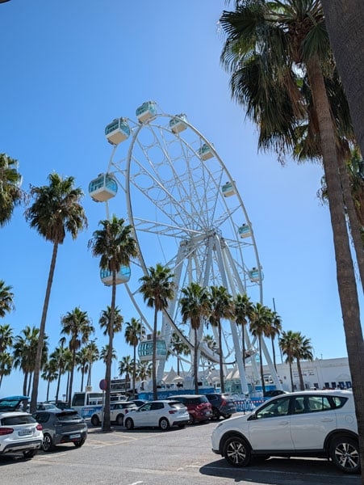

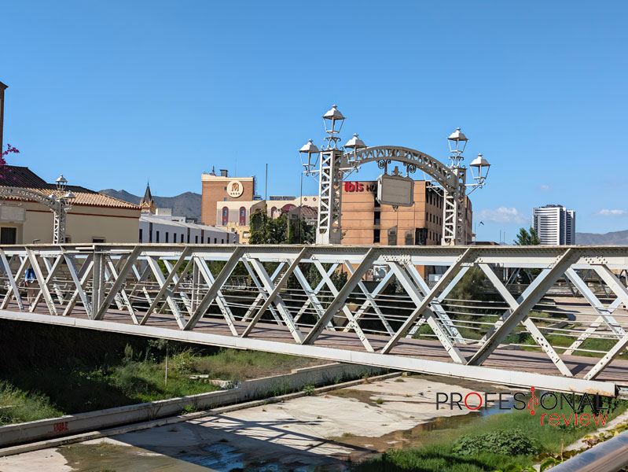

La cámara frontal es un **sensor de 42 MP con enfoque automático, apertura f/2,2 y campo de visión de 103 grados**, pensado también para fotos grupales. El medio elogia el tratamiento del color, el rango dinámico y un modo retrato bien pulido, además de un buen comportamiento nocturno. En vídeo, en cambio, el Pixel 11 Pro XL sigue por detrás de rivales como el Samsung Galaxy S26 Ultra o el iPhone 17 Pro: el análisis aprecia ruido en condiciones de poca luz y transiciones menos fluidas, y apunta a posibles mejoras por actualización. La función de captura mágica, que extrae imágenes fijas mientras se graba, está limitada a 1080p.

El medio ya había analizado cómo puntúa DXOMARK la cámara de otros buques insignia recientes, como el [iPhone 18 Pro, que se quedó en 172 puntos](/noticias/iphone-18-pro-dxo-172/), una referencia útil para situar la nota del Pixel.

## Batería, precio y conclusiones

La autonomía es uno de los puntos más criticados del análisis. La batería del Pixel 11 Pro XL es de **5115 mAh**, y la del Pixel 11 Pro de 4850 mAh, cifras que no suben respecto a la generación anterior (5200 y 4870 mAh) y que se quedan lejos de los 6000 o 7000 mAh de algunos competidores. La carga rápida es de 45 W en el modelo XL y de 30 W en el Pro, con carga inalámbrica de 25 W Qi2.2 y carga reversible. El redactor describe un uso intensivo que llega al día siguiente con apenas un 10-15 % de batería y califica el resultado de decepcionante.

En seguridad, el terminal combina reconocimiento facial y lector de huellas en pantalla, ambos correctos pero sin estar entre los mejores del mercado: el desbloqueo facial no es 3D como el Face ID de Apple.

El análisis cierra con una valoración global del 89 % y medalla de platino. Entre las ventajas señala la pantalla, el rendimiento de las cámaras en foto y vídeo, la fluidez del sistema, los siete años de actualizaciones, una suscripción de doce meses a Google AI Pro y un plan renove que facilita la compra. Entre los inconvenientes apunta el procesador por debajo de la competencia, la imposibilidad de usar a la vez las cámaras trasera y delantera, un precio elevado y una autonomía que no está a la altura. El precio es de **1399 euros para el Pixel 11 Pro XL y 1199 euros para el Pixel 11 Pro**, con rivales directos como el Samsung Galaxy S26 Ultra, el iPhone 18 Pro Max o el Xiaomi 17 Ultra.

En resumen, el Pixel 11 Pro XL confirma que Google sabe construir uno de los Android más completos del mercado, sobre todo por cámaras y software, pero para competir de tú a tú con los mejores de Samsung, Apple o Xiaomi todavía necesita dar un paso adelante en rendimiento, autonomía y temperaturas.
