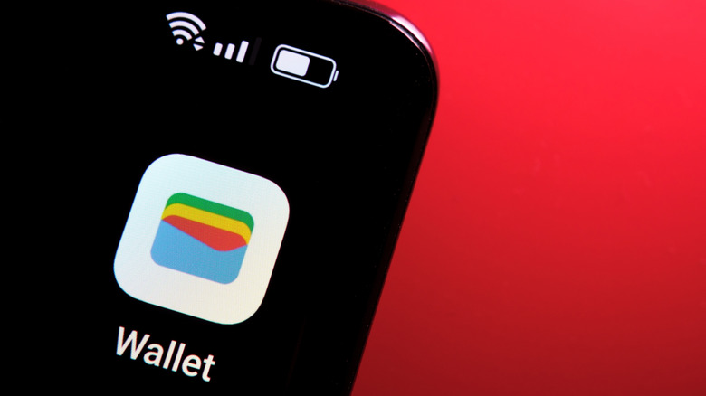
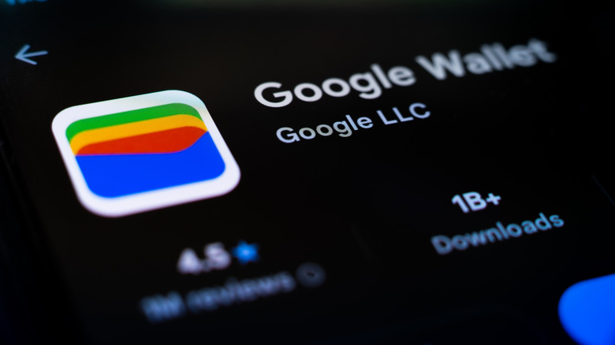
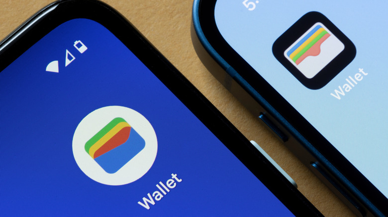

Google Wallet es una de esas aplicaciones que se integran en la rutina sin que uno se dé cuenta: sustituye las tarjetas físicas por versiones virtuales y permite pagar con el móvil sin sacar la cartera. Una vez configurada, debería funcionar sin más complicaciones, pero no siempre es así.

Esta guía está pensada para quien se topa con los fallos más habituales de la aplicación y no sabe por dónde empezar. Algunos son evidentes, como una tarjeta que se resiste a añadirse; otros esconden la causa en los ajustes del propio teléfono o en la entidad bancaria. A continuación se repasan los cuatro problemas más frecuentes y qué hacer en cada caso.

## Requisitos previos

Antes de entrar en los fallos concretos, conviene tener a mano lo básico:

- Un **teléfono Android** con Google Wallet instalado.
- Una **cuenta de Gmail personal** para el documento de identidad digital: las cuentas de empresa o personalizadas no sirven para ese uso.
- Acceso a la **aplicación o la web de tu banco**, ya que en varios casos será la entidad quien tenga que autorizar el alta.

## 1. El teléfono no realiza pagos sin contacto

El síntoma es fácil de reconocer: acercas el teléfono desbloqueado a un datáfono o terminal sin contacto y no ocurre nada.

Lo primero es comprobar que el dispositivo está listo para pagar. Abre Google Wallet, toca tu **foto de perfil** y selecciona **Payment Setup**. Ahí aparecen los problemas pendientes de resolver, como una tarjeta que no terminó de configurarse, y la propia guía integrada de Google ayuda a arrancar el proceso.

También hay que asegurarse de que el **NFC** está activado, ya que es la tecnología que permite al teléfono comunicarse con el terminal de pago. Búscalo en los ajustes del dispositivo y actívalo. En un Samsung Galaxy reciente suele estar en **Connections** > **NFC and contactless payments**, y hay que verificar que el interruptor está encendido; si no aparece en esa ruta, se puede buscar «NFC» desde la propia aplicación de Ajustes.

Con la tarjeta lista, desbloquea el teléfono y mantén la parte trasera contra el lector unos segundos. No hace falta abrir la aplicación: Google Wallet usa la tarjeta predeterminada, que es una de sus ventajas frente a otras carteras. Si quieres usar otra, basta con deslizar hasta esa tarjeta dentro de la app.

Si el primer intento no funciona, mueve un poco el teléfono: la antena NFC puede estar en un sitio distinto del que uno espera. Lo que no sirve es pasarlo rápido por el terminal; hay que dejarlo apoyado para darle tiempo a conectar.

La funda también puede estorbar. Las fundas gruesas, las metálicas y las que incorporan ranuras para tarjetas físicas pueden bloquear o interrumpir la lectura. Para comprobarlo, retira la funda e inténtalo de nuevo, preferiblemente en un comercio con poca gente. Si funciona sin la funda, ya tienes identificado el problema.

Conviene además prestar atención a los avisos que aparezcan en pantalla: puede que tengas que verificar algo si es tu primer pago con tarjeta sin contacto. Si un pago falla sin motivo aparente, consulta con tu banco si el problema es ajeno a la tarjeta digital. Google también publica una guía de solución de problemas para estos casos.

## 2. La tarjeta bancaria no se añade o no termina de verificarse

Una de las causas más comunes es una configuración incompleta: mientras la tarjeta no esté lista, no se pueden hacer pagos sin contacto. Y tener una tarjeta física no garantiza que funcione en Google Wallet: no todos los bancos dan soporte a la aplicación y la tarjeta o cuenta debe ser elegible.

Si el alta falla, lo primero es consultar con tu banco o el emisor de la tarjeta. Puedes comprobar la elegibilidad de la tarjeta en la web de soporte de Google, pero incluso siendo apta, el banco puede tener que aprobarla o pedirte una verificación adicional. Google avisa cuando no pudo completar la configuración, algo que suele indicar que la entidad no está aceptando la solicitud. Merece la pena revisar si tu banco ofrece una opción del tipo **Add to GPay** en su aplicación o en la banca online: es una vía alternativa y ya aprobada para dar de alta los datos de la tarjeta.

Incluso haciéndolo todo bien, la verificación puede atascarse. Por ejemplo, es posible que tengas que esperar un código por mensaje de texto del banco para completar el proceso. Si no llega, contacta con la entidad y asegúrate de que tus datos correctos están registrados: es un problema habitual en cuentas antiguas con número de teléfono desactualizado, que impide verificar online cuando llega el momento.

Si tus datos están al día, solicita otro código y revisa las carpetas de spam. Según el banco, pueden ofrecerse otros métodos de verificación, como llamadas telefónicas o códigos de la cuenta bancaria. Para cerrar los pasos que queden pendientes, toca **Finish Setup** dentro de la aplicación.

## 3. El teléfono no cumple los requisitos de seguridad

Google Wallet exige una serie de condiciones de seguridad en el dispositivo para permitir los pagos sin contacto. Una de las clave es la certificación **Google Play Protect**.

Para comprobarla, abre Play Store, toca el icono de tu perfil y ve a **Settings** > **About**. Si el teléfono está certificado, bajo **Play Protect certification** verás **Device is certified**. Sin esa certificación, Google bloquea por completo los pagos sin contacto para proteger tus datos financieros. Puede que baste con actualizar los servicios de Google Play e instalar las actualizaciones del sistema Android disponibles.

Como mínimo, Google espera que el teléfono use una seguridad básica, como un bloqueo de pantalla. Sirve un PIN, un patrón, una contraseña o datos biométricos, pero tiene que haber algo que impida desbloquearlo sin ninguna medida. Además, es posible que debas desbloquearlo la primera vez que lo reinicies para poder pagar sin contacto.

El asunto se complica si el teléfono tiene el **bootloader desbloqueado** o una **ROM de Android personalizada**. Estas modificaciones pueden bloquear las comprobaciones necesarias y obligan a consultar la documentación. Un ejemplo: GrapheneOS, centrado en la privacidad, no admite pagos NFC con Google Wallet, así que con él no se pueden hacer pagos sin contacto.

## 4. No se puede añadir el documento de identidad digital

Si tienes problemas para añadir un pase de identidad a Google Wallet, comprueba primero dos condiciones: que el teléfono lo admita y que el documento proceda de un país que haya habilitado el soporte. La lista actualizada de países y regiones compatibles está publicada en la web de Google.

El dispositivo debe ejecutar **Android 9 o posterior** y contar con NFC y bloqueo de pantalla activados. También hace falta una cuenta de Gmail personal, porque las de empresa o personalizadas no funcionan.

El proceso de lectura también puede dar problemas. El teléfono necesita leer con limpieza el chip NFC del pasaporte, así que retira la funda, deja el pasaporte plano y desplaza despacio la parte trasera del móvil sobre la cubierta o la página con la fotografía. Después hay que pasar una verificación adicional, como grabar tu rostro. Esto solo funciona con un dispositivo a la vez: si ya lo hiciste en otro teléfono, tendrás que eliminar antes ese pase.

## Cómo verificar que funcionó

Para los pagos sin contacto, la prueba definitiva es sencilla: desbloquea el teléfono y mantenlo apoyado unos segundos contra un lector. Si el pago se completa con la tarjeta predeterminada, la configuración es correcta. Repite la comprobación sin la funda si sospechas que era ella la que interfería.

En el caso de las tarjetas, vuelve a Google Wallet y revisa que ya no figure ningún paso pendiente; el aviso de configuración incompleta debe haber desaparecido. Para la certificación de seguridad, consulta de nuevo **Play Protect certification** en Play Store y confirma que sigue apareciendo **Device is certified**. Y para el documento de identidad, el pase debe quedar guardado y accesible en la aplicación tras superar la verificación facial.

## Limitaciones y advertencias

- **No todos los bancos son compatibles.** El soporte depende de cada entidad y de la elegibilidad de la tarjeta o cuenta, así que el banco sigue siendo el primer punto de consulta.
- **Las modificaciones del sistema pasan factura.** Un bootloader desbloqueado o una ROM personalizada pueden impedir los pagos, y sistemas como GrapheneOS directamente no los admiten.
- **El documento de identidad está limitado por región.** Hace falta un dispositivo compatible y un país que haya habilitado el soporte, además de una cuenta de Gmail personal.
- **No te deshagas de lo físico.** Conviene seguir llevando las tarjetas y el documento de identidad en formato físico: los documentos digitales todavía no se aceptan en todas partes.
