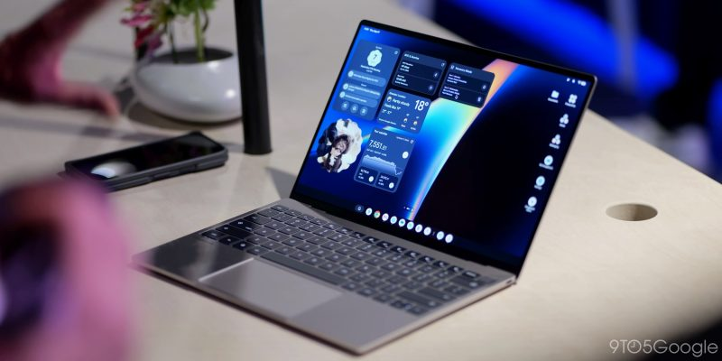
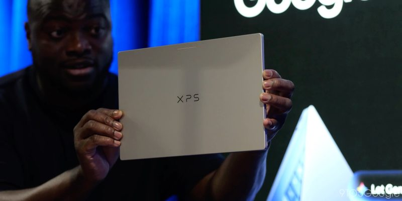
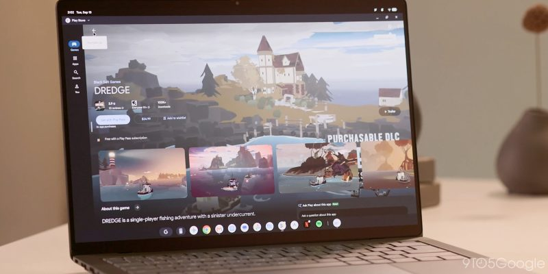
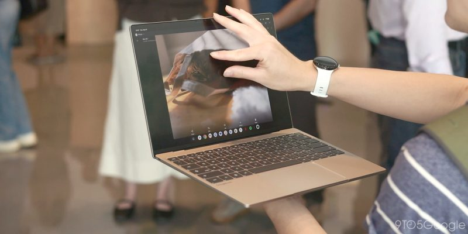
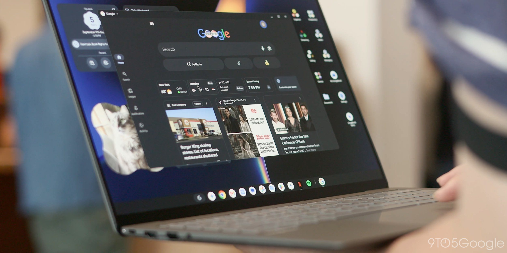
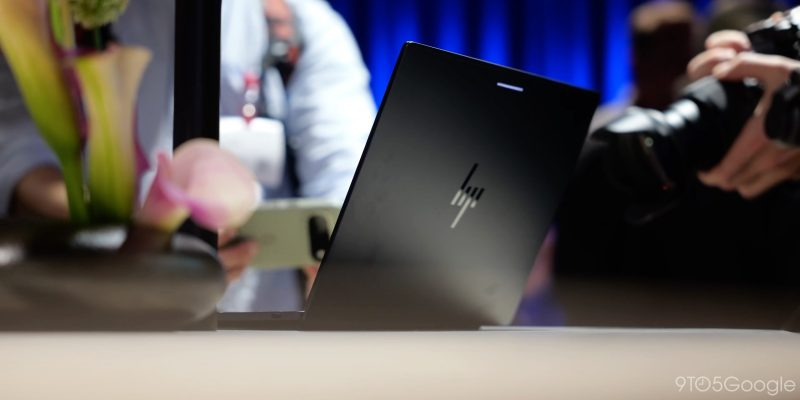
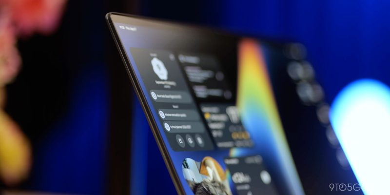

El Googlebook todavía no tiene una cuota de mercado relevante, pero para el redactor de 9to5Google Damien Wilde encierra una oportunidad que casi ningún otro fabricante podría plantearse: convertir Android en un sistema de escritorio de pleno derecho. El autor se declara cautelosamente optimista y sitúa el movimiento en su contexto: con Microsoft en una relación cada vez más tensa con los usuarios de Windows, el mercado necesita un tercer competidor frente a Mac y Windows, y Google llega en un momento en el que ChromeOS lleva años estancado tras su empuje inicial en el sector educativo.

## Un Android de escritorio de verdad, más allá de DeX y ChromeOS

Hasta ahora, sostiene el análisis, nadie ha intentado en serio que Android funcione como una experiencia de escritorio completa. La excepción es DeX de Samsung, un añadido interno para móviles y tabletas Galaxy que trata de emular un escritorio en lugar de serlo. Googlebook OS, en cambio, es Android reimaginado para la era del escritorio, según la toma de contacto previa del propio medio.

El autor, que ya ha probado los primeros Googlebook, admite que los modelos de gama alta presentados bajo la nueva marca le parecen caros en muchos casos, y aclara que no es ahí donde ve las ventajas. Frente a las versiones anteriores de ChromeOS, Android está mejor optimizado para hardware modesto y de bajo consumo: en su experiencia, un Chromebook malo casi siempre resulta peor que un dispositivo Android malo, porque en un portátil el rendimiento deficiente se nota más que en un móvil, donde todo es más ligero. A eso se suma que los procesadores móviles actuales rinden a la altura de los procesadores medios de portátil, como Apple ya demostró al llevar aplicaciones de escritorio a sus propios chips móviles, y el autor imagina un portátil funcionando sin problemas con un Snapdragon 8 Gen 3 de hace unos años y un consumo mínimo.

## Juegos, tacto nativo y la generación criada con el móvil

El terreno donde el cambio se nota más es el juego. Hace unos años, con Stadia aún en pie, la idea de un Chromebook para jugar resultaba absurda: eran equipos que dependían por completo de la nube y pedían un precio prémium por un portátil que no podía jugar sin una conexión perfecta. Un Googlebook para juegos sería otra historia: los chips móviles modernos superan a consolas de la generación anterior como la PlayStation 4, el catálogo Android incluye hoy títulos de gran fidelidad visual además de los juegos casuales, y la emulación local de PC y consolas clásicas lo convierte en una máquina autosuficiente que no necesita enchufe para aguantar horas. Como detalle, Fortnite está disponible desde el primer día, algo que las Steam Machines y la Steam Deck no pueden decir.

Otro argumento que el análisis considera infravalorado es el táctil: ningún otro sistema de escritorio se diseñó desde cero pensando en la interacción táctil. Android solo tiene que cerrar su brecha de aplicaciones, que el autor ve como un problema exponencialmente más fácil que adaptar un sistema heredado a un formato nuevo. Y ahí entra la apuesta estratégica: frente a Apple, que mantiene iOS, iPadOS y macOS como sistemas separados, Google unifica todo bajo Android. Para la generación que ha crecido con el móvil en la mano, que edita en CapCut en lugar de Adobe y juega a Roblox o a versiones móviles de los grandes títulos, el Googlebook extiende lo familiar a un formato nuevo, siempre que el precio acompañe.

## El todo o nada de las aplicaciones en el Googlebook

Para los usuarios veteranos, el análisis no esquiva la asignatura pendiente: el software de nivel de escritorio. Que compañías como Blackmagic o Adobe lleven DaVinci Resolve o las aplicaciones de Creative Cloud al Googlebook es, en su lectura, imprescindible, y traería un beneficio oculto: la próxima oleada de plegables y tabletas Android heredaría esas aplicaciones profesionales en formatos mucho más portátiles que un portátil tradicional. Por eso el autor considera que cerrar la brecha de aplicaciones es el componente más importante del primer año del Googlebook, y que todo depende de qué marcas empiecen a desarrollar para Android.

El paralelismo final es Linux: el impulso de Valve con SteamOS y la Steam Deck ha demostrado que existe una alternativa viable a Windows para jugadores, y Proton es el modelo que Google podría seguir, con unos pocos ports nativos de las aplicaciones más grandes bastando para atraer al resto. Una capa de compatibilidad con aplicaciones de Windows o Linux en Android no está descartada, aunque el autor lo deja en el terreno de la especulación. La conclusión es un optimismo con condiciones: un sistema flexible que abarque móviles, plegables, tabletas y portátiles podría escalar como ningún otro sistema lo ha hecho, pero solo si Google trata el proyecto a largo plazo y tapa rápido las carencias de software. El propio Wilde reconoce que hace años habría dicho que jamás abandonaría Windows en su PC de juegos, y escribe esto dieciocho meses después de cambiarlo por Linux.

Para situar este análisis en el contexto del lanzamiento, conviene repasar [en qué se diferencia el Googlebook del Chromebook](/noticias/googlebook-vs-chromebook/): Android, Gemini integrado y precios desde 899 dólares.

