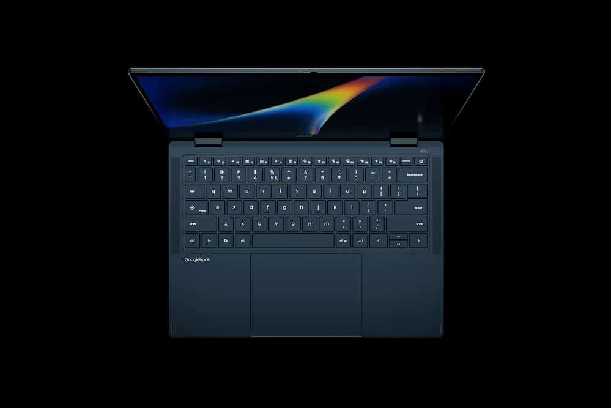
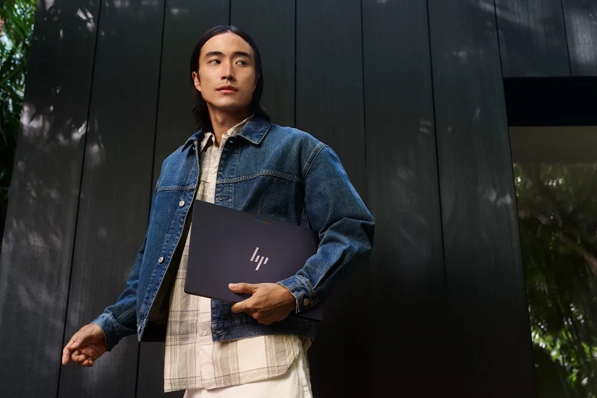

Google ha abierto las reservas de los cinco primeros **Googlebook**, la nueva categoría
de portátiles con la que la compañía quiere dejar atrás la etapa de los Chromebooks de
entrada. La tienda oficial ya muestra el catálogo completo, con precios que arrancan en
los 899 dólares y llegan hasta los 1.299, y concreta el hardware que firma cada
fabricante.

Tras la presentación de la marca en mayo y [la apertura de reservas del 21 de
septiembre](/noticias/googlebook-preorders-september-21/), lo que faltaba por conocer
era el detalle de cada modelo. Estos son los cinco equipos, sus precios y lo que
comparten.

## Cinco modelos y dos familias de procesadores

La primera hornada se reparte entre chips **Intel Core Ultra Serie 3** (arquitectura
Panther Lake) y **Snapdragon X Elite** de Qualcomm. MediaTek figura como socio, pero sus
procesadores no llegan en esta primera ola.

| Modelo | Precio desde | Pantalla | Procesador | RAM / Almacenamiento | Peso |
| --- | --- | --- | --- | --- | --- |
| Acer Googlebook 14 | 899 $ | 14″ OLED 2,8K táctil | Intel Core Ultra 5/7 Serie 3 | 16 GB / 256–512 GB | 1,13 kg |
| ASUS Googlebook 14 | 1.299 $ | 14″ OLED 2,8K táctil | Intel Core Ultra 5/7 Serie 3 | 16–32 GB / 256–512 GB | 1,00 kg |
| Dell XPS Googlebook | 1.199 $ | 13,4″ táctil 2,5K | Snapdragon X Elite | 16–32 GB / 512 GB o más | 1,00 kg |
| HP Googlebook 14 | 1.299 $ | 14″ OLED 2,8K táctil | Snapdragon X Elite | 16–32 GB / 256 GB–1 TB | 1,24 kg |
| Lenovo Googlebook 15 | 1.299 $ | 15,3″ OLED 2,8K táctil | Intel Core Ultra 5 Serie 3 | 16 GB / 256–512 GB | 1,22 kg |

Son precios de referencia en dólares para el mercado estadounidense. En el caso del Acer,
su precio de 899 dólares es una tarifa de lanzamiento por tiempo limitado, según ha
advertido la propia compañía.

## Lo que comparten todos los Googlebook

Google ha fijado un mínimo común para la categoría: **16 GB de RAM** (ampliables a 32 GB
en varias configuraciones), almacenamiento desde 256 GB —hasta 1 TB en el HP—, pantallas
táctiles, teclado retroiluminado y trackpad háptico de cristal. En la mayoría de los
casos el panel es **OLED de 2,8K**; la excepción es el Dell XPS, que recurre a una
pantalla LCD de 13,4 pulgadas y 2,5K para quedarse en torno a un kilogramo de peso.

Bajo el capó, las NPU dedicadas superan los **45 TOPS**, la cifra con la que la compañía
justifica ejecutar tareas de IA en local. La autonomía prometida por Google es de hasta
14 horas de vídeo y 16 horas de navegación, aunque algunos modelos declaran más según
sus fichas. Todos los diseños son **sin ventilador**, con materiales como aluminio,
aleación de magnesio y fibra de carbono.

El **Glowbar** vuelve como seña de identidad: la tira luminosa de la tapa se enciende al
arrancar, muestra el nivel de batería y reacciona cuando se habla con Gemini. Google ha
anunciado que abrirá una API para que los desarrolladores la aprovechen. En seguridad,
todos incorporan el chip **Titan** como raíz de confianza y lector de huellas; HP y
Lenovo añaden además desbloqueo facial.

El Acer es el único **convertible 2 en 1** de la tanda, mientras que el Lenovo es el
único con pantalla de 15,3 pulgadas y sonido **Dolby Atmos**.

## Gemini Intelligence manda en el software

El sistema, bautizado como **GooglebookOS**, combina la base técnica de Android con
cimientos de escritorio heredados de ChromeOS. Sobre esa mezcla se asienta **Gemini
Intelligence**, con funciones como **Magic Pointer** —al mover el cursor, Gemini aparece
y ofrece acciones sobre lo que hay en pantalla—, la creación de widgets mediante
instrucciones en lenguaje natural y **Rambler**, el dictado conversacional que la
compañía estrenó en los Pixel.

A nivel de aplicaciones, conviven el Chrome de escritorio con extensiones y la tienda
Google Play con apps de Android adaptadas a pantallas grandes. Para desarrollo, los
equipos incluyen Antigravity y un entorno Linux con terminal. La integración con el
móvil Android permite acceder a los archivos del teléfono y retomar tareas entre ambos
dispositivos.

Cada compra incluye **12 meses de Google AI Pro** (con 5 TB de almacenamiento y Gemini
Advanced), tres meses de YouTube Premium, Adobe Photoshop y CapCut, y un año de GeForce
Now. Google promete actualizaciones y novedades de sistema **hasta 10 años**.

## Cuándo llegan y qué pasa con España

Las reservas están abiertas desde el **21 de septiembre** en la Google Store, Best Buy y
otros distribuidores seleccionados. Los equipos llegarán a las tiendas el **4 de octubre
en Estados Unidos** y el **5 de octubre en Canadá, Reino Unido, Irlanda, Francia,
Alemania y Australia**.

**España no aparece en esa lista**, igual que el resto de mercados de habla hispana, y
tampoco hay precio en euros. Google mantiene por ahora los Chromebooks en el catálogo,
así que los Googlebook no los sustituyen: apuntan a otro tipo de usuario y a un
segmento de precio muy distinto, con el MacBook Air y los portátiles Windows premium
como rivales directos. Para quienes sigan el mercado español, la disponibilidad y el
precio en euros quedan pendientes de confirmación.
