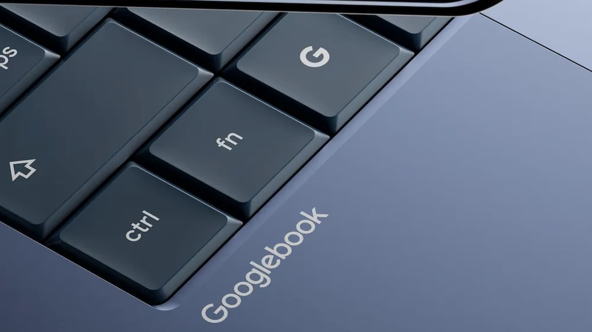

Google pondrá en marcha las reservas de sus primeros Googlebook, la nueva familia de
portátiles de gama alta con la que busca evolucionar el concepto del Chromebook. Las
personas inscritas para recibir actualizaciones sobre estos equipos fueron avisadas por
la propia compañía de que podrán asegurar una unidad a partir del **21 de septiembre a
las 9:00, hora del este de Estados Unidos**. La misma fecha aparece ya en el sitio oficial
de los dispositivos, según recoge *9to5Google* y amplía *Engadget*.

## Un sistema Android disfrazado de ChromeOS

La gran apuesta de esta línea es el sistema operativo: los Googlebook correrán una
versión de **ChromeOS construida sobre Android**, dentro de la estrategia de Google por
unificar ambos ecosistemas. Desde el anuncio de la marca, en mayo, la compañía no había
detallado demasiado qué esperar de estos equipos, pero el software sitúa a
**Gemini Intelligence** como el núcleo de la experiencia.

## Qué hará la IA en estos equipos

Uno de los rasgos más llamativos es el **Magic Pointer**. Al mover el cursor de forma
rápida, este se transforma en un puntero que, apuntado hacia cualquier elemento de la
pantalla, ofrece sugerencias contextuales sobre las acciones disponibles. A esto se suma
la posibilidad de **generar widgets personalizados** y una integración profunda con
teléfonos Android.

En el apartado de diseño, los equipos incorporan una franja luminosa en la tapa, bautizada
como *glowbar*, que los distingue de los Chromebook tradicionales.

## Cinco fabricantes, una misma plataforma

La primera hornada llegará de la mano de los fabricantes que ya producían Chromebooks:
**Acer, ASUS, Dell, HP y Lenovo** preparan sus propios modelos. Con esta combinación de
hardware de gama alta y un sistema Android con funciones de IA integradas, Google aspira
a competir en un segmento donde la integración con el móvil y la automatización por IA
serán, previsiblemente, el principal argumento de venta.
