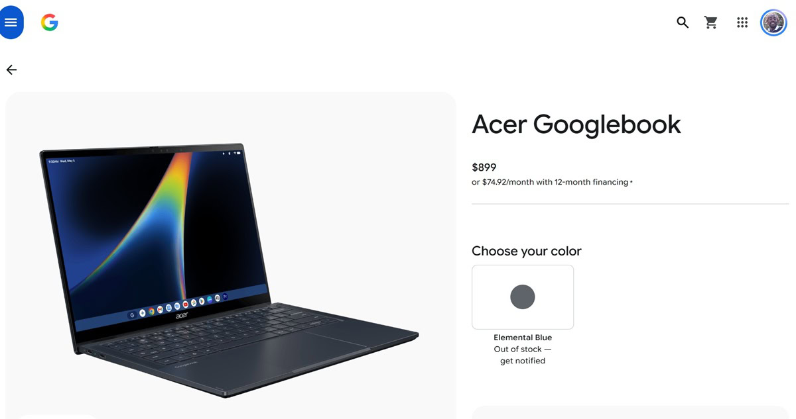
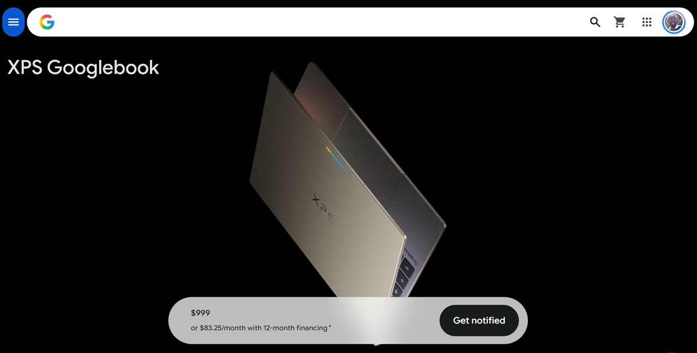
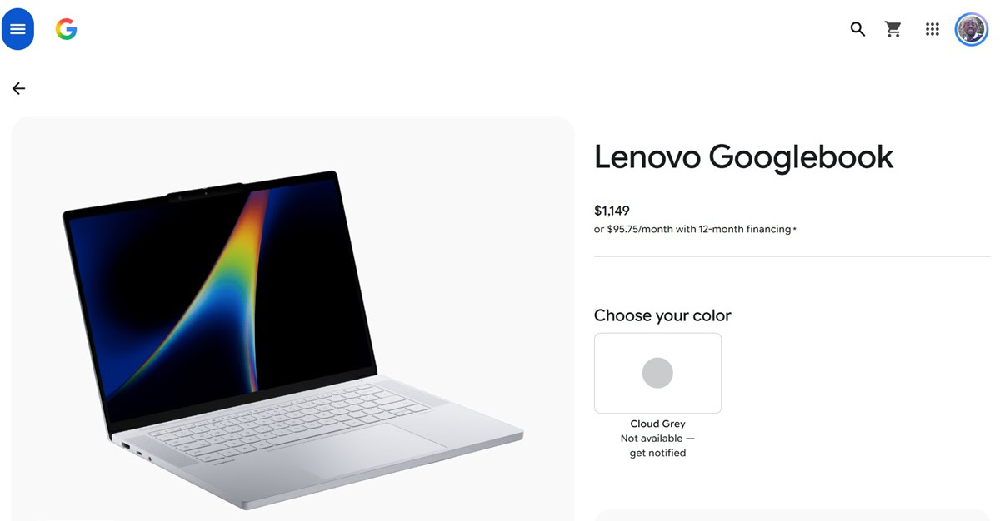

Los nuevos portátiles Googlebook han agotado las reservas en la tienda en línea de Google en Estados Unidos apenas unos días después de que se abrieran los pedidos anticipados el 21 de septiembre. Los tres modelos que la compañía vende directamente ya no aparecen disponibles, un arranque que apunta a una demanda mayor de la prevista o a un stock inicial limitado para esta nueva familia, que parte de los 899 dólares.

## Los Googlebook se agotan en la tienda de Google

La falta de stock la detectó un usuario de Reddit tras comprobar varias veces la tienda de Google y encontrar todos los modelos agotados, y otros usuarios del mismo hilo confirmaron la situación. Android Authority verificó después la tienda estadounidense y comprobó que los tres Googlebook que Google vende directamente —el Acer Googlebook, el Dell XPS Googlebook y el Lenovo Googlebook— ya no admiten reserva.

Llama la atención que Google solo comercialice esos tres modelos en su propia tienda, aunque la primera oleada de Googlebook incluye también equipos de HP y ASUS. Esa selección limitada podría explicar en parte que su asignación se haya agotado tan rápido.

## Demanda fuerte o stock inicial limitado

Con un precio de partida de 899 dólares, agotar las existencias de la tienda propia tan pronto después de la apertura de reservas es, en todo caso, una señal alentadora para una familia de portátiles completamente nueva. Queda por ver si responde a un aluvión de pedidos de usuarios dispuestos a probar la apuesta de Google por el portátil prémium o a que la compañía calculó las existencias pensando en un lanzamiento más tranquilo.

Cabe recordar que el Googlebook convive con el Chromebook tradicional y propone un enfoque distinto, con Android como sistema y funciones de inteligencia artificial integradas, como repasamos en la [comparativa entre Googlebook y Chromebook](/noticias/googlebook-vs-chromebook/).

## Qué opciones quedan para comprar un Googlebook

Quien quiera hacerse con uno de estos equipos todavía tiene alternativa: Best Buy sigue aceptando reservas de los modelos Googlebook, cuyo lanzamiento oficial está previsto para el 4 de octubre. La otra vía es esperar a que la tienda de Google reponga existencias con un nuevo lote antes de esa fecha.
