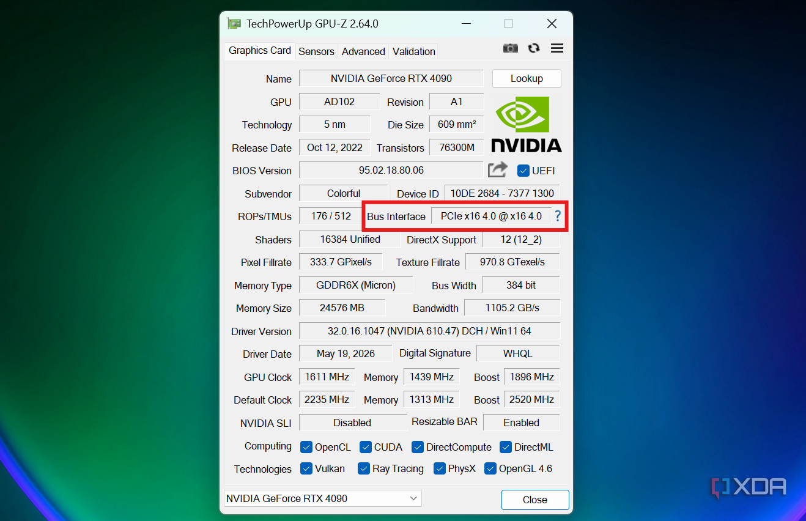
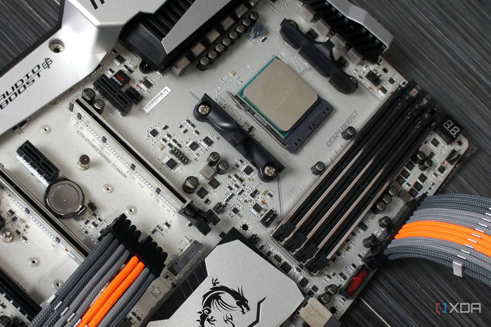
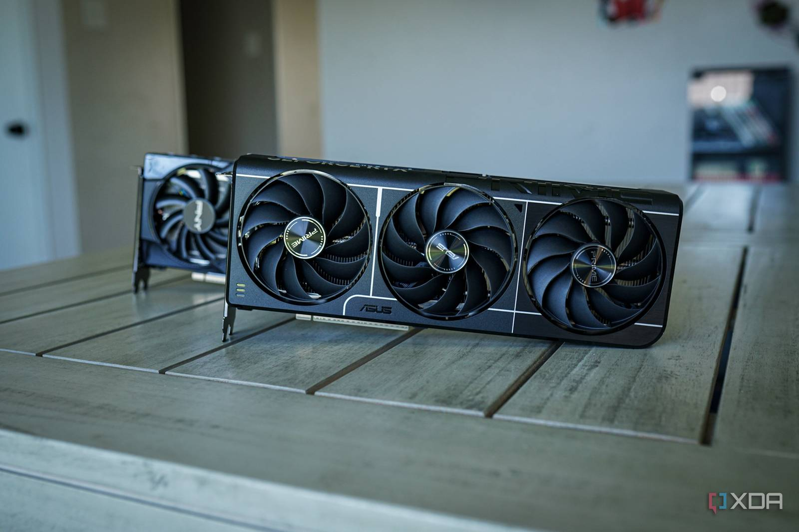
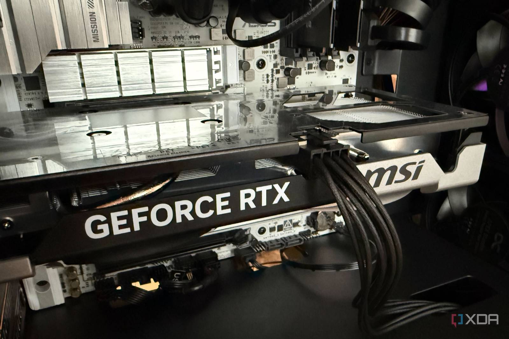
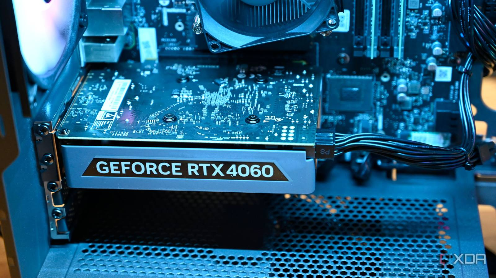
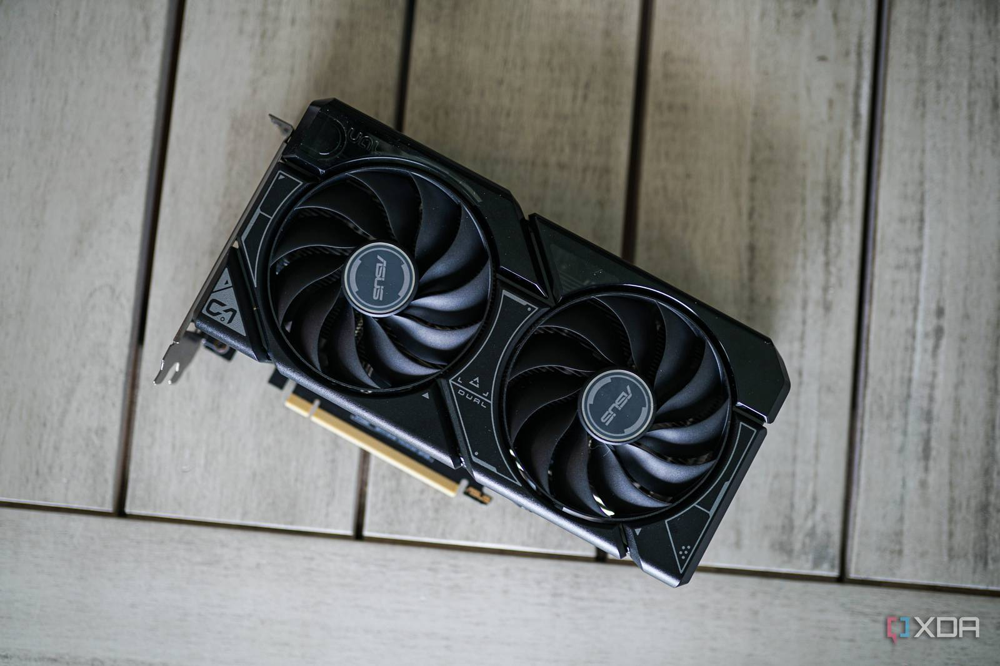

PCIe 3.0 lleva tanto tiempo entre nosotros que verlo en un equipo actual hace que toda la plataforma parezca antigua. Ya en 2012, un montaje con un i7-3770K incorporaba este estándar; desde entonces llegaron PCIe 4.0 y, en las placas base de gama mainstream, PCIe 5.0. Como las GPU actuales de Nvidia y AMD ya son PCIe 5.0, emparejar una de ellas con una placa limitada a PCIe 3.0 suena, a primera vista, a mala idea.

Los números teóricos refuerzan esa impresión: una ranura PCIe 3.0 x16 entrega a la tarjeta gráfica solo una cuarta parte del ancho de banda que obtendría de una PCIe 5.0 x16. Es fácil concluir que una interfaz obsoleta va a limitar seriamente a una RTX 50 o una RX 9000. Sin embargo, ese no es el mayor problema de usar una GPU moderna en una plataforma antigua, y desde luego no debería ser el único motivo para cambiar de placa base.

## El ancho de banda apenas importa al jugar

El error habitual es tratar el ancho de banda de PCIe como si fuera el de la memoria de la GPU. La tarjeta gráfica no está tirando constantemente de todo lo que necesita a través de la ranura mientras se juega: las texturas, los búferes de fotograma y la mayor parte de los datos con los que trabaja residen en su propia VRAM, cuyo ancho de banda es muy superior al de la interfaz. Incluso una GPU de entrada como la Radeon RX 9050 de 8 GB ronda los 288 GB/s de memoria, frente a los aproximadamente 64 GB/s por dirección que alcanza PCIe 5.0 x16.

PCIe sigue importando porque los datos tienen que moverse entre la GPU y el resto del sistema, pero un juego no va a consumir automáticamente cada gigabyte por segundo que ofrece la ranura. La RTX 5090 es la mejor prueba: pese a ser una tarjeta PCIe 5.0, las pruebas de *Gamers Nexus* encontraron solo en torno a un 1–4 % de diferencia entre PCIe 5.0 x16 y PCIe 3.0 x16 al jugar. Si eso ocurre con la GPU más rápida del mercado, no parece motivo suficiente para deshacerse de una placa base solo porque la tarjeta admita un estándar más nuevo.

## El resto de la placa es el verdadero cuello de botella

Si aún se usa una placa limitada a PCIe 3.0, lo más probable es que la CPU también sea antigua. Hay excepciones, como montar un 5800X3D en una placa X370 como actualización directa para estirar unos años más una plataforma AM4, pero quien siga con el procesador original de esa placa tiene muchas más probabilidades de que sea la CPU —y no la ranura— la que ahogue a una GPU moderna. Esto se nota especialmente en quienes buscan tasas de fotogramas altas a 1080p o 1440p.

Cuando la GPU queda infrautilizada porque la CPU no le da abasto, se pierde bastante más rendimiento del que se sacrifica por usar PCIe 3.0 x16. Y no es solo cuestión del procesador: la plataforma también arrastra velocidades PCIe 3.0 para el almacenamiento, memoria DDR4 y estándares USB antiguos. Incluso la conectividad de red ha avanzado mucho desde entonces, con placas más recientes que ofrecen 2,5 GbE y Wi-Fi 6 o 7. Ninguno de estos factores es decisivo por sí solo, salvo un cuello de botella serio de CPU, pero en conjunto conforman un argumento mucho más sólido para actualizar.

## Cuándo PCIe 3.0 sí puede ser un problema

Hay una salvedad importante: no todas las GPU emplean 16 carriles PCIe. La RTX 5060 Ti, por ejemplo, usa una interfaz PCIe 5.0 x8, de modo que instalarla en una ranura PCIe 3.0 la obliga a funcionar como PCIe 3.0 x8 y la deja con la mitad del ancho de banda de PCIe 3.0 x16, es decir, menos de 8 GB/s por dirección. Eso puede convertirse en un problema en cuanto se agota la VRAM, algo a lo que las GPU de 8 GB son propensas en juegos AAA.

Cuando un juego supera la VRAM disponible, parte de esos datos puede desbordarse a la memoria del sistema y la GPU tiene que acceder a ellos a través del bus PCIe. Con menos de 8 GB/s, esa transferencia empieza a notarse en las tasas de fotogramas, sobre todo en los mínimos del 1 %. La misma limitación afecta a la RTX 5060 y a la 4060, que también se quedan en 8 carriles y 8 GB de VRAM.

En cambio, mientras la GPU tenga 16 GB de VRAM y una interfaz x16, la diferencia entre PCIe 3.0 y PCIe 5.0 es lo bastante pequeña como para no importar.

## Qué significa para el lector

La conclusión es que el problema es la plataforma, no la ranura. Las cifras de ancho de banda hacen que PCIe 5.0 parezca un salto enorme, pero si la GPU no necesita todo ese caudal al jugar, da bastante igual que la ranura se quede en PCIe 3.0. Quien siga con una plataforma tan antigua tiene asuntos más relevantes que atender: rendimiento de CPU, de memoria, velocidad de almacenamiento y conectividad de red.

Cuando esos factores empiezan a frenar el equipo, ahí sí merece la pena plantearse el cambio de placa base. PCIe 5.0 llegará de propina, pero conviene tratarlo como un extra frente a todo lo demás que aporta una plataforma mucho más reciente.
