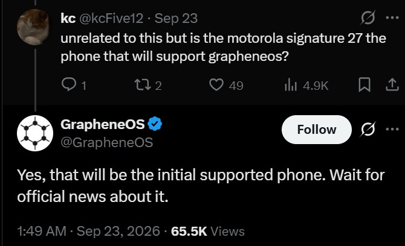

Durante años, instalar **GrapheneOS** obligaba a una única elección de hardware: un **Google Pixel**. Ese cerrojo está a punto de romperse. La comunidad que desarrolla este sistema operativo centrado en la privacidad y la seguridad ha confirmado que el **Motorola Signature 27** será su primer teléfono compatible fuera de la familia Pixel, después de que [Motorola presentara el dispositivo](/noticias/motorola-signature-27-snapdragon-8-elite-extreme/) hace unos días.

## El Signature 27 será el primer Motorola compatible con GrapheneOS

La confirmación no llegó por un comunicado, sino a través de una respuesta en X. Un usuario preguntó al proyecto si el Signature 27 admitiría GrapheneOS, y la respuesta fue afirmativa: el equipo lo describió como «el teléfono compatible inicial» y pidió esperar noticias oficiales al respecto.

Ese matiz es importante. Por ahora **no hay fecha de disponibilidad** ni está claro si Motorola venderá el terminal con el sistema ya instalado o si la compatibilidad se ofrecerá como una instalación manual, como ocurre hoy con los Pixel.

## Por qué hasta ahora solo funcionaba en Pixel

GrapheneOS no es una versión «ligera» de Android: es un sistema distinto, mantenido al margen de Google, que reescribe partes profundas de la plataforma para reforzar la seguridad y reducir la recolección de datos. Ese enfoque exige un hardware que cumpla requisitos muy concretos.

Según ha explicado el propio proyecto, sus exigencias incluyen **etiquetado de memoria por hardware** (memory tagging), una integración sólida del **elemento seguro** del teléfono y **siete años de actualizaciones** reales. Hasta ahora, los Pixel eran los únicos que cubrían todos esos puntos, lo que explicaba esa dependencia de un solo fabricante.

La asociación con Motorola busca precisamente abrir el abanico. El proyecto ya avanzó que sus primeros terminales Motorola serían **gamas altas**, porque los chips Snapdragon de gama alta de Qualcomm son los que hoy ofrecen las funciones de seguridad y el soporte a largo plazo que necesita.

Sobre el papel, el Signature 27 cumple: monta el **Snapdragon 8 Elite Extreme Gen 6** y Motorola promete **siete actualizaciones del sistema operativo** y hasta **siete años de parches de seguridad**. El plan original situaba un **flagship convencional** (no plegable) como primer paso, antes de extender la compatibilidad a los plegables de Motorola.

## El trasfondo: la relación cada vez más tensa con Google

El anuncio llega en un momento delicado entre GrapheneOS y Google. El proyecto se ha encontrado con obstáculos para llevar su sistema al **Pixel 11** por el soporte de MTE, ha criticado el nuevo proceso manual para acceder al código fuente de los controladores de los Pixel y ha acusado a la compañía de **restringir ciertas API y parches de seguridad de Android 17**.

A eso se suma un esfuerzo paralelo por depender menos de los servicios de Google. GrapheneOS trabaja en renovar su **aplicación de mensajería** y en añadir **soporte nativo de RCS**, además de sustituir apps antiguas de AOSP e incorporar funciones de privacidad como el pegado seguro.

## Qué cambia para el usuario

Para quien busca un Android sin ataduras de Google, la noticia elimina la pregunta de siempre: **ya hay una alternativa al Pixel**, aunque todavía en el aire. Hasta que el proyecto publique fechas y condiciones, la compatibilidad es una promesa confirmada, no un producto listo para comprar.

Lo prudente, por tanto, es esperar al anuncio oficial antes de decidir una compra: aún no se sabe cuándo llegará el soporte, si el Signature 27 se venderá con GrapheneOS preinstalado ni qué ocurrirá con la garantía y las actualizaciones en ese escenario. Lo que sí queda claro es la dirección: GrapheneOS quiere dejar de ser un sistema atado a un solo fabricante.

Quien busque reducir su dependencia de Google encontrará margen más allá del sistema operativo: en el día a día también pesa el [software de código abierto que instalamos en el teléfono](/noticias/open-source-android-apps/).
