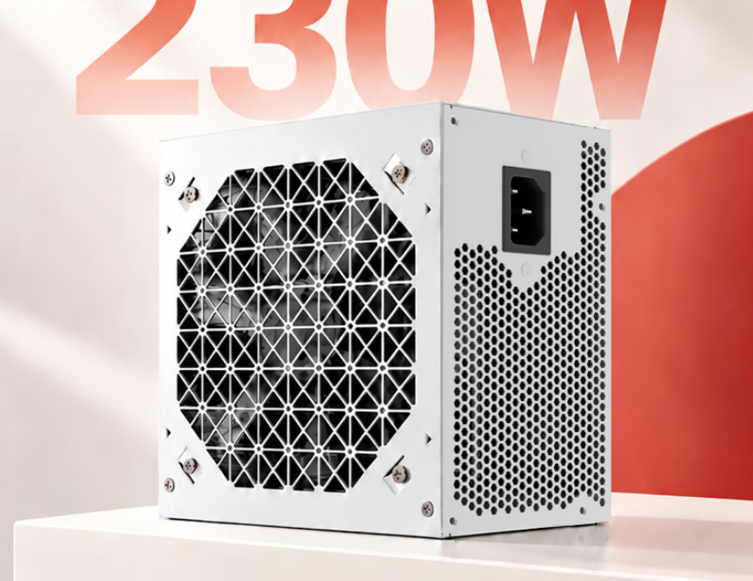
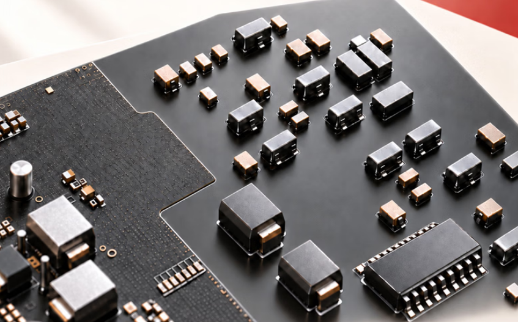
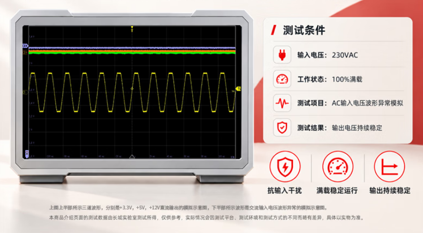

Great Wall ha puesto a la venta en China una fuente de alimentación compacta de 230 W pensada para equipos básicos y entornos exigentes. La unidad destaca por su recubrimiento de triple protección en la placa de circuito, se vende por 149 yuanes e incluye tres años de garantía, según informa MyDrivers.

## Una fuente de 230 W con recubrimiento triple

La fuente Great Wall de 230 W utiliza una carcasa metálica con rejillas de ventilación en forma de panal en la parte superior y trasera para favorecer la disipación del calor. El cableado interno recurre a un diseño de cables de colores y, como detalle a tener en cuenta, el fabricante no incluye el cable de alimentación de corriente alterna en la caja: hay que adquirirlo por separado.

El elemento diferencial está en el interior. La placa de circuito impreso lleva un recubrimiento de triple protección contra insectos, humedad y polvo, pensado para evitar averías provocadas por plagas, ambientes húmedos o acumulación de suciedad y para mantener un funcionamiento estable en condiciones adversas.

## Especificaciones y protecciones eléctricas

En el plano eléctrico, la unidad cumple con la nueva norma nacional china, ofrece una potencia nominal de 230 W y emplea un diseño de carril único de 12 V con una salida de 19,16 A. Admite una entrada de tensión amplia de 180 a 240 V y, según el fabricante, funciona con normalidad en entornos situados hasta 5.000 metros de altitud.

El circuito integra cuatro mecanismos de protección: sobretensión (OVP), sobrecorriente (OCP), sobrepotencia (OPP) y cortocircuito (SCP).

## Qué cambia para el lector

No es una fuente para un equipo de juegos exigente, y tampoco pretende serlo: con 230 W apunta a ofimática, equipos compactos y renovaciones de bajo consumo. Su argumento es la durabilidad en entornos complicados —talleres, locales con polvo o zonas húmedas— donde el recubrimiento protector puede marcar la diferencia frente a una fuente genérica del mismo rango.

De momento solo se ha anunciado su venta en la tienda JD en China por 149 yuanes, sin noticias de disponibilidad oficial en España. Es el extremo opuesto de lanzamientos recientes como [la fuente de 850 W con certificación 80 PLUS Ruby](/noticias/fsp-fuente-80-plus-ruby-850w/): aquí no se compite en eficiencia ni en potencia, sino en resistencia al entorno. Quien monte un equipo básico podrá tomarla como referencia de lo que ofrece hoy la gama de entrada con protecciones completas y garantía de tres años.
