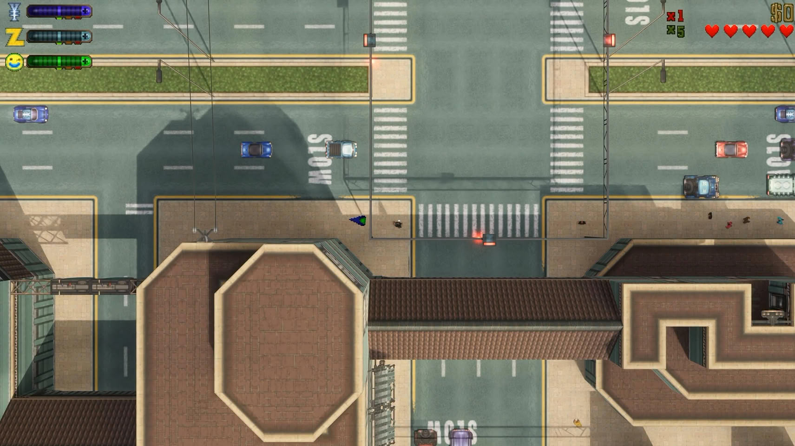
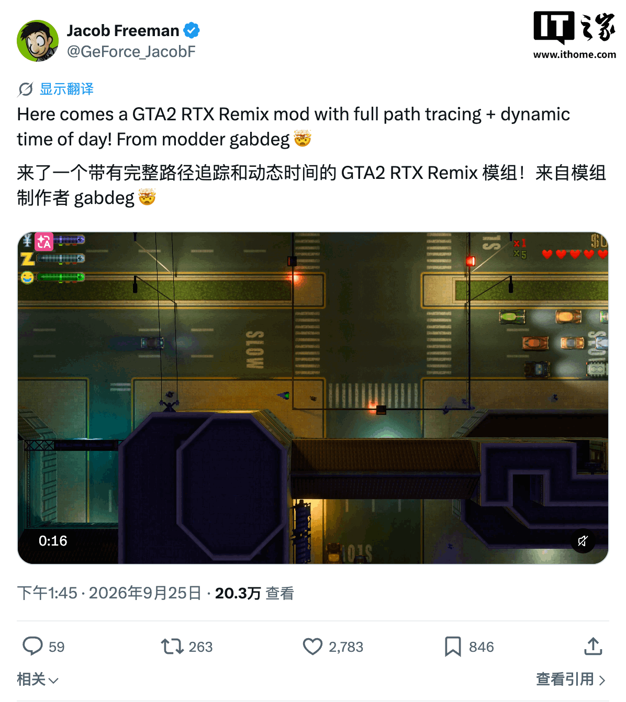
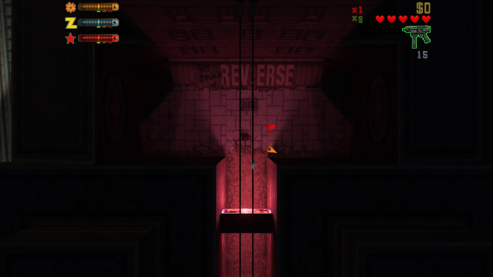
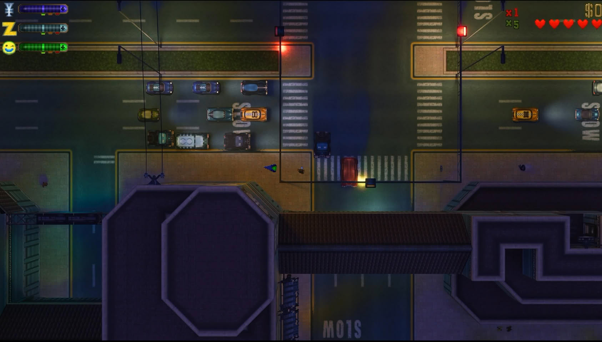

El modder conocido como gebdag ha publicado **GTA2 RTX Remix**, una modificación para *GTA 2* que, según su autor, incorpora iluminación con trayecto de rayos (*path tracing*) y un ciclo dinámico de día y noche al clásico cenital de 1999. La información la recogió ITHome a partir del reportaje de TechPowerUp, y el embajador de GeForce de NVIDIA Jacob Freeman compartió una demostración del mod en X el 25 de septiembre.

GTA 2 se lanzó en 1999 y sigue siendo un juego cenital en 2D, veintisiete años después. Fue *GTA 3*, publicado en 2001, el que abrió la etapa tridimensional de la saga, así que la mejora llega justo al lado contrario de aquel salto gráfico.

## Un envoltorio propio de Direct3D 9 para que RTX Remix entienda a GTA 2

El escollo principal era técnico. GTA 2 se apoya en DirectDraw y en una versión temprana de Direct3D, dos interfaces que RTX Remix no admite de forma nativa. Para sortear esa limitación, gebdag construyó con dos DLL una capa envolvente (*wrapper*) de Direct3D 9 a medida, encargada de traducir las llamadas de renderizado originales del juego a un formato que la herramienta de NVIDIA sabe interpretar.

Según el desarrollador, esa adaptación permite obtener iluminación con trayecto de rayos en tiempo real: las explosiones, los vehículos en llamas y los rótulos de neón iluminan por sí mismos su entorno, mientras que la luz general varía con la alternancia entre día y noche. Conviene leerlo con cautela, porque GTA 2 es un título en 2D isométrico y no una escena tridimensional con geometría como la que RTX Remix suele procesar: lo que la fuente describe es el resultado que el modder reporta, no una reconstrucción del render original.

Jacob Freeman publicó en X un clip de 16 segundos con el mod en marcha.

## 16:9, ciclo día-noche y hasta 60 FPS

Más allá de la iluminación, el mod desbloquea el formato panorámico 16:9 —el original solo admitía 4:3— e incorpora generación de fotogramas para alcanzar hasta 60 FPS, muy por encima de lo que lograba la versión de 1999. Las capturas que acompañan la noticia muestran cómo se comporta la nueva iluminación a plena luz del día y de noche.

## Requisitos y descarga de GTA2 RTX Remix

GTA2 RTX Remix está publicado como código abierto en GitHub. gebdag probó el mod sobre la versión 9.6 de GTA 2, la edición que Rockstar distribuyó de forma gratuita en 2004, y para ejecutarlo hace falta Windows 10 o Windows 11 de 64 bits junto con RTX Remix instalado.

Es un caso más dentro de la racha de mods que aplican *path tracking* a títulos que pocos pensaban volver a tocar: por ejemplo, [un mod de path tracing y DLSS 5 ya llevó a Dark Souls 3 a otro nivel visual](/noticias/dark-souls-3-path-tracing-dlss-5/).
