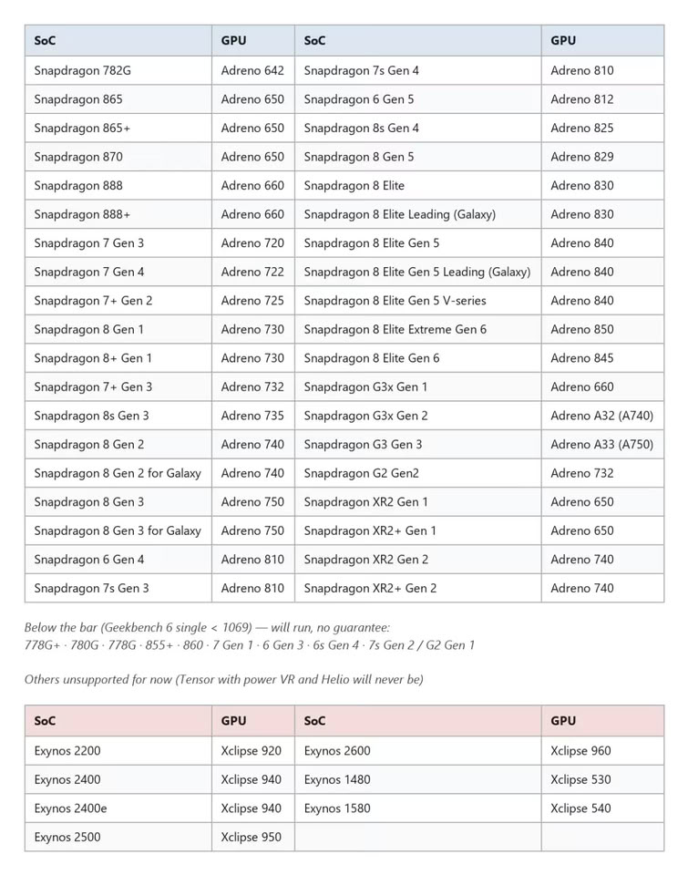

Grand Theft Auto 5 podría jugarse pronto en el bolsillo sin depender de emuladores de Windows. Según TechPowerUp, M0jso, el desarrollador de Paralympics Productions que ya consiguió mover el juego de forma nativa en la Nintendo Switch original, trabaja ahora en un port no oficial para Android. El proyecto se encuentra en una fase temprana y todavía no tiene fecha de lanzamiento.

La noticia llega apenas unos días después de que ese mismo modder demostrara GTA 5 corriendo en el hardware de Switch, y confirma una tendencia: los esfuerzos de la comunidad por llevar títulos de gran presupuesto a plataformas para las que nunca fueron pensados.

## Nativo sobre Arm, no una capa de compatibilidad

La diferencia clave frente a soluciones como Winlator es el enfoque técnico. Winlator ejecuta la versión de Windows del juego a través de capas de compatibilidad, lo que añade sobrecarga y suele lastrar el rendimiento. Este proyecto, en cambio, se construye para correr de forma nativa sobre Arm, la arquitectura que domina el mercado móvil.

Según TechPowerUp, el port parte de la misma base que la versión para Switch, que a su vez se apoya en GTA 5 Legacy 1.0.2699 y en el código fuente filtrado en 2023. Ese detalle explica por qué el trabajo avanza rápido entre plataformas: buena parte del esfuerzo pesado ya está hecho.

## Requisitos altos y muchos móviles fuera

El listón de entrada no es bajo. Los requisitos mínimos apuntan a un Snapdragon 865, 8 GB de RAM y 65 GB de almacenamiento libre, con compatibilidad que se extiende hasta los Snapdragon de las series 7 y 8 más recientes. La primera compilación pública será exclusiva para chips Snapdragon, lo que deja fuera de salida a los Exynos (1480, 1580, 2200, 2400 y 2600), a los Tensor de Pixel con gráficos PowerVR y a los MediaTek Helio. La compatibilidad con GPU Mali llegaría más adelante.

La propia lista del proyecto recoge qué chips quedan por debajo del umbral y, por tanto, no ofrecen garantías de funcionamiento. Merece la pena recordar que 65 GB de almacenamiento es una cifra que muchos móviles de gama media no pueden permitirse una vez descontado el sistema y las aplicaciones habituales.

## Qué significa para el jugador hispanohablante

La noticia es interesante, pero conviene ponerla en contexto. Hablamos de un proyecto no oficial, sin respaldo de Rockstar Games ni de Take-Two, y con una base de código filtrada, lo que lo sitúa en un terreno legal delicado y sin garantías de continuidad. Tampoco hay fecha de lanzamiento ni una versión pública verificable, así que lo prudente es tratar cualquier promesa de rendimiento como provisional hasta verla en acción.

Dicho esto, el movimiento apunta a algo más grande: los móviles de gama alta actuales ya tienen potencia de sobra para títulos que hace unos años exigían una consola o un PC. Si el port acaba funcionando en dispositivos con Snapdragon, la pregunta dejará de ser si GTA 5 cabe en un teléfono y pasará a ser cuánto tarda la industria en ofrecerlo de forma oficial. Por ahora, toca esperar y seguir el proyecto con escepticismo sano.
