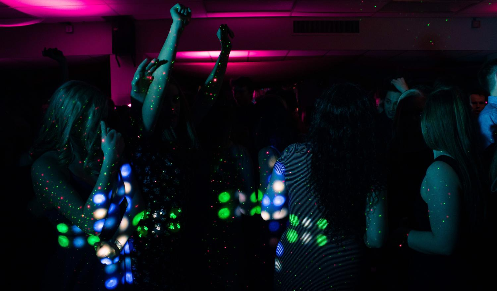
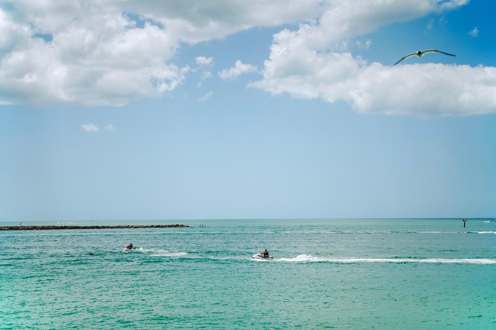
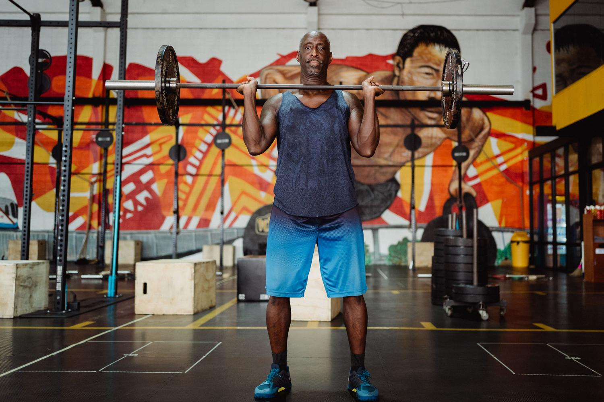

GTA 6 no se juega solo a golpe de misión principal. Según lo mostrado en los adelantos y en el gameplay extendido, el estado de Leonida estará repleto de actividades secundarias y minijuegos pensados para que Jason y Lucía puedan olvidarse de sus asuntos criminales durante horas. El mapa promete ser el doble de grande que el de la entrega anterior y esa escala se traduce en una densidad de ocio que va del plan más tranquilo a la adrenalina más pura.

Esta guía reúne, por bloques, todo lo que se ha podido ver sobre esas actividades. Conviene aclarar desde el principio que Rockstar Games todavía no ha publicado un listado oficial y detallado de cada minijuego: lo que sigue es un recorrido por lo que apuntan los avances, no un manual con pasos cerrados.

## Adrenalina sobre ruedas y en el aire en GTA 6

El componente competitivo vuelve con fuerza. Además de las clásicas carreras nocturnas por el asfalto de Vice City, se espera que haya circuitos profesionales de corte similar a Daytona y pistas de motocross. La conducción apunta a tener más peso realista, con diferencias claras entre un deportivo ágil y un SUV pesado, de modo que elegir bien el vehículo importará.

Para quien prefiere las alturas, el cielo de Leonida sería el escenario de salto base y paracaidismo, una forma de explotar la verticalidad del mapa. En otro orden de cosas, se ha mencionado la posibilidad de reunir piezas sueltas para dedicarse a la reconstrucción de coches clásicos, una actividad más profunda pensada para quien disfrute coleccionando vehículos con historia.

## Vida nocturna y ocio urbano

La ciudad ofrece un abanico amplio de planes. Se podrán visitar discotecas y clubes de striptease para bailar y gastar dinero, o simplemente tomar algo en un bar. Para los ratos más tranquilos aparecen opciones cotidianas como el billar, el minigolf o el baloncesto en canchas callejeras, ese tipo de detalle que ayuda a que el mundo se sienta creíble.

El teléfono móvil seguirá siendo el centro de la vida social: permitiría hacer scroll en redes y ver cómo las acciones del jugador afectan a su popularidad en línea. A esto se suman mecánicas más curiosas, como espiar a los vecinos y a otros personajes no jugables, lo que podría derivar en situaciones inesperadas o en misiones improvisadas.

## Naturaleza, fauna y deportes acuáticos de Leonida

Leonida es un estado de pantanos y costas, y eso se traduce en una cantidad de animales sin precedentes. El estudio de las criaturas se apoyaría en un registro de colección similar al de Red Dead Redemption 2, con especies que irían desde perros callejeros a los que se puede acariciar hasta cocodrilos e iguanas. La pesca deportiva funcionaría como actividad relajante para pasar el rato junto al agua.

En el apartado acuático las opciones serían variadas: navegar en kayak o en moto de agua, probar el hidrodeslizador o practicar buceo en cuevas submarinas. Para quien prefiera quedarse en tierra, tomar el sol en la playa queda como opción de descanso entre atraco y atraco.

## Progreso físico y crimen organizado

Una de las vueltas más esperadas es la del gimnasio. Jason y Lucía podrían entrenar con pesas para tonificar el cuerpo, con un aspecto físico que cambiaría según el ejercicio y la dieta, recuperando la esencia de San Andreas. Ese entrenamiento no sería solo estético: influiría en la capacidad física de los personajes durante la partida.

El crimen sigue siendo el motor del juego. Los atracos a tiendas y bancos serían más flexibles, permitiendo planear la huida y elegir la estrategia más limpia. Robar coches dejaría de ser pulsar un botón: los vehículos de lujo tendrían sistemas de seguridad complejos que exigirían herramientas específicas para evitar que salte la alarma.

## Otras distracciones y detalles

Más allá de los grandes bloques, los avances dejan entrever un puñado de distracciones sueltas:

- Prácticas de tiro en galerías especializadas para mejorar la puntería.
- Uso de patinetes eléctricos para moverse por las zonas urbanas.
- Interacciones con animales callejeros, como alimentarlos o jugar con ellos.
- Ver la televisión y apostar en juegos de azar.

## Limitaciones y qué conviene tener en cuenta

- **No es un manual con pasos.** Rockstar no ha publicado un desglose oficial de menús, ajustes ni secuencias para estas actividades, así que aquí no hay rutas ni combinaciones concretas que seguir: lo que recoge esta guía es la información difundida en los adelantos y el gameplay extendido.
- **Puede cambiar antes del lanzamiento.** Al tratarse de funciones mostradas en material de avance, es posible que algunas actividades, nombres o mecánicas se recorten, se retrasen o directamente no lleguen a la versión final.
- **Alcance del contenido.** El detalle disponible se centra en qué actividades existirán y en cómo se describen, no en recompensas, ubicaciones exactas ni requisitos de desbloqueo, datos que todavía no se conocen.
- **Sin confirmación independiente.** Las cifras y afirmaciones más llamativas, como el tamaño del mapa o el nuevo peso de la conducción, proceden de la propia campaña de comunicación del juego y aún no se han podido comprobar en una versión final.

Para poner la saga en contexto mientras llega el lanzamiento, puedes repasar el [port no oficial de GTA 5 para Switch y su salto a Android](/noticias/gta-5-switch-port-android/), un ejemplo de hasta dónde llega el interés por la franquicia fuera de las plataformas oficiales.
