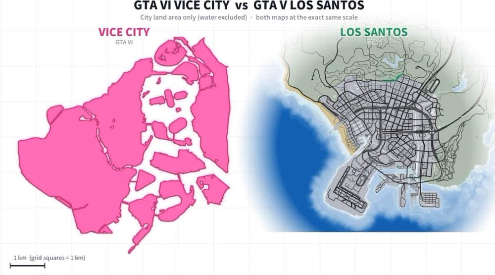

A menos de dos meses de su lanzamiento previsto, GTA 6 sigue alimentando todo tipo de cábalas sobre el tamaño de su mundo. La última llega de la mano de la propia comunidad: una comparativa sitúa Vice City en unos 16,6 km², frente a los 9,1 km² de Los Santos de GTA 5, lo que dejaría a la nueva ciudad en torno a un 81 % por encima de la anterior.

El cálculo no procede de Rockstar Games, que todavía no ha publicado un mapa oficial del juego, sino de una estimación ciudadana. Conviene tratarla, por tanto, como una aproximación y no como una cifra confirmada.

## Una comparativa de la comunidad mide Vice City frente a Los Santos

El punto de partida es un vídeo creado por el usuario de Reddit u/Haykguy, que en lugar de colocar los dos mapas uno al lado del otro superpone el contorno de Los Santos sobre la reconstrucción del mundo de GTA 6. Ese ejercicio visual permite calibrar cuánto espacio ocuparía Vice City dentro del estado ficticio de Leonida.

La referencia empleada es el Community Mapping Project, el trabajo colaborativo con el que los aficionados intentan reconstruir la geografía del juego a partir de los materiales publicados. De ahí salen las superficies que maneja la comparativa: 16,6 km² para Vice City y 9,1 km² para Los Santos.

## Qué revela la comparativa y qué deja fuera

La comunidad ha recibido el vídeo con interés, pero también ha señalado sus límites. El propio autor aclara que se centró en la zona claramente urbana de ambas ciudades y que no incluyó ninguna superficie de agua, un detalle relevante si se tiene en cuenta que Leonida contará con playas y ríos que ampliarían el recuento.

Entre los comentarios también se apunta que faltan áreas de Los Santos como Vinewood Hills y El Burro Heights, lo que según algunos usuarios acercaría bastante las cifras de ambos mapas. El creador mantiene, aun así, que Vice City seguiría siendo considerablemente más grande incluso sumando esas zonas.

## Qué significa para quien vaya a jugarlo

Más allá del número exacto, la comparación refuerza una idea que Rockstar ya ha anticipado con sus avances: Leonida no se limita a Vice City, sino que se extiende por un territorio mucho más amplio. Si la estimación se confirma, recorrer el mapa a pie o en vehículo exigirá bastante más tiempo que en GTA 5, algo que encaja con la densidad de actividades que se espera encontrar.

Para quien planee exprimir el juego, el aviso es el de siempre: cualquier cifra que no venga de Rockstar es provisional. La escala real, y con ella la magnitud real del mapa, solo quedará clara cuando el título llegue al mercado. Mientras tanto, si te interesa todo lo que se podrá hacer en ese mundo, puedes repasar la [guía de actividades secundarias y minijuegos de GTA 6](/noticias/gta-6-actividades-secundarias/).
