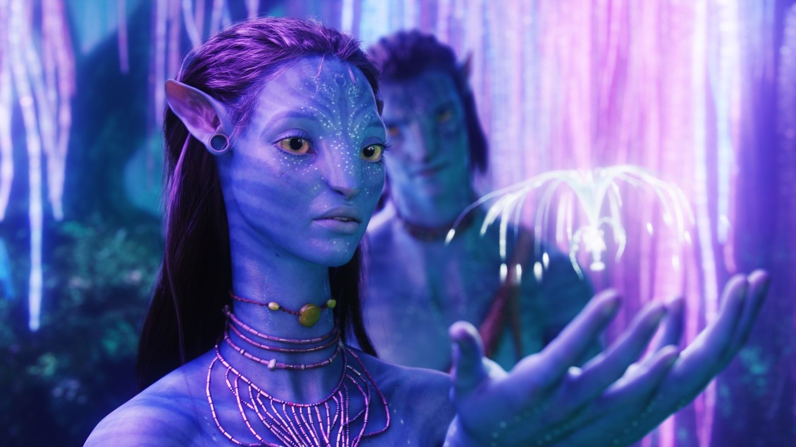

Circula un nuevo rumor sobre GTA 6: unas supuestas impresiones de un medio francés que participó en un avance del juego describen sus primeros minutos como un impacto comparable al de ver Avatar en el cine en 2009. **No hay confirmación oficial de Rockstar**, y la información llega a través de una cadena de intermediarios, así que conviene leerla como lo que es: un rumor exultante, no un veredicto.

## Qué se afirma en la supuesta filtración del avance de GTA 6

Según la versión que circula, recogida por Gamersky a partir de una información de Playground, un periodista de un medio francés que asistió a una sesión de prueba del juego habría compartido sus sensaciones: los primeros minutos de partida le habrían producido una conmoción cultural parecida a la del estreno de la película de James Cameron. El relato evita deliberadamente hablar de resolución o tasa de imágenes y pone el acento en la sensación de entrar en un mundo virtual inédito.

Siempre según esa misma versión, el periodista consideraría que GTA 6 no es una simple evolución de la entrega anterior, sino el inicio de una etapa nueva para la saga y quizá para el género. La palabra más repetida sería «inmersión»: el estado de Leonida —su ambientación, su nivel de detalle y sus posibilidades de interacción— estaría a un nivel tal que muchos jugadores podrían pasar decenas de horas paseando, observando la simulación de vida y experimentando con el mundo, dejando incluso de lado la historia principal.

## Por qué estas impresiones importan, con cautela

El rumor encaja con un patrón verificable: Rockstar lleva semanas enseñando el juego a la prensa de forma controlada. IGN publicó en agosto un avance exclusivo tras visitar Rockstar North, y el 25 de septiembre se conocieron las impresiones del medio francés Troiscouleurs, que habló de un nuevo estándar de espectacularidad tras media hora de juego. Que exista una ronda de avances reales hace plausible que circulen más testimonios, pero también hace más difícil distinguir una impresión auténtica de una exageración amplificada por cada intermediario de la cadena.

Hay otro motivo para la prudencia: ni Playground ni el medio francés original han publicado, que se sepa, el testimonio completo y verificable, y Rockstar no ha confirmado ni desmentido nada. Las comparaciones con hitos culturales como Avatar son, además, el tipo de declaración imposible de comprobar antes del lanzamiento. El dato sólido más cercano sigue siendo el calendario oficial que maneja la prensa: el número especial de Game Informer con 14 páginas sobre el juego sale el 29 de septiembre, y el lanzamiento está previsto para el 19 de noviembre en PS5 y Xbox Series X|S.

## Qué cambia para el lector

De momento, nada en firme: si estas impresiones resultan ser ciertas, apuntarían a un GTA 6 centrado en la densidad del mundo más que en la potencia bruta, donde perderse por [Vice City y sus alrededores](/noticias/gta-6-mapa-vice-city/) sería tan atractivo como avanzar en la campaña. Pero hasta que Rockstar o medios con el material publicado de forma abierta lo corroboren, la lectura sensata es mantener la expectación bajo control y no dar por confirmados ni el tono ni el alcance de estas supuestas impresiones. Quien siga la actualidad del juego tiene una cita más fiable a la vuelta de la esquina: el reportaje de Game Informer del 29 de septiembre, con imágenes inéditas y entrevistas directas con los desarrolladores.
