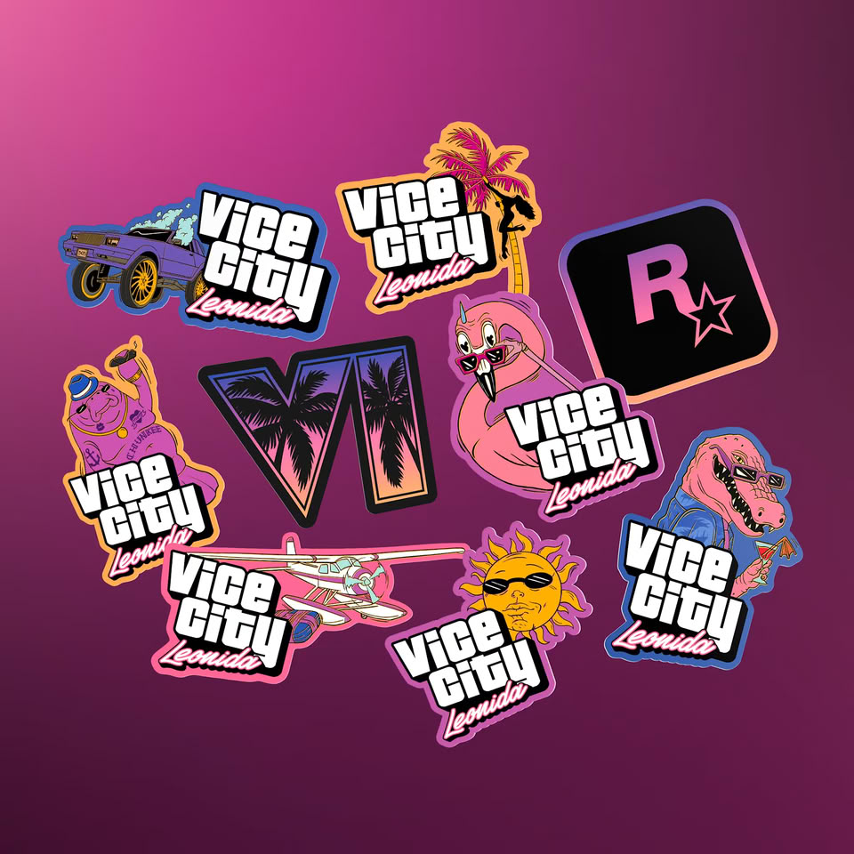

Rockstar Games ha abierto las reservas de la caja coleccionista de GTA 6, la Grand Theft Auto VI: The Goodtime State – Vice City Collection, con un precio de 399,99 dólares en Estados Unidos y 349,99 libras en el Reino Unido. A pesar de su apariencia, no se trata de una edición coleccionista del juego: la propia tienda de Rockstar advierte de que GTA 6 se vende por separado, así que la caja no contiene ni disco ni código de descarga.

## Qué incluye la Vice City Collection de GTA 6

La colección reúne 11 artículos inspirados en Macca the Gator, una serie ficticia de televisión ambientada en Leonida, el estado donde transcurre el juego. El contenido combina piezas de coleccionista con accesorios de marcas externas.

Entre los artículos principales figuran una figura de Macca the Gator con base de apertura giratoria, unas gafas de sol Oakley Frogskins, un bolso cruzado Leonida Keys y una gorra snapback New Era 9FORTY. Los objetos menores son un espejo magnético, un vaso de chupito de Chunkee the Manatee, una cucharilla de cóctel de Vice City y un llavero con forma de cuchilla. El conjunto se completa con nueve pines esmaltados, nueve pegatinas de vinilo y un póster de doble cara con el mapa de Leonida.

## Una caja sin juego, sin envío gratis y solo para adultos

Rockstar clasifica la colección como artículo de coleccionista para adultos a partir de 18 años y avisa de que no admite envío gratuito. Según la información recogida por TechPowerUp, los envíos están previstos para el 19 de noviembre, la misma fecha en la que GTA 6 llegará a PS5 y Xbox Series X|S.

El precio del juego va aparte: la edición estándar cuesta 79,99 dólares y la Ultimate Edition, 99,99 dólares. Incluso las copias físicas prescinden del disco e incluyen únicamente un código de descarga en la caja.

## Qué cambia para el lector en España

Para quien juegue en consola en España, el cálculo es doble: a los cerca de 400 euros que marca la tienda europea hay que sumar el precio del juego y los gastos de envío. La caja solo tiene sentido como objeto de colección, no como forma de hacerse con GTA 6.

La colección se enmarca en una ofensiva de mercancía más amplia: Rockstar también anunció un álbum de GTA 6 con una edición en vinilo que alcanza los 125 dólares. Y para ir conociendo el escenario, el mapa de Vice City sería un 81 % más grande que Los Santos según una comparativa de la comunidad que analizamos en [el mapa de GTA 6 frente a Los Santos](/noticias/gta-6-mapa-vice-city/).
