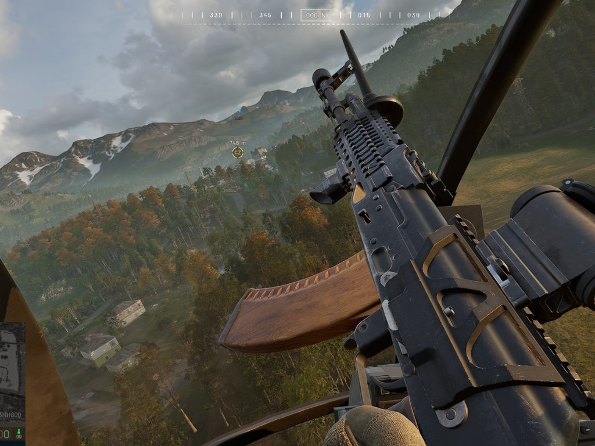

Joe Brammer, director ejecutivo de Bulkhead y productor ejecutivo de Wardogs, ha salido a defender el plan de subida de precio de su shooter en acceso anticipado y, de paso, ha lanzado un dardo a Rockstar: considera que GTA 6 podría salir al mercado con un precio demasiado bajo, algo que a largo plazo perjudicaría a toda la industria. Las declaraciones proceden de una entrevista con GamesRadar+ recogida por ITHome.

## Precio escalonado: de 40 a 60 dólares a medida que crece el juego

Wardogs se vende actualmente en acceso anticipado en Steam por 39,99 dólares. Según explicó Brammer, el plan es subirlo a 49,99 dólares cuando el juego alcance la versión 0.5, dentro de unos doce meses, y a 59,99 dólares con la versión 1.0 definitiva, prevista para dentro de unos dos años. El directivo lo describió como un modelo de «precio por etapas»: quien quiera entrar barato puede hacerlo ahora, y quien prefiera esperar a que haya más contenido pagará más tarde un precio mayor.

Brammer fue tajante con quienes critican la estrategia: el juego vale ese precio y, si a alguien no le convence, que no lo compre. Argumentó que Bulkhead se mueve entre el desarrollo independiente y el doble A, y que un shooter en primera persona con ese nivel visual y físico exige mucho tiempo y dinero, aun controlando los salarios del equipo. Añadió que el estudio quiere sentar un precedente: a ese precio, el jugador debe esperar una calidad acorde. En la red social X insistió en que no hay ningún secreto: en septiembre del año que viene el precio será de 49,99 dólares.

## Por qué el precio de GTA 6 preocupa a los estudios medianos

La parte más polémica de la entrevista es su valoración de GTA 6. Rockstar confirmó en junio un precio de 80 dólares para la edición estándar y de 99,99 dólares para la Ultimate, con lanzamiento previsto para noviembre en PlayStation 5 y Xbox Series X y S. Para Brammer, incluso esa cifra —la más alta que ha puesto un juego de Rockstar a su edición base— se queda corta para el fenómeno que es GTA 6, y teme que fije un techo que el resto de estudios no podrá superar aunque sus costes sigan subiendo.

El contexto le da peso al aviso: GTA 6 llega tras más de una década de espera y con unos costes de desarrollo sin precedentes, y aun así no rompió la barrera de los 100 dólares que algunos analistas pronosticaban. Si el mayor lanzamiento de la historia del entretenimiento no normaliza precios más altos, los estudios medianos como Bulkhead tendrán aún más difícil justificar subidas como la de Wardogs. No es la primera vez que el sector debate este techo: el mapa de GTA 6 y su escala ya alimentan la conversación sobre [lo que Rockstar pone sobre la mesa con Vice City](/noticias/gta-6-mapa-vice-city/).

## Qué cambia para el lector

Para quien juegue en consola, el mensaje es doble. A corto plazo, GTA 6 mantendrá su precio de salida en 80 dólares y nada de lo dicho por Brammer lo va a cambiar. A medio plazo, en cambio, conviene leer entre líneas: si la industria asume que ni siquiera GTA puede pasar de cierta cifra, la presión se trasladará a otras vías de ingreso —ediciones especiales, contenido descargable y monetización dentro del juego— en lugar de al precio base.

En PC, el caso Wardogs deja una referencia clara de cómo leer un acceso anticipado con precio creciente: entrar ahora significa pagar lo mínimo a cambio de un juego incompleto, y esperar significa pagar más por un producto más terminado. Ninguna de las dos opciones es una oferta: es una decisión de compra informada, y el propio estudio pide que se tome como tal.
