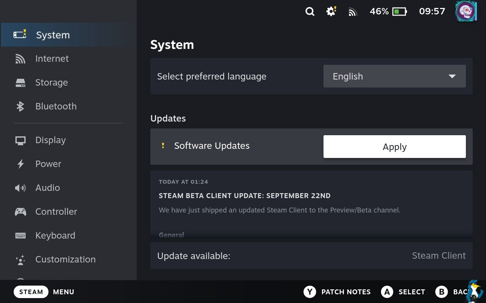
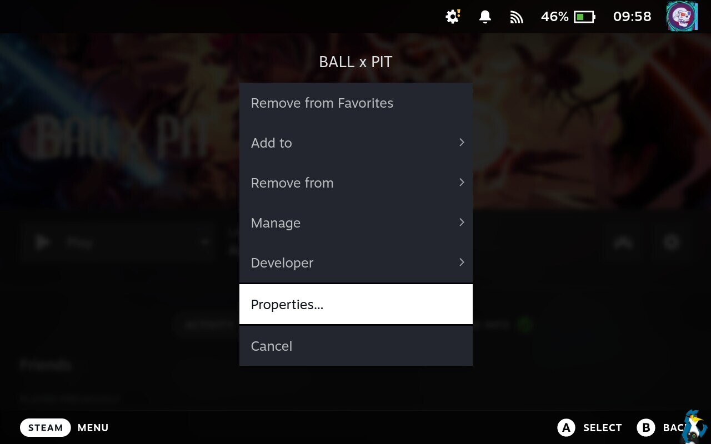
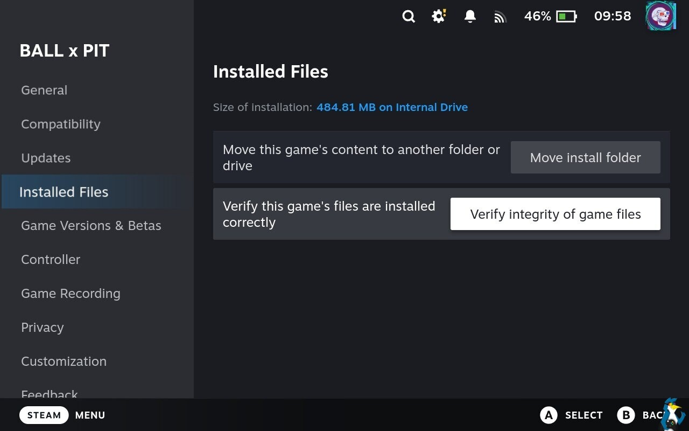
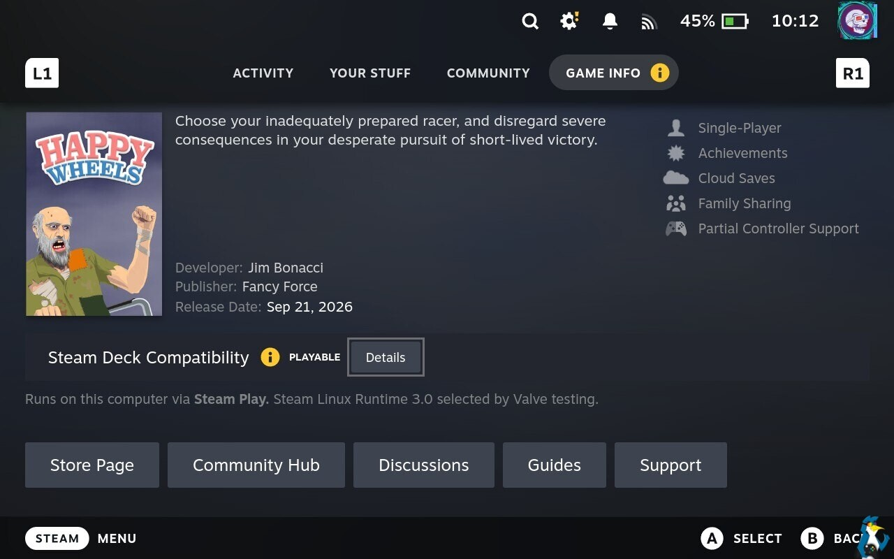
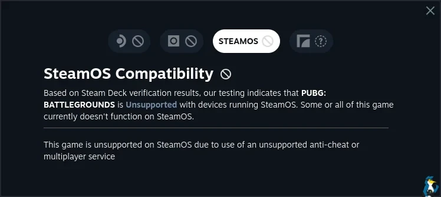

Que un juego no arranque en un dispositivo con SteamOS es uno de los fallos más frustrantes para quien juega en Steam Deck, Steam Machine o Steam Frame. La buena noticia es que, en la mayoría de los casos, el problema no está en el juego ni en el hardware, sino en algo del sistema que se puede corregir en unos minutos.

Esta guía reúne, en orden de menor a mayor esfuerzo, las comprobaciones que suelen resolver un arranque fallido. Está pensada para cualquier dispositivo con SteamOS, desde la Steam Deck hasta la Steam Machine de sobremesa, y no requiere herramientas externas ni conocimientos avanzados de Linux.

Antes de empezar conviene tener presente una excepción: hay juegos protegidos con **anti-cheat** que directamente no funcionan en SteamOS, por mucho que se ajuste todo lo demás. Si tu título entra en esa categoría, ninguno de los pasos siguientes lo hará arrancar.

## Paso 1: reiniciar el dispositivo

Es lo primero que suena obvio, pero es también lo que más veces soluciona el problema. El culpable habitual es el **modo de suspensión** de SteamOS, que a veces no vuelve a cargar todo correctamente al despertar.

Reinicia el dispositivo por completo y vuelve a probar el juego. Si esto lo arregla, una costumbre útil es apagarlo del todo en lugar de dejarlo en suspensión.

## Paso 2: buscar actualizaciones de SteamOS y del juego

Un fallo de arranque puede venir de un componente del sistema que se quedó atrás. Entra en los ajustes del sistema y busca actualizaciones: pueden faltar correcciones de SteamOS, del **kernel de Linux**, del controlador gráfico **Mesa** y de otros componentes.

Si estás en el canal de actualizaciones **Beta o Preview**, prueba a volver al canal **Stable** para ver si el problema desaparece. Si estás en Stable, la prueba contraria también vale: pasar a Beta o Preview y volver a cambiar cuando quieras.

Además, abre la sección de **Descargas** de Steam y comprueba si el juego tiene una actualización pendiente.

## Paso 3: verificar los archivos del juego

A veces una actualización no se aplica bien: hay archivos que no llegan a descargarse o que se corrompen por un corte de red o un problema del sistema. Verificar los archivos del juego comprueba que todo esté correcto.

El proceso puede tardar un rato, sobre todo en juegos grandes y más aún si están instalados en una tarjeta SD. Para lanzarlo, abre las propiedades del juego en tu biblioteca y busca la opción de verificar los archivos instalados.

## Paso 4: probar otra versión de Proton

**Proton** es la capa de compatibilidad que ejecuta juegos de Windows sobre SteamOS. Algunas versiones funcionan mejor que otras, así que cambiar la que usa un juego concreto es una de las pruebas más eficaces.

Valve etiqueta una versión concreta de Proton para los juegos que han pasado su verificación. A veces hará falta una versión más nueva, porque el juego se actualizó, y otras una más antigua, porque Valve rompió algo en una reciente.

Antes de tocar nada, una advertencia importante: si el juego usa **Denuvo**, cambiar varias veces la versión de Proton puede dejarte fuera de él durante 24 horas. Cambiar la versión de Proton de un juego es sencillo y está explicado en [otra guía de GamingOnLinux](https://www.gamingonlinux.com/guides/view/how-to-change-the-proton-version-on-linux-steamos-and-steam-deck/).

## Paso 5: probar GE-Proton

Algunos juegos incluyen archivos multimedia que no se reproducen en las versiones oficiales de Proton de Valve, y eso puede impedir que el juego avance. **GE-Proton** incorpora cambios específicos para estos casos, así que merece la pena probarlo si la versión oficial se queda atascada.

La instalación de GE-Proton también está cubierta en [una guía aparte de GamingOnLinux](https://www.gamingonlinux.com/guides/view/how-to-install-ge-proton-on-steam-deck-steamos-linux/).

## Paso 6: versión nativa de Linux frente a Proton

Algunos juegos tienen versión nativa para Linux y otros no; de ahí existe Proton. Lo que ocurre es que, a veces, una de las dos versiones funciona mejor que la otra, así que conviene comprobar cuál estás usando.

Abre el juego en tu biblioteca de Steam, desplázate hasta la pestaña de información del juego y mira qué aparece. Si ves algo como **Steam Linux Runtime** con un número de versión, estás usando la versión nativa: prueba a cambiar a Proton para ver si mejora. Si el juego tiene versión de Linux, la prueba inversa también vale.

## Paso 7: comprobar si el juego es compatible

Valve mantiene su propio sistema de verificación para Steam Deck, Steam Machine, SteamOS y Steam Frame. Si un juego figura como **no compatible**, puede que no haya nada que hacer.

Aun así, el sistema no es perfecto: hay juegos marcados como no compatibles que en realidad funcionan sin problemas. Merece la pena probarlo antes de darlo por perdido.

## Paso 8: revisar las opciones de lanzamiento y los problemas conocidos

Algunos juegos necesitan **opciones de lanzamiento personalizadas** para arrancar, por ejemplo para saltarse un launcher que no funciona. Si ya habías añadido unas cuantas, prueba a quitarlas y ver qué pasa: a veces son ellas las que estorban.

También puede ocurrir que el juego tenga problemas conocidos con soluciones ya publicadas. Dos sitios útiles son [ProtonDB](https://www.protondb.com/), donde otros usuarios comparten qué configuración les funcionó, y el [rastreador oficial de errores de Proton en GitHub](https://github.com/ValveSoftware/Proton/issues), donde se puede reportar cada caso directamente a Valve.

## Paso 9: pedir ayuda

Si después de todo sigues atascado, siempre queda preguntar a la comunidad. GamingOnLinux atiende dudas en su [foro](https://www.gamingonlinux.com/forum/), su [servidor de Discord](https://discord.gg/AghnYbMjYg) y su [subreddit](https://www.reddit.com/r/gamingonlinuxsub/).

## Cómo verificar que funcionó

La comprobación es la misma en todos los pasos: después de cada cambio, vuelve a lanzar el juego desde la biblioteca de Steam y confirma que llega a la pantalla de inicio o al menú principal. Si antes se cerraba sin más y ahora avanza, la corrección ha servido.

Como los pasos van de menor a mayor esfuerzo, lo habitual es parar en cuanto el juego arranque, sin necesidad de llegar al final de la lista.

## Advertencias y limitaciones

- **El anti-cheat no se puede sortear con estos ajustes.** Los juegos con sistemas anti-cheat incompatibles con SteamOS seguirán sin funcionar aunque se cambie Proton o se verifiquen los archivos.
- **Cuidado con Denuvo al cambiar de Proton.** Alternar varias veces la versión puede bloquear el acceso al juego durante 24 horas.
- **Verificar los archivos puede tardar.** Cuanto más grande sea el juego, y más aún si está en tarjeta SD, más tiempo llevará el proceso.
- **El sistema de compatibilidad de Valve no es infalible.** Un juego marcado como no compatible puede funcionar igualmente, y uno verificado puede dar problemas puntuales.
- **Estos ajustes no sustituyen a un restablecimiento completo.** Si el problema es de fondo y ningún cambio lo resuelve, restablecer la Steam Deck de fábrica es la última opción; lo contamos paso a paso en [nuestra guía para restablecer la Steam Deck](/noticias/steam-deck-factory-reset/).
