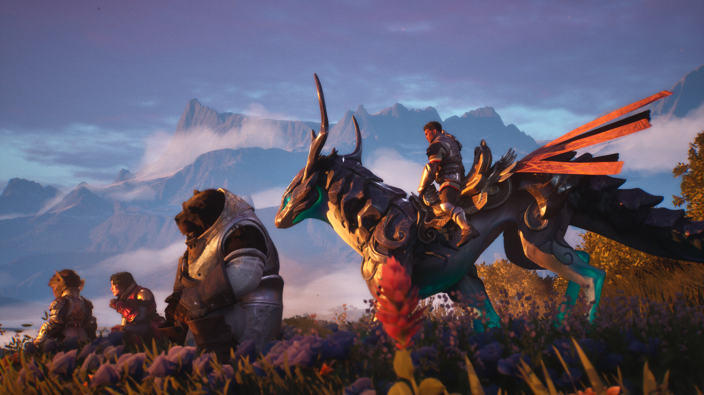

ArenaNet ha mostrado una versión temprana de *Guild Wars 3* durante una presentación guiada en la Gamescom a la que asistió TechRadar Gaming. De ese primer vistazo salen dos decisiones que definen el proyecto: una interfaz deliberadamente más despejada que la del MMO medio y el salto de la franquicia a consola por primera vez. El jefe de estudio, Colin Johanson, advirtió que el HUD todavía está sujeto a cambios a lo largo del desarrollo, pero dejó clara la intención del equipo.

## Un HUD con bastante menos interfaz

Johanson explicó que el objetivo es tener "bastante menos interfaz en general". En otros títulos del género, como *World of Warcraft* o *Final Fantasy 14*, lo habitual es una pantalla principal llena de listas de misiones, mejoras y penalizaciones, barras de acción y los elementos que cada jugador decide añadir. En *Guild Wars 3* esa carga se reduce de forma notable.

El propio responsable del estudio describió el punto de partida: en los MMO tradicionales "hay una enorme cantidad de iconos repartidos por toda la pantalla que sirven para comunicar el estado del combate y todo lo que está pasando". La apuesta de ArenaNet es un HUD más limpio que deje ver mejor el combate y el mundo abierto, y que además resuelva un problema práctico: quien juega con mando no puede pasar el cursor por encima de los iconos para leerlos.

## El combate se cuenta en el mundo, no en iconos

La reducción de la interfaz no consiste solo en ocultar elementos, sino en trasladar información al propio escenario. Los estados que en otros MMO aparecen como iconos apilados en el HUD, como los ataques de frío, se representarán visualmente sobre los personajes.

"Construimos un sistema de combos multijugador para sustituir eso", explicó Johanson. Al acumular frío sobre un enemigo, sus animaciones empiezan a ralentizarse y el hielo se extiende por su cuerpo; varios jugadores pueden coordinarse y, si se acumula suficiente frío, el enemigo se congela en un bloque de hielo sólido, un efecto que depende de su tamaño. Todo ocurre en el mundo del juego en lugar de en un pequeño icono en la parte inferior de la pantalla.

El responsable del estudio añade que el resultado se nota en las pruebas: "vemos que la gente ahora mira el combate real que ocurre en pantalla en lugar de quedarse mirando la interfaz todo el tiempo". Según Johanson, la limitación del mando empujó al equipo a diseñar una versión del combate que también resulta mejor con ratón y teclado, y hay "muchas cosas que simplemente no estarán en la interfaz porque no necesitan usarse".

## Consola por primera vez: PS5 y PC, sin Xbox

El otro gran anuncio es que *Guild Wars 3* será el primer juego de la saga en lanzarse a la vez en consola y PC. Durante la presentación, Johanson lo relacionó directamente con el alcance del proyecto: "con nosotros llevando el juego a consola por primera vez, y con el lanzamiento en Steam desde el primer día en nuestra propia plataforma, podemos llegar a un grupo mucho más amplio de jugadores".

Las plataformas confirmadas son PlayStation 5 y PC. Por ahora no está claro si el juego podría recibir más adelante una versión para Xbox. La entrega se sitúa 1000 años antes del primer *Guild Wars*, en la antigua tierra de Orr, lo que la convierte en una precuela.

## Qué cambia para el jugador hispanohablante

Este doble movimiento importa porque baja las barreras de entrada. Al ser una precuela, no hace falta haber jugado a los dos primeros títulos para entender la historia. "Todos van a aprenderlo todo juntos, y si eres un gran fan de *Guild Wars* reconocerás algunas especies, personajes o lugares", señaló Johanson, que insistió en que "en la mayor parte de los casos, todo el mundo parte en igualdad de condiciones".

La intención declarada del estudio es que esta sea la puerta de entrada a la franquicia para quien nunca la ha tocado: "queríamos ofrecer una invitación para que todo el mundo venga a jugar a *Guild Wars 3* juntos y sienta que este puede ser su primer juego de *Guild Wars*". Conviene recordar que el título sigue en desarrollo, no tiene fecha de lanzamiento y su beta está prevista para el otoño de 2027, por lo que tanto el HUD como el resto de sistemas pueden cambiar antes de llegar a las tiendas.
