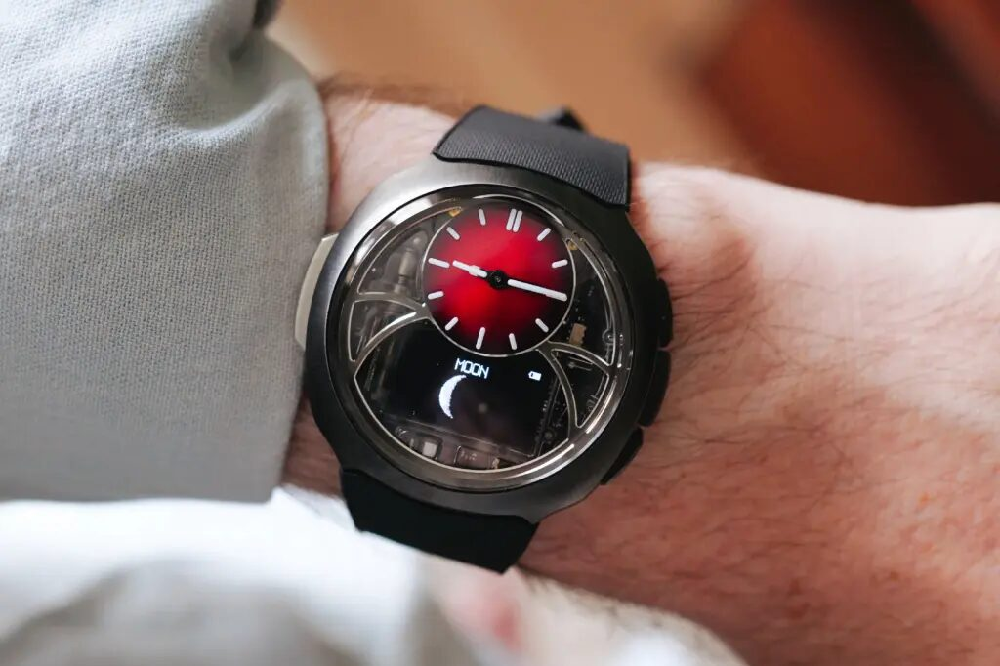
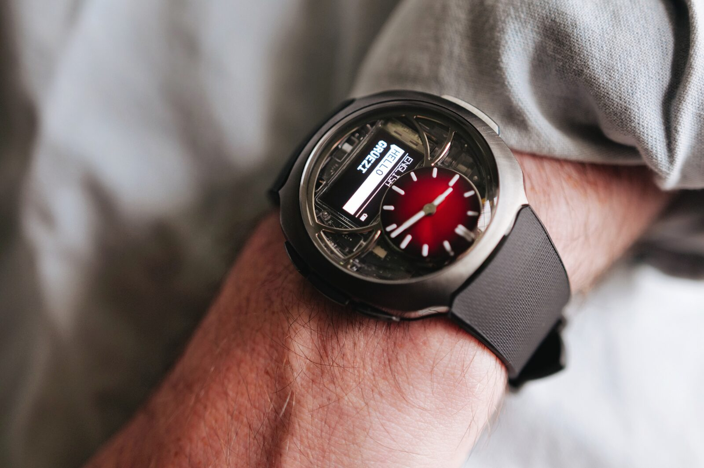
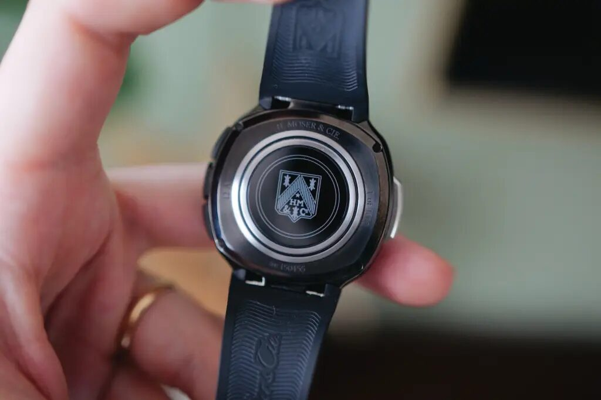
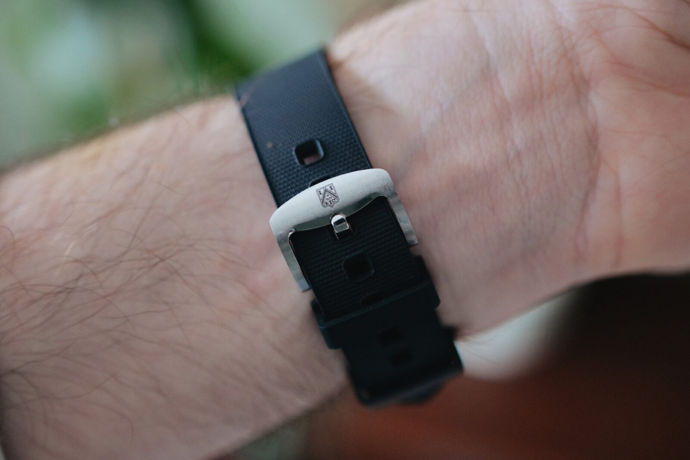
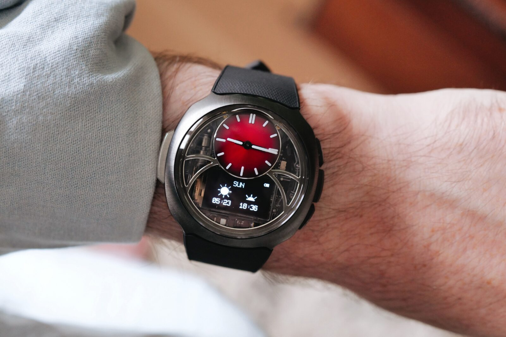
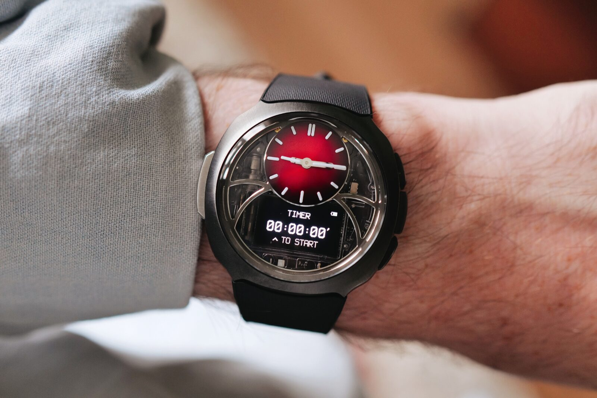
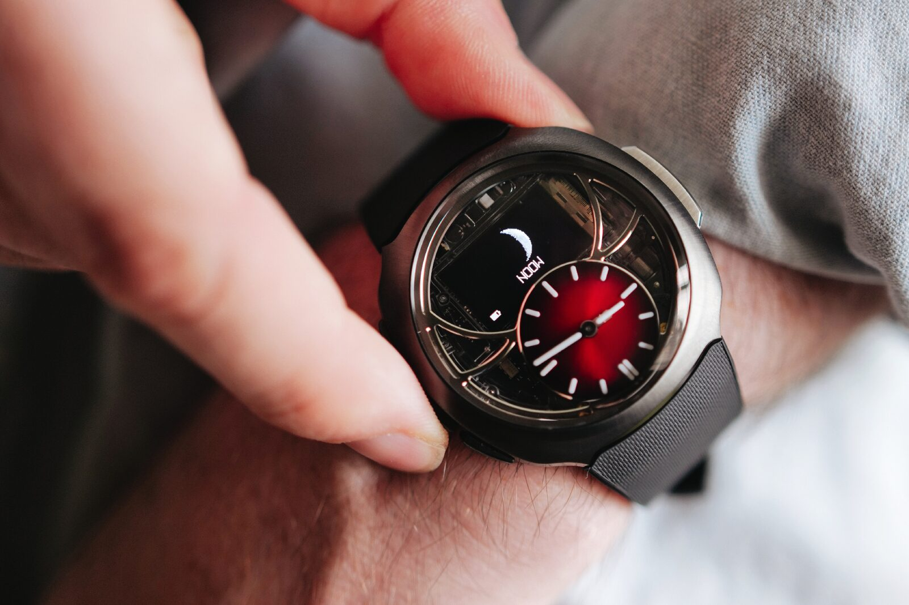

H. Moser & Cie. es una de esas firmas suizas que ha construido su reputación despojando el reloj mecánico hasta dejarlo en lo esencial. Ahora ha trasladado esa misma idea al terreno digital con el **Off-Grid**, un reloj de agujas con pantalla integrada que se conecta por Bluetooth al móvil y ofrece aplicación propia para iOS y Android. La marca, sin embargo, rechaza la etiqueta de smartwatch: lo sitúa deliberadamente a mitad de camino entre un reloj inteligente y uno mecánico.

La pieza se ha dado a conocer en una reseña publicada por **Stuff** y firmada por Spencer Hart, que la ha llevado durante una semana y la describe como el reloj digital más premium que ha probado. Su tesis es también el eje de esta categoría: el atractivo del Off-Grid no está en hacer más cosas que un smartwatch, sino en hacer deliberadamente menos.

## De la parrilla de Fórmula 1 a la muñeca

El Off-Grid no nace de la nada. Sus raíces están en la colaboración de H. Moser & Cie. con Alpine en la Fórmula 1, una asociación que Hart conoció de primera mano en el Gran Premio de Silverstone. El año pasado, esa alianza produjo las ediciones **Streamliner Alpine Drivers y Mechanics**, una pareja de relojes que se vendía junta por **59.000 francos suizos** y se limitó a 200 unidades. La versión Drivers era un cronógrafo mecánico esqueletizado pensado para los pilotos; la Mechanics, su contraparte digital, estaba dirigida al equipo de boxes.

El Off-Grid desciende precisamente de esa edición Mechanics, lo que también explica su nombre. La marca juega con un doble sentido: desconectarse del ruido de la tecnología siempre activa y, a la vez, quedar fuera de la parrilla de la Fórmula 1. Ese guiño resume bien la propuesta, un reloj tecnológico que reivindica la pausa.

## Qué gana y qué pierde el Off-Grid frente a un smartwatch

Aquí está la decisión de fondo de todo reloj híbrido. Bajo la esfera esqueletizada del Off-Grid se esconde una pantalla digital, y el reloj suma Bluetooth, compatibilidad con iOS y Android y una aplicación móvil. A cambio, renuncia de forma explícita a lo que define a un smartwatch convencional: no hay seguimiento de actividad física, ni sensor de frecuencia cardíaca, ni un flujo constante de notificaciones.

Lo que ofrece en su lugar es un repertorio de complicaciones clásicas en formato digital: función **GMT** con selector de país, cronógrafo de segundas partidas, calendario perpetuo, fase lunar perpetua programada con un siglo de antelación, alarma por vibración y temporizador. En palabras del reseñista, es "una gran complicación en formato digital". A ello se añade el modo que da nombre al reloj: al pulsar el botón de las 9 en punto aparece un selector de país junto a un diccionario integrado de diez palabras o frases traducidas a 21 idiomas, un detalle que Hart describe como útil para viajar y, a la vez, casi un juguete para matar el tiempo en un vuelo largo.

Hart admite que no es entusiasta de los smartwatches que llaman la atención y que cubre sus necesidades de actividad física con anillos inteligentes. Por eso conecta con el planteamiento de Moser: la idea de que la inteligencia a veces consiste en saber cuándo parar le resulta refrescante. Es una postura personal, no una medida objetiva, pero dibuja bien el hueco de mercado de este tipo de pieza.

Quien busque el extremo opuesto encontrará propuestas como el [Moto Watch Ultra con Wear OS y LTE](/noticias/moto-watch-ultra-lte/), que apuesta por la pantalla, las aplicaciones y la conectividad constante. En la otra dirección, dispositivos como la [Garmin CIRQA sin pantalla](/noticias/garmin-cirqa-screenless-band/) persiguen una discreción parecida, aunque por la vía de eliminar el panel por completo en lugar de esconderlo.

## Diseño, calibre D10 y meses de autonomía

A distancia, el Off-Grid se confunde con un Streamliner de la propia casa. Es fino, está bien construido y su correa de caucho es, según Hart, una de las más cómodas que ha probado. La caja mide **42,6 mm** de diámetro y **14,4 mm** de grosor, aunque en la muñeca se percibe más compacto de lo que sugieren esas cifras.

La firma ofrece dos acabados. El primero, referencia **6DI0-1202**, combina acero con tratamiento PVD azul, esfera fumé negra y correa de caucho blanca integrada: es el más deportivo. El segundo, referencia **6DI0-1205**, apuesta por el acero PVD negro con esfera fumé roja y correa negra, y es el favorito del reseñista. En ambos, el pequeño subdial abovedado de las 12 en punto lleva el logotipo de H. Moser & Cie. en laca transparente.

Uno de los detalles que más valora Hart es que las placas de circuito y las baterías quedan a la vista a través de la esfera esqueletizada. Su pega principal es la integración de la pantalla: cuando está apagada, añade, se convierte en un rectángulo negro en medio de la esfera que choca con el cuidado detalle mecánico del resto.

En el apartado técnico, bajo la esfera late el calibre **D10**, desarrollado junto a Sequent. Reúne **186 componentes** y funciona a **32.768 vibraciones por segundo**, con una precisión de **±0,3 segundos al día**. La autonomía depende del uso: como simple reloj puede superar los **12 meses**; con la función GMT y 30 días de uso de la alarma se queda por encima de los **6 meses**; y si a eso se suma cuatro horas de cronógrafo, baja a algo más de **3 meses**. El reloj resiste el agua hasta **12 ATM** y su trasera de zafiro deja ver el emblema de la marca.

## Precio, disponibilidad y la letra pequeña

El Off-Grid cuesta **3.900 francos suizos más impuestos**, una cifra que, sobre el papel, resulta elevada para un reloj digital. El propio reseñista lo reconoce, aunque matiza que es la vía más económica para entrar en el catálogo de H. Moser & Cie. y que probablemente lo seguirá siendo durante mucho tiempo. Cada uno de los dos acabados está limitado a **1.000 unidades**.

La disponibilidad se escalona. Los clientes actuales de la marca tienen acceso prioritario en boutiques y en la web de Moser entre el **21 y el 24 de septiembre**. A partir del **24 de septiembre a la 1 PM (hora central europea)** se abre al público general, y la ventana se cierra el **4 de octubre**.

Hart no recomienda el Off-Grid como único reloj. Lo sitúa, en cambio, como una pieza para una colección más amplia, del tipo "configurar y olvidar", comparable a un G-Shock aunque mucho menos robusto. También señala el reverso de la moneda con honestidad: por mucho acabado de lujo que tenga, sigue siendo un híbrido digital con fecha de caducidad. La batería, el módulo y el chip Bluetooth acabarán quedando obsoletos de una forma en la que un movimiento mecánico nunca lo hace.

Ese es, en definitiva, el compromiso de la categoría. Un reloj como el Off-Grid compra tranquilidad, autonomía de meses y una estética que no envejece, pero renuncia a la parte del smartwatch que se actualiza y se amplía con sensores y aplicaciones. Para el comprador español, la pregunta no es si es mejor o peor que un reloj inteligente completo, sino qué lado de ese intercambio le importa más.

