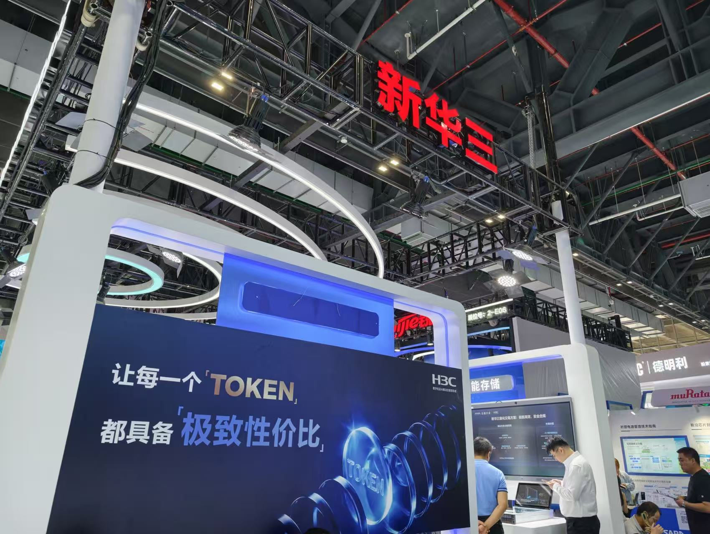
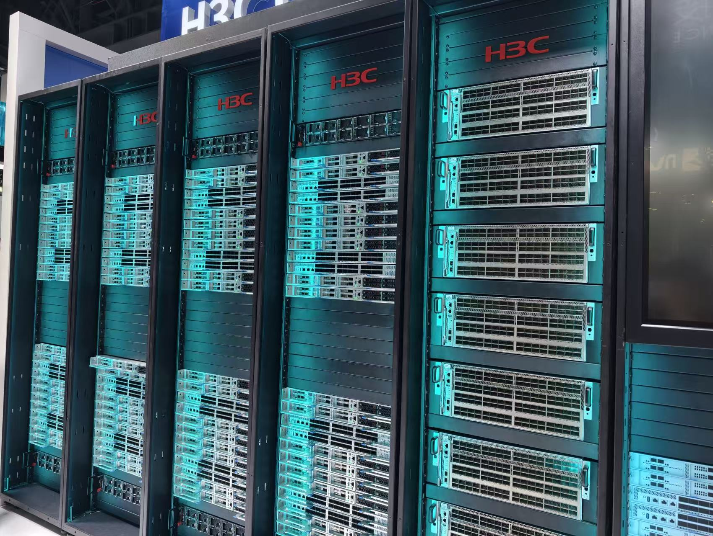

Durante los últimos años, la palabra clave de la infraestructura de inteligencia artificial fue una sola: más cómputo. El despliegue masivo de agentes de IA está cambiando el criterio. Cuando los agentes llaman de forma continua a los modelos fundacionales, los servicios a escala de billones de tokens dejan de ser una excepción y se convierten en un requisito de infraestructura. La pregunta ya no es cuántas GPU se pueden comprar, sino cuánto provecho se saca a las que ya están encendidas: la eficiencia de tokens se ha convertido en el nuevo criterio de medida.

Ese cambio de enfoque es el que H3C, fabricante chino de infraestructura de red y cómputo, planteó en la conferencia Apsara 2026, el evento anual de computación en la nube de Alibaba Cloud. Su mensaje: sumar GPU no garantiza un aumento proporcional del rendimiento, porque el cómputo ocioso, la congestión de red, la falta de datos listos para alimentar el sistema y los problemas operativos de los clústeres grandes acaban diluyendo la inversión. La eficiencia de tokens se convierte así en la métrica que ordena todo lo demás.

## Más GPU no siempre significa más rendimiento

Zhu Shiyin, director general del departamento de Investigación de Tecnología Avanzada de H3C, describió los clústeres de IA como sistemas fuertemente integrados que exigen coordinación entre hardware y software. A medida que un clúster pasa de cientos de GPU a miles o decenas de miles, las tarjetas dejan de ser el único factor: la comunicación entre chips, la transferencia de datos, la planificación de tareas, el suministro eléctrico y la refrigeración condicionan la utilización real del cómputo.

El ejemplo que puso la compañía en el evento es su SuperPod de la serie UniPoD S80000, que admite configuraciones de 32 a 1.024 GPU y puede escalar hasta 16.384, con soporte para recursos heterogéneos (CPU, GPU, NPU y DPU) y marcos de trabajo habituales. El objetivo no es meter más chips en un mismo sistema, sino coordinar cómputo, red, almacenamiento, nube, seguridad y operaciones para gestionar distintos tipos de recursos como una plataforma única. En la práctica, la competencia deja de medirse por cuántas GPU tiene un sistema y pasa a medirse por cuántos tokens útiles produce cada GPU.

## La red puede convertirse en el cuello de botella

Otro de los puntos que destacó Zhu es la interconexión de alta velocidad. La razón es directa: cuando las GPU mejoran, también crece el volumen de datos que intercambian entre sí. Si la red no acompaña, las tarjetas se quedan esperando. Por eso H3C presentó tres escenarios de interconexión: Scale-Up (dentro del nodo), Scale-Out (entre nodos) y Scale-Across (entre centros de datos).

- **Dentro del nodo**, el conmutador S9828-128EO de 102,4T con óptica de silicio NPO y óptica coempaquetada, que según la compañía reduce la latencia extremo a extremo un 15 %.
- **Entre nodos**, el conmutador de cómputo inteligente S9828-64FP de 1,6T con SerDes de 224G, que recorta el consumo más de un 20 % en entornos de alta densidad.
- **Entre centros de datos**, el conmutador DCI S12500R-64EP de 800G, pensado para la planificación de cómputo y la sincronización de gradientes entre instalaciones de una misma ciudad.

Detrás de estas tres capas hay una pregunta central: a medida que crecen los clústeres, ¿cómo evitar que la interconexión frene el rendimiento del cómputo? La respuesta ya no depende solo del ancho de banda. Los protocolos, el control de congestión, la fiabilidad de los enlaces y el diagnóstico de fallos pesan igual, y los ecosistemas cerrados pueden crear nuevos silos tecnológicos: los protocolos abiertos y los estándares de la industria serán cada vez más importantes.

## El dato y el software, las piezas que se subestiman

Las GPU no funcionan sin datos. En el entrenamiento de modelos grandes, la preparación de datos, el propio entrenamiento y el intercambio de parámetros implican mover volúmenes enormes de información; en la inferencia, la caché KV añade presión sobre el almacenamiento y el sistema de caché. Por eso H3C coloca el almacenamiento de alto rendimiento dentro de la misma cadena de producción de tokens.

Su sistema UniStor X20000, en la variante X20836, declara hasta 200 GB/s de ancho de banda y 3 millones de IOPS por nodo, con interoperabilidad entre protocolos de bloque, fichero, objeto y HDFS. La compañía asegura que su motor a plena velocidad reduce un 30 % el tiempo de espera de las GPU, mientras que la aceleración de inferencia XCache recorta hasta un 90 % la latencia hasta el primer token. El mensaje es práctico: la infraestructura de IA deja de ser un centro de cómputo y pasa a ser un sistema de tratamiento de datos de extremo a extremo, donde cada espera se traduce en coste.

A partir de cierta escala, el software se vuelve igual de determinante. Desde el sistema operativo y las bibliotecas de comunicación hasta la gestión de recursos y las plataformas de planificación, todo debe encajar con el hardware subyacente. La optimización de las comunicaciones, el solapamiento entre cómputo y comunicación, la planificación de tareas, el equilibrio dinámico de carga y la gestión unificada de recursos sirven para reducir el tiempo muerto de las GPU. Si cualquiera de estas piezas se convierte en cuello de botella, el efecto deja de notarse en una métrica aislada de hardware y aparece en algo más tangible: cuántos tokens útiles por segundo genera el sistema y cuánto cuesta producirlos.

## La eficiencia de tokens, la nueva medida de la competencia

En el fondo, las distintas propuestas que H3C llevó a la conferencia Apsara responden a la misma idea. Los supernodos organizan los recursos de cómputo a escala; la red de alta velocidad permite que se comuniquen con eficiencia; el almacenamiento garantiza que los datos lleguen a tiempo; y el software, la planificación y la gestión unificada convierten todo eso en capacidad de IA sostenida.

Con modelos que ya se acercan a la escala de billones de parámetros y agentes que llaman a los modelos de forma constante, los criterios que importan son la utilización del cómputo, el caudal de tokens, la latencia, el consumo energético y el coste por token. Es un cambio relevante para cualquiera que compre GPU o monte infraestructura de IA: el rendimiento de un sistema no depende de un solo componente, sino de que toda la cadena deje de esperar. Como ya ocurre en el mercado de los clústeres chinos, donde [Huawei aprieta la escala de sus SuperPod](/noticias/huawei-ascend-960-superpod/) hasta los 15.488 chips, la próxima fase de la infraestructura de IA se juega menos en acumular aceleradores y más en aprovechar los que ya están instalados.
