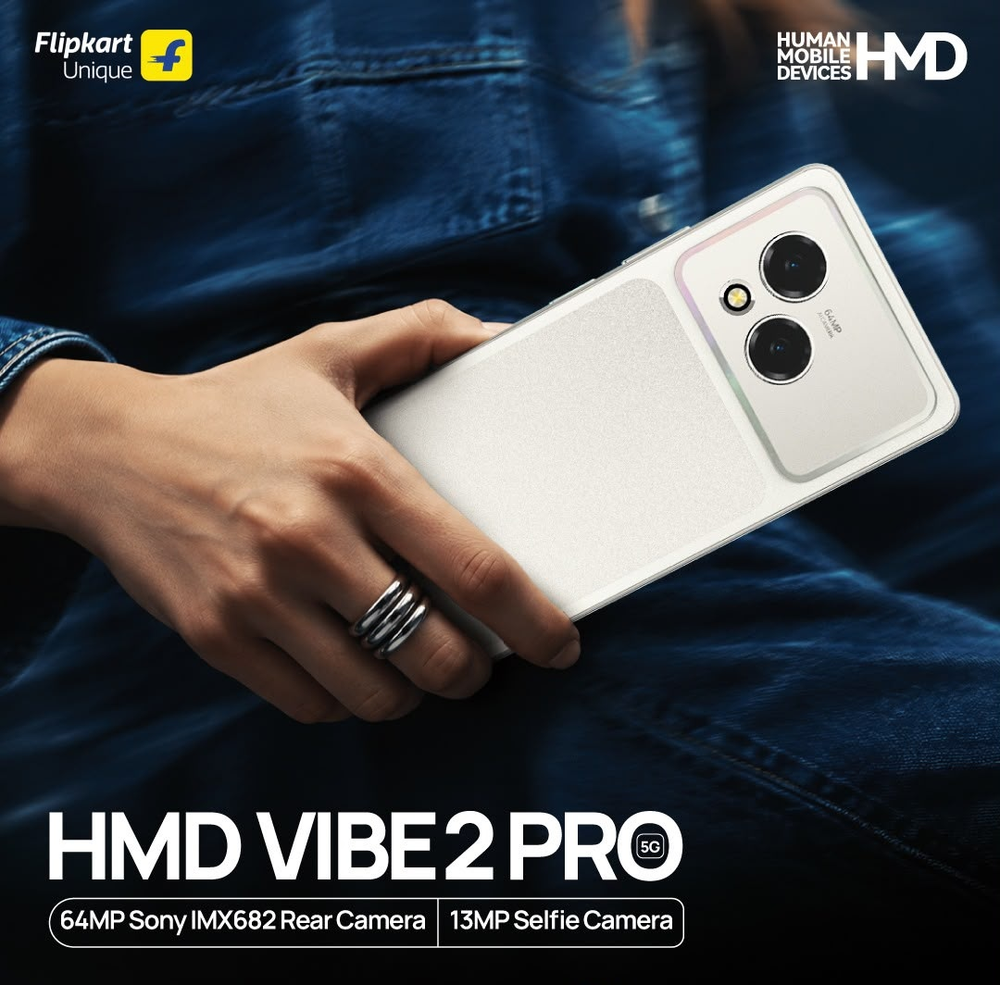
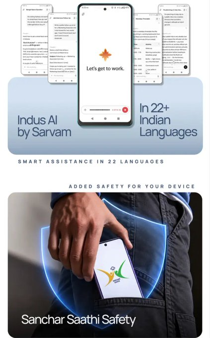
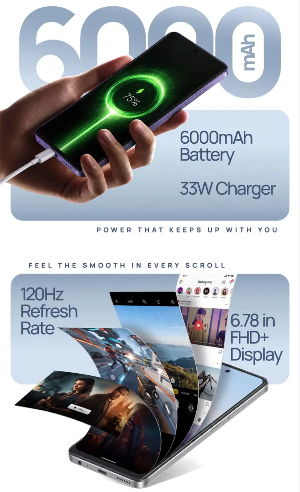
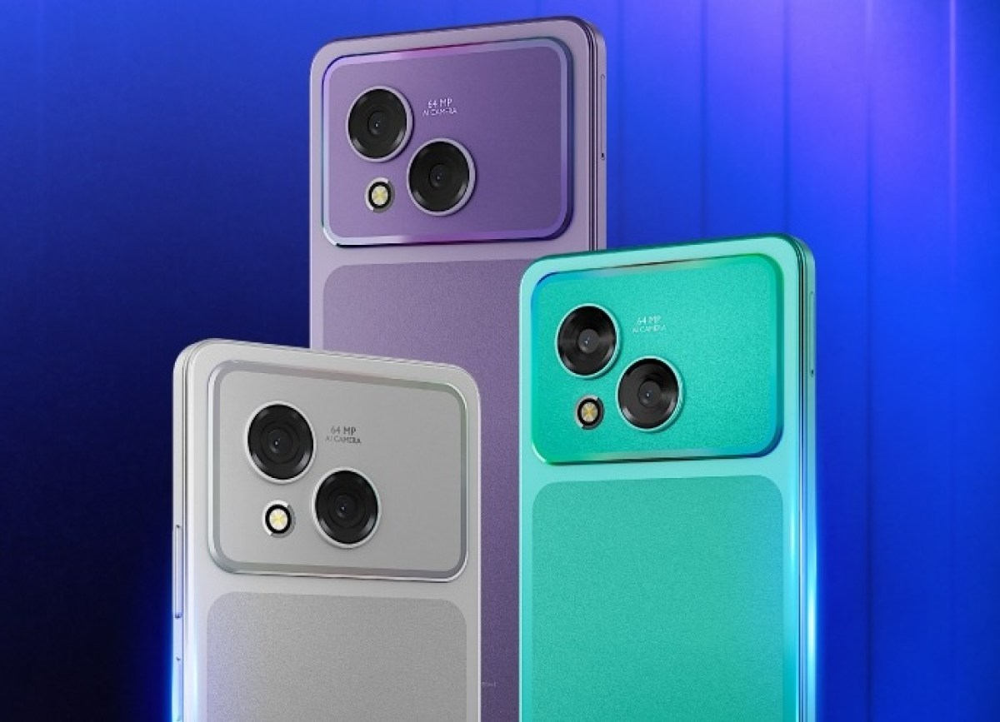

El HMD Vibe2 Pro ya tiene fecha y buena parte de su ficha técnica. La compañía ha confirmado que el nuevo integrante de su familia de gama de entrada llegará a India el 29 de septiembre, unos cuatro meses después de que el Vibe2 se presentara en ese mismo mercado. El modelo apuesta por un procesador de MediaTek, una batería de gran capacidad y una cámara principal de 64 megapíxeles.

## Dimensity 6400 y Android 16

El Vibe2 Pro estará impulsado por el MediaTek Dimensity 6400, un chip que en esta configuración se combina con hasta 8 GB de memoria RAM y 128 GB de almacenamiento. La compañía confirma que el teléfono saldrá de fábrica con Android 16 y con Indus AI, un software de inteligencia artificial desarrollado por Sarvam que, según el fabricante, cubre más de 22 idiomas de la India. El material promocional del anuncio menciona además Sanchar Saathi, una herramienta de seguridad para el dispositivo orientada al mercado indio.

## 6.000 mAh, carga de 33 W y pantalla de 120 Hz

La autonomía es uno de los argumentos centrales del anuncio. El Vibe2 Pro incorpora una batería de 6.000 mAh con soporte para carga rápida por cable de 33 W. Las imágenes promocionales que acompañan al anuncio detallan además una pantalla de 6,78 pulgadas FHD+ con tasa de refresco de 120 Hz y conectividad 5G. El teléfono conserva el conector de auriculares de 3,5 mm, un elemento cada vez menos habitual en esta franja de precio.

## Cámaras y acabados del Vibe2 Pro

En el apartado fotográfico, HMD recurre a un sensor principal Sony IMX682 de 64 megapíxeles acompañado de un macro de 2 megapíxeles. En la parte frontal hay una cámara de 13 megapíxeles para selfies y videollamadas. El teléfono se venderá en tres acabados: morado, gris y verde.

## Qué significa para el comprador

El lanzamiento se limita de momento a India, el mercado donde HMD concentra buena parte de su estrategia de gama de entrada y donde funciones como Indus AI o Sanchar Saathi tienen un encaje claro. La apuesta por combinar una batería generosa con un chip de gama media es una receta que repiten varios fabricantes: el [Vivo S2 FE filtrado esta misma semana](/noticias/vivo-s2-fe-10000mah-leak/) también apunta a una batería de gran capacidad con un Dimensity de la misma familia.

No hay precio confirmado ni planes anunciados para mercados fuera de India, por lo que la llegada del Vibe2 Pro a España, si finalmente se produce, está todavía por concretar. Tampoco se conocen las cifras de rendimiento reales del Dimensity 6400 en este modelo: habrá que esperar a las primeras pruebas independientes para comprobar si la combinación de hardware se traduce en una experiencia equilibrada más allá de la ficha técnica.
