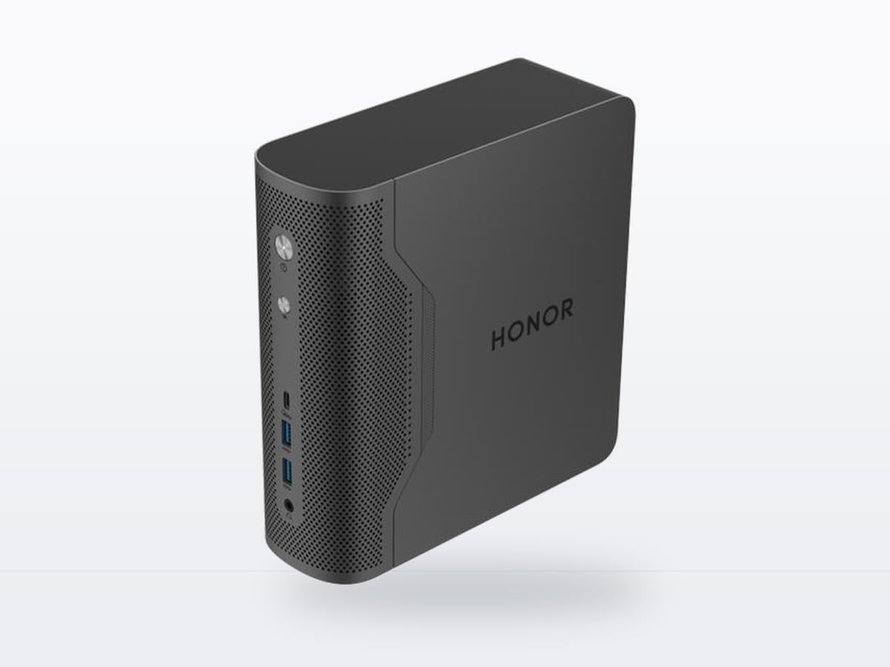
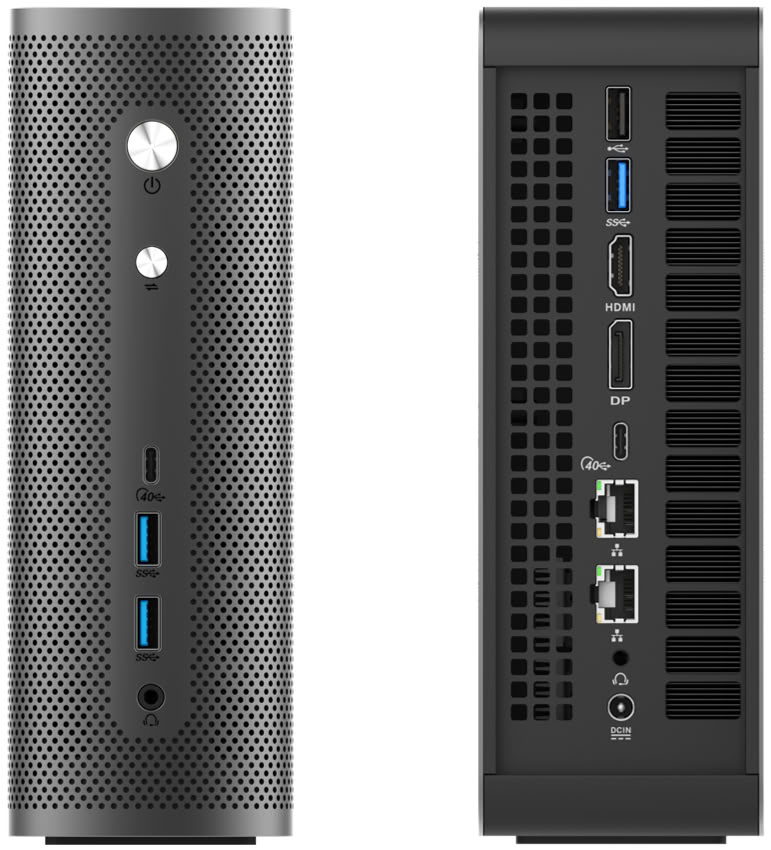

Honor ha desvelado el Tiangong AXB35, una plataforma de estación de trabajo pensada para el ámbito empresarial que cabe en apenas 2 litros de volumen. El equipo, presentado dentro de la línea Tiangong de la compañía, admite configuraciones con silicio de Intel, AMD o NVIDIA según el uso previsto, y está orientado a cargas como bases de conocimiento locales, inferencia de IA, aplicaciones de agentes o trabajo de oficina avanzado.

Sus dimensiones son de 70 × 192 × 203 mm y el peso ronda los 1,5 kg, unas cifras propias de un sobremesa ultracompacto más que de una torre convencional. Ese es, precisamente, el argumento central del producto: acercar cargas de cálculo que normalmente exigen un equipo de mayor tamaño a un formato que cabe en cualquier escritorio.

## Tres plataformas, tres perfiles de uso

La familia AXB35 se articula en torno a tres versiones principales, cada una con un planteamiento distinto:

| Versión | Plataforma | Memoria / almacenamiento | Modelos que aspira a mover |
| --- | --- | --- | --- |
| Standard | Intel Core Ultra X7 358H | 64 GB / 512 GB NVMe | Modelos cuantizados de clase 35B |
| Pro | AMD Ryzen AI Max+ 395 | 128 GB / 1 TB NVMe | Hasta modelos de 300B |
| Ultra | NVIDIA RTX Spark (arquitectura Arm) | 128 GB / 2 TB NVMe | Hasta modelos de 300B |

Honor cifra la capacidad de cómputo de IA de cada configuración: hasta 180 TOPS en la Standard (con un NPU de hasta 50 TOPS), hasta 126 TOPS en la Pro y hasta 1 PFLOP en FP4 en la Ultra. La compañía advierte que el tamaño de modelo es una referencia de selección y que el resultado real depende del método de cuantización, la longitud de contexto, la concurrencia y el entorno de ejecución. Existe además una cuarta variante orientada al mercado chino, con plataforma configurable y ajustes por proyecto, que Honor enmarca dentro de sus programas de adaptación local de hardware y software.

## Conectividad y consumo

El chasis es común a las cuatro configuraciones y concentra buena parte de la propuesta: dos ranuras M.2 2280 PCIe x4 más una tercera de 2242/2280, dos puertos Ethernet de 10 GbE, Wi-Fi 7 y Bluetooth 5.0 o superior. En el apartado de puertos hay dos USB4, cuatro USB tipo A, una salida HDMI 2.1, una DisplayPort 1.4 y dos conectores de audio de 3,5 mm, uno delante y otro detrás.

La alimentación corre a cargo de una fuente externa de 240 W, y el sistema ofrece tres modos de rendimiento: silencioso a 55 W, equilibrado a 85 W y rendimiento a 132 W. El software puede ser Windows 11 o Ubuntu, lo que deja margen para integrarlo tanto en entornos corporativos tradicionales como en despliegues de desarrollo.

## Sin precio ni fecha, y con el foco en la empresa

Honor no ha comunicado precio ni disponibilidad, ni tampoco si el producto llegará a mercados fuera de China. Es un anuncio de plataforma, no un lanzamiento comercial, así que conviene tratar cualquier cifra de venta como pendiente. Tampoco hay detalles sobre soporte, garantías o certificaciones por región más allá de las listas de cumplimiento (RoHS, WEEE, CE o CB, entre otras) que la compañía menciona en su página de producto.

**Contexto:** el interés por los mini-PC capaces de ejecutar modelos de IA en local ha crecido al calor de las plataformas con memoria unificada y gran ancho de banda, un nicho en el que el AXB35 se posiciona de forma explícita. Para el lector español, la incógnita sigue siendo la misma que con otros equipos de esta categoría anunciados primero en Asia: si el fabricante decide distribuirlos en Europa y a qué precio.
