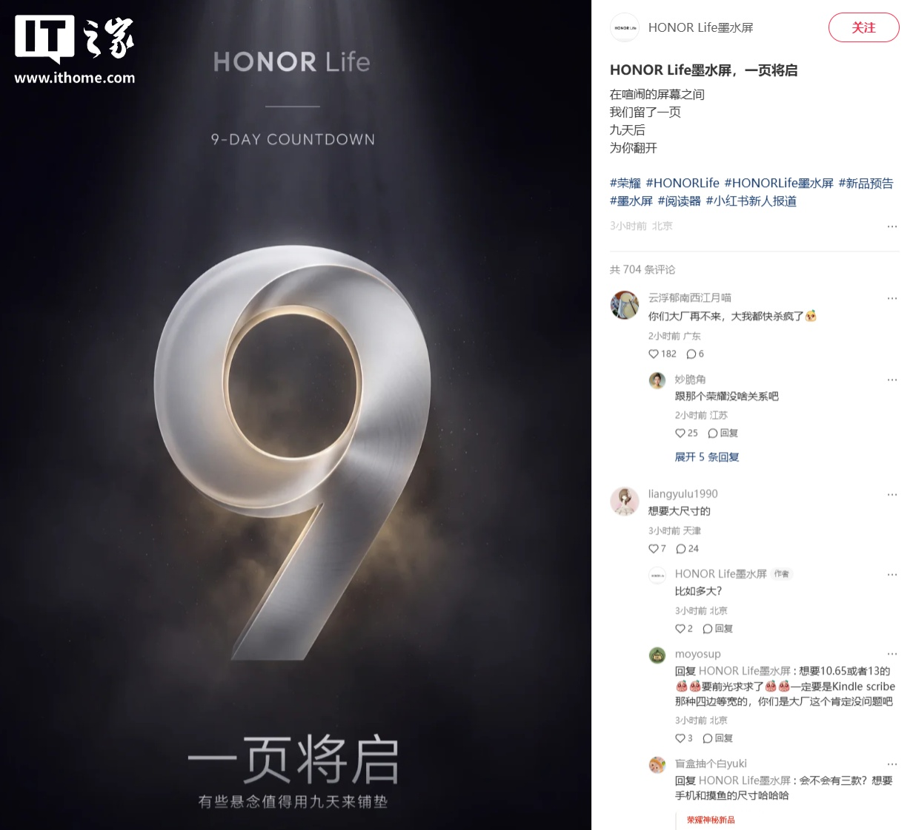

Honor ha confirmado que prepara un dispositivo con pantalla de tinta electrónica bajo el paraguas de HONOR Life, su marca de productos de vida inteligente. La compañía presentó el anuncio el 19 de septiembre con un cartel de cuenta atrás de nueve días, en el que aparece un gran número 9 y el lema «一页将启», que puede traducirse como «una página está por abrirse». Según lo publicado por la propia marca, el producto se dará a conocer en el marco del evento Honor Magic y de la presentación de la serie Magic9.

La cuenta atrás apunta directamente al 28 de septiembre, la fecha que Honor ya había fijado para su cita de otoño en Pekín. El anuncio no adelanta ninguna característica técnica: se desconoce el tamaño de la pantalla, si será en color o en escala de grises, qué sistema operativo utilizará y en qué categoría de producto se encuadra exactamente.

## Una pista, pero sin ficha técnica

El material difundido por Honor procede de una cuenta oficial de la marca en la red social china Xiaohongshu llamada precisamente «HONOR Life墨水屏» (pantalla de tinta electrónica de HONOR Life). En esa publicación, la compañía acompaña el cartel con la etiqueta «lector» y con la frase «entre pantallas ruidosas, hemos reservado una página; nueve días después, la abriremos para ti». Es el único indicio sobre el enfoque del producto, y conviene tratarlo como una orientación de marketing, no como una especificación confirmada.

Honor tampoco ha detallado precio, disponibilidad ni mercados. Se trata, por tanto, de un anuncio de cuenta atrás y no de un lanzamiento comercial, así que cualquier dato de venta o de prestaciones que circule estos días es todavía especulación.

## Qué es HONOR Life

HONOR Life es la marca de vida inteligente del fabricante chino, lanzada en 2020 y englobada dentro del ecosistema Honor Select (荣耀亲选). Su enfoque son los productos de ecosistema para distintos escenarios de uso, desde el hogar hasta la movilidad. Entre los artículos que la marca ha puesto en el mercado figuran auriculares de tipo pinza, un router WiFi 5G portátil y un termo de titanio, según recoge el anuncio del propio Honor.

La irrupción de esta marca en el terreno de la tinta electrónica resulta llamativa porque se trata de una tecnología asociada sobre todo a lectores de libros electrónicos, un segmento en el que Honor no tiene presencia consolidada. La tinta electrónica se caracteriza por un consumo muy bajo y por una lectura cómoda con luz ambiental, a diferencia de las pantallas convencionales de los teléfonos y las tabletas.

## Qué cambia para el lector

Para el público hispanohablante, la información relevante es limitada por ahora: lo confirmado es que existe un producto de tinta electrónica de HONOR Life y que se mostrará el 28 de septiembre. No hay indicios de que vaya a venderse fuera de China, ni de cuánto costaría si lo hiciera.

Conviene, en cualquier caso, no confundir este movimiento con otros accesorios de tinta electrónica que se han presentado en las últimas semanas. Aquí no hay una funda ni un complemento para el teléfono: Honor habla de un producto propio dentro de su catálogo de vida inteligente. La ficha completa, con características, precio y disponibilidad, llegará, si todo sigue el calendario previsto, en la cita del día 28.
