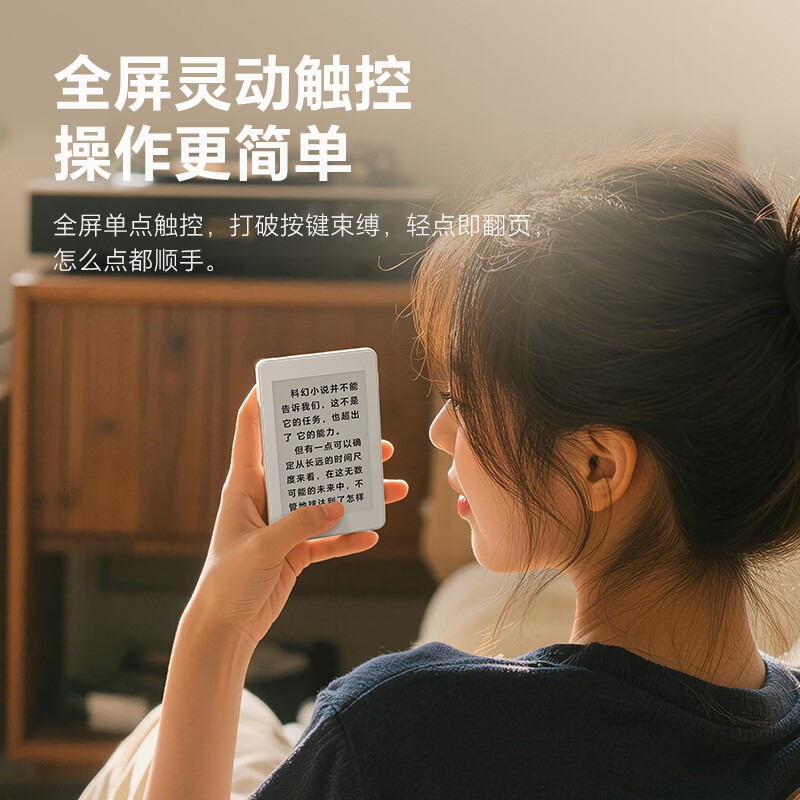
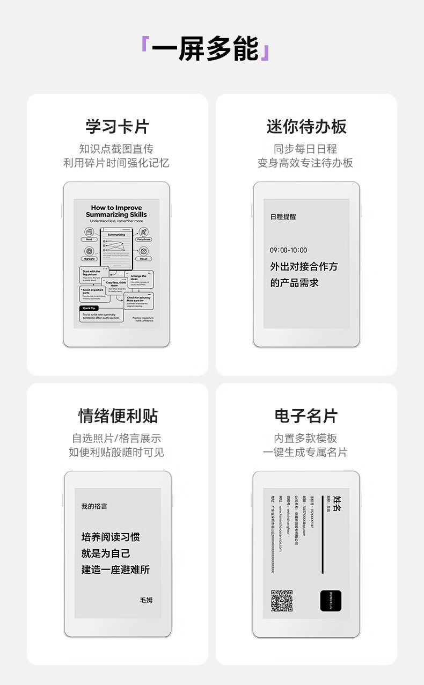
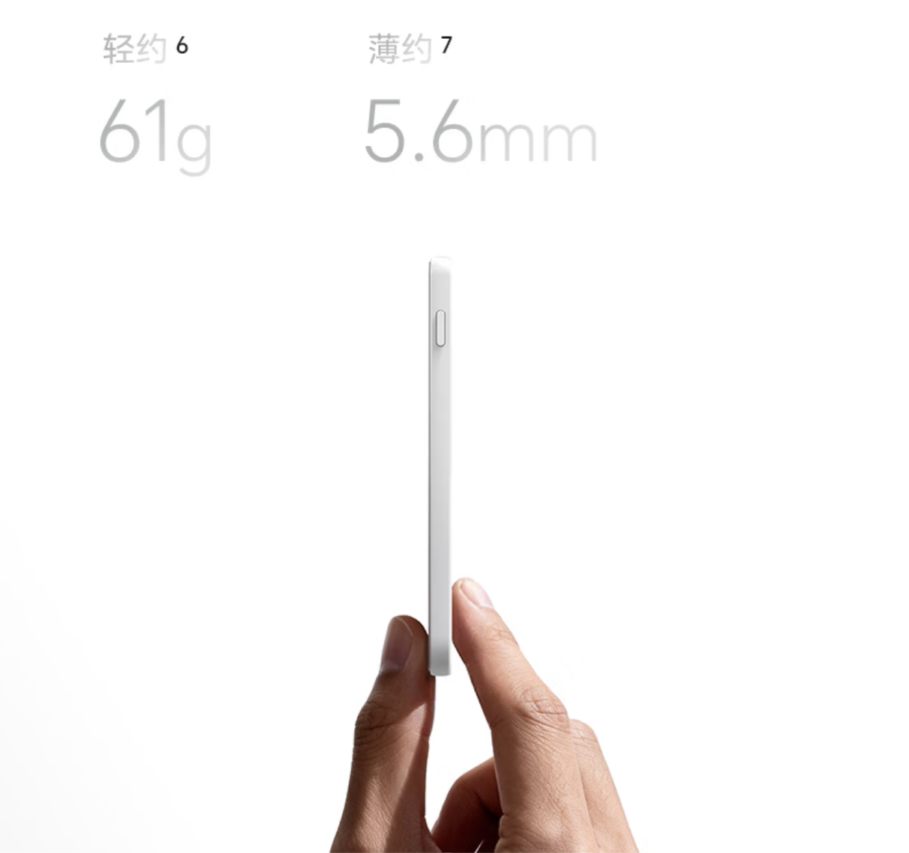
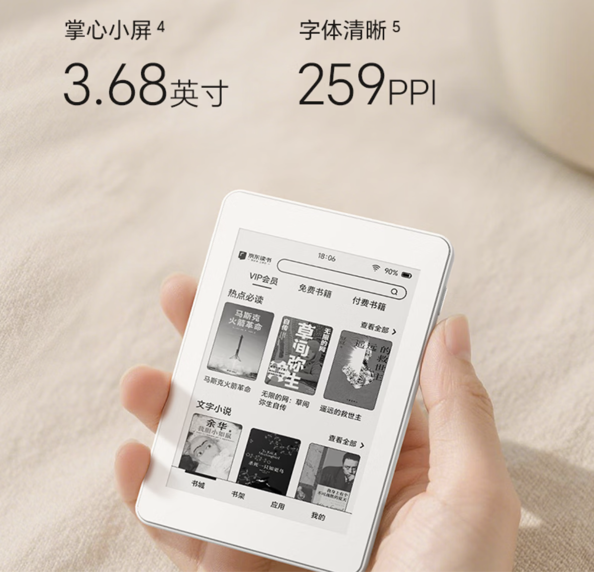
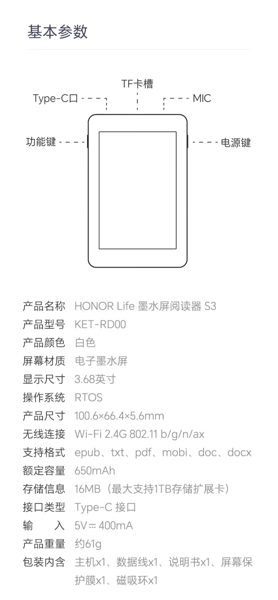

La cuenta atrás que Honor abrió con [un adelanto de su dispositivo de tinta electrónica](/noticias/honor-life-eink-device/) se ha saldado en la fecha prevista: el lector HONOR Life S3 ya está disponible en las plataformas de comercio electrónico chinas con un precio de 359 yuanes, según recoge ITHome. El producto confirma la pista que daba aquel anuncio —la marca lo etiquetó como «lector»— y despeja las dudas que quedaban abiertas, empezando por la ficha técnica.

## Un lector de 61 gramos pensado para el teléfono

El HONOR Life S3 pesa unos 61 gramos y mide 5,6 milímetros de grosor. Su rasgo diferencial es la **sujeción magnética**: el aparato se adhiere al dorso de un teléfono, de modo que convierte la parte trasera del móvil en una superficie de lectura. La pantalla es de tipo táctil a página completa, con gesto de toque para pasar página.

Ese posicionamiento explica las dimensiones: el S3 no busca sustituir a un lector de formato grande, sino acompañar al teléfono y aprovechar los ratos muertos del día, siempre dentro del mismo bolsillo.

## Ficha del HONOR Life S3

La pantalla es de **3,68 pulgadas de tinta electrónica con tratamiento de luz suave** y una densidad de 259 píxeles por pulgada (PPI). En autonomía, el fabricante promete 30 horas de lectura continua sin conexión, una semana de uso con una sola carga y hasta 20 días en espera.

Más allá de la lectura, el material promocional del fabricante ilustra otros usos de esa misma pantalla, como tarjetas de estudio, un panel de tareas o una tarjeta de visita digital.

## Transferencia por Wi-Fi 6 y expansión hasta 1 TB

Los libros llegan al aparato **por Wi-Fi 6, sin cables**, mediante la aplicación de espacio inteligente de Honor (荣耀智慧空间). El lector admite los formatos epub, pdf, mobi, doc, docx y txt, y acepta además expansión de almacenamiento con tarjeta TF de hasta 1 TB.

## Qué cambia para el lector

Hasta ahora la información sobre este producto se limitaba a la cuenta atrás que Honor publicó nueve días antes; con el listado del S3, el mercado chino ya tiene un lector de tinta electrónica de 61 gramos a 359 yuanes. La apuesta no va contra un lector de sobremesa, sino contra el hueco de llevar una pantalla de lectura siempre adherida al teléfono.

Queda una incógnita abierta para el público hispanohablante: ITHome recoge el listado en plataformas chinas y en yuanes, y no hay constancia, por ahora, de disponibilidad ni de precio fuera de China.
