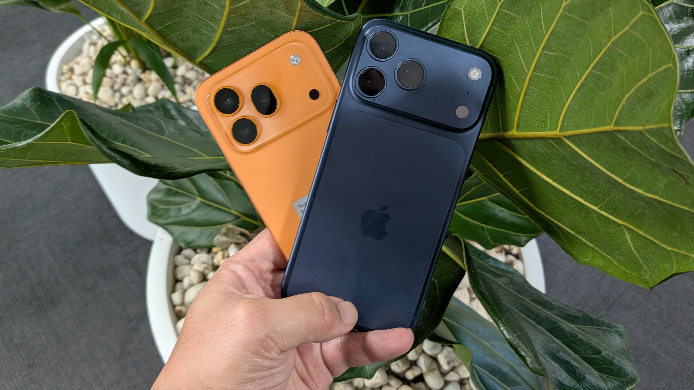
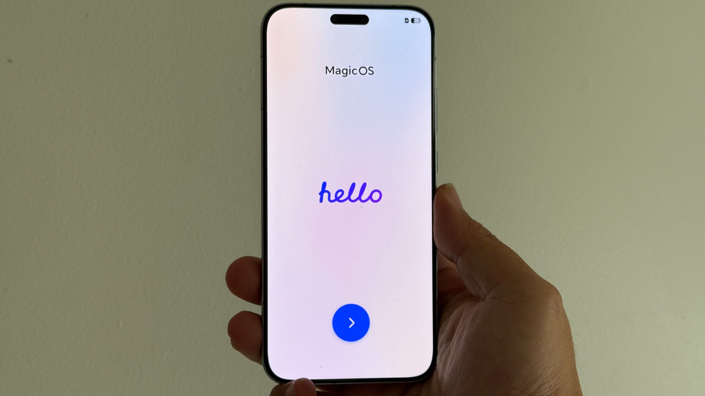
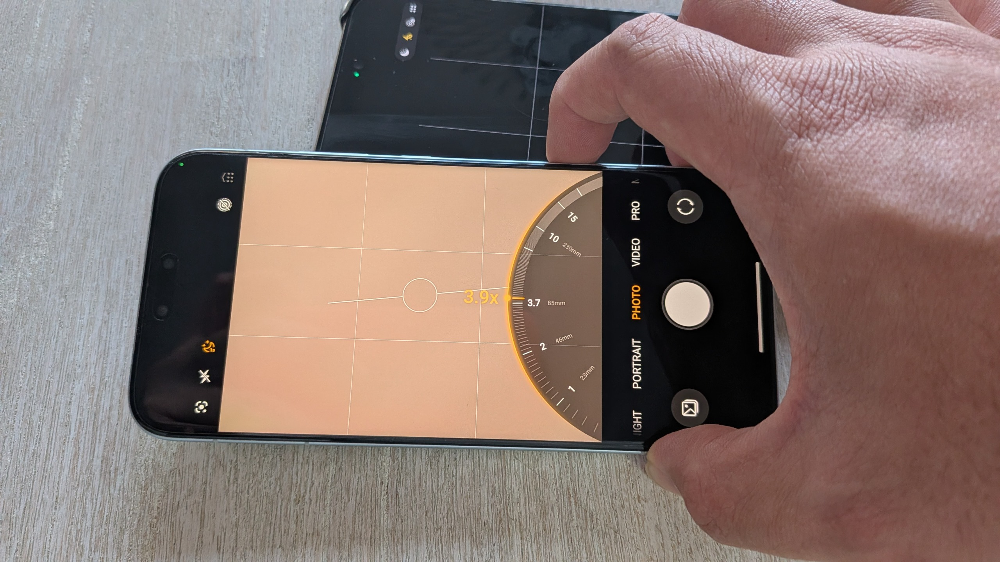
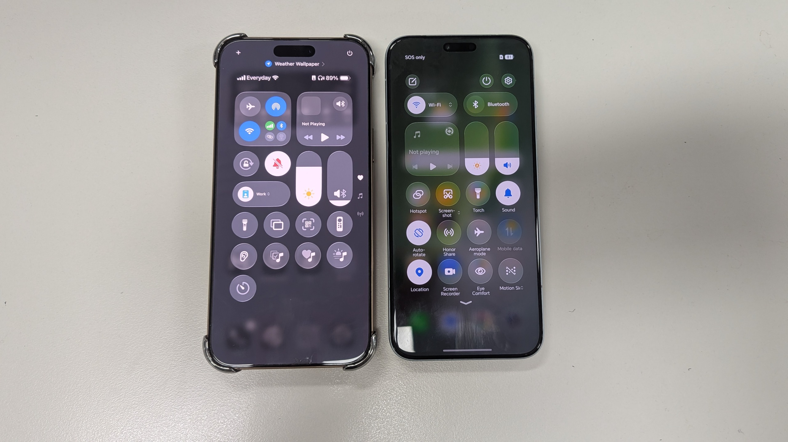

El Honor Magic 8 Pro y el Honor 600 Pro llegan con una propuesta de hardware difícil de discutir: baterías de silicio-carbono enormes, carga rápida, cámaras ambiciosas y resistencia al agua y al polvo de primer nivel. Sin embargo, según la opinión publicada por TechRadar tras probar ambos terminales, sus méritos quedan tapados por un problema que no está en la ficha técnica, sino en el diseño: los dos teléfonos se parecen demasiado a un iPhone.

## Qué ofrecen el Magic 8 Pro y el 600 Pro

Sobre el papel, las cifras son llamativas. El Magic 8 Pro incorpora una batería de 7.100 mAh y el 600 Pro se queda en 7.000 mAh, ambas de silicio-carbono y con carga rápida. En el uso diario, según la prueba, superan los dos días de autonomía, algo que pocos móviles consiguen. El apartado fotográfico también destaca, sobre todo por el teleobjetivo de 200 MP con zoom óptico de 3,7x del modelo de gama alta.

Los dos resisten certificaciones IP68 e IP69K, y el acabado se percibe premium pese a recurrir al plástico en la parte trasera. En potencia, montan chips Snapdragon 8 Elite: la generación 5 para el Magic 8 Pro y la generación 4 del año anterior para el 600 Pro. Ambos mueven con soltura la multitarea y los juegos exigentes.

El precio también juega a su favor. El Magic 8 Pro de 512 GB parte de 1.099,99 libras (1.999 dólares australianos) y el 600 Pro arranca en 899,99 libras (1.499 dólares australianos) con la misma capacidad. Ninguno de los dos se vende oficialmente en Estados Unidos.

## Un MagicOS que mira demasiado a iOS

El punto de fricción aparece en el software. MagicOS replica en Android buena parte de la experiencia de iOS: el panel de ajustes rápidos se parece al Centro de Control, las transiciones del sistema, las animaciones de apertura de apps y hasta el desplazamiento recuerdan a un iPhone. Además, el cajón de aplicaciones viene desactivado por defecto, con todos los programas repartidos por varias pantallas de inicio, tal como organizaba iOS antes de la Biblioteca de Apps.

Incluso la configuración inicial muestra una animación de bienvenida con un "Hello" en cursiva, muy reconocible para cualquier usuario de iPhone. A eso se suma un botón de IA en la esquina inferior derecha que imita al control de cámara del iPhone: lanza funciones de inteligencia artificial, pero una doble pulsación abre la cámara, sirve como disparador y ajusta el zoom al deslizar.

TechRadar concede a Honor un mérito relevante: Magic Capsule se lanzó en 2019, tres años antes de que Apple estrenara su Dynamic Island en el iPhone 14 Pro. El argumento no es que todas las funciones similares nacieran en Apple, sino que el lenguaje de diseño de Honor apunta una y otra vez en la misma dirección.

## Del módulo de cámara al acabado naranja

El parecido físico es más evidente en el Honor 600 Pro. Su módulo de cámara recuerda al del iPhone 17 Pro, con un bloque rectangular ancho y una disposición de tres cámaras muy similar. Hasta el acabado naranja se percibe como una variación cercana del Cosmic Orange de Apple. Las diferencias existen, pero no bastan para construir una identidad visual propia.

La conclusión del análisis es que estas coincidencias se sienten menos como un homenaje y más como una falta de confianza. Honor introduce cambios suficientes para diferenciar sus funciones a nivel técnico, pero no para darles un carácter propio. Sus propios análisis inciden en lo mismo: el del 600 Pro señala que está "claramente influenciado por el iPhone 17 Pro, algunos dirían que descaradamente", y que MagicOS está "demasiado supeditado al trabajo de Apple".

## Qué debería cambiar Honor

Honor no es ajena a la innovación. La marca ha explorado diseños con personalidad, como el plegable Honor V Purse o el llamativo Honor Robot Phone, conceptos que llegaron a convertirse en productos comerciales, aunque de momento solo se hayan vendido en China. Eso hace más frustrante la imitación: la compañía ya ha demostrado que puede crear productos con identidad propia.

En software, firmas como Nothing han enseñado que es posible dar un giro fresco a Android. Honor tiene sobre la mesa lo necesario para competir de verdad —autonomía excepcional, cámaras ambiciosas, buena resistencia y precios ajustados—, pero, según esta opinión, le falta confianza para que sus móviles parezcan y se sientan producto de Honor. Esa es, precisamente, la asignatura pendiente que arrastra el sector: la homogeneidad de diseño también ha marcado la conversación en el lado de Apple, donde [el iPhone 18 Pro apenas se distingue del iPhone 17 Pro](/noticias/iphone-17-18-same-design-cases/). Mientras no resuelva esa pregunta, su mejor hardware seguirá a la sombra de la duda de a quién está siguiendo.
