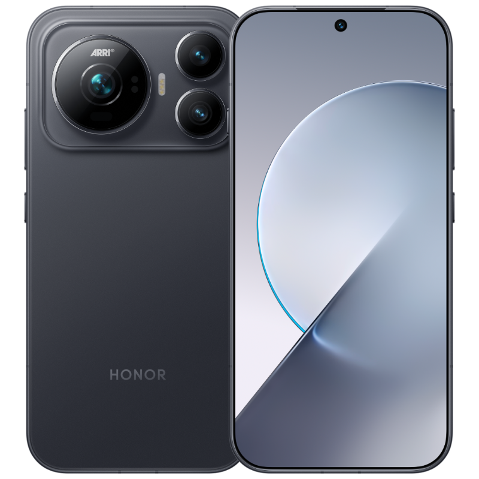

Honor ha hecho públicos los precios de su próximo buque insignia, el Honor Magic 9, apenas unos días antes de la presentación oficial prevista para el 28 de septiembre. El anuncio lo firmó Li Jian, consejero delegado de la compañía, en una jornada en la que Honor celebra el décimo aniversario de la familia Magic y en la que presentó el teléfono como una muestra de su apuesta por explorar ideas nuevas en el sector.

## Tres precios para el Honor Magic 9

La compañía maneja tres cifras según el momento y las condiciones de compra:

- **Precio de partida:** 6.499 yuanes (unos 961 dólares), que Honor presenta como «el precio más bajo del sector». Es, con toda probabilidad, el precio de salida oficial.
- **Precio por el décimo aniversario:** 5.999 yuanes (unos 887 dólares), una tarifa conmemorativa por la década de la serie Magic.
- **Precio con subvención:** 5.499 yuanes (unos 813 dólares) para quienes cumplan los requisitos de la subvención nacional de China, 1.000 yuanes (unos 148 dólares) menos que el precio de partida.

## Un lanzamiento a pocos días

Honor confirmó el 28 de septiembre como fecha de presentación en agosto, poco después de su evento del Robot Phone. Desde entonces la compañía ha ido dosificando detalles: ya mostró el nuevo diseño de la cámara trasera y un extensor teleobjetivo de 500 mm, y confirmó las opciones de almacenamiento y colores del Magic 9 Pro Max, el Magic 9 y el Magic 9 Super Edition.

Según los informes recogidos por la prensa especializada, el Magic 9 Super Edition incluiría un ventilador de refrigeración activa integrado para sostener el rendimiento en tareas exigentes. La gama también apuntaría al procesador Snapdragon 8 Elite Gen 6 de Qualcomm junto al chip H1 desarrollado por Honor.

## Qué cambia para el comprador

El movimiento sitúa al Magic 9 en la gama alta china con un precio de partida que la compañía quiere presentar como agresivo. Conviene recordar que los 6.499 yuanes son el precio para China: la equivalencia en dólares que maneja la fuente es orientativa y el precio europeo se conocerá, como muy pronto, en el evento del 28 de septiembre. La subvención nacional china tampoco está disponible fuera del país, de modo que el descuento de 1.000 yuanes queda fuera del alcance del comprador español.

Para quien siga la serie, la referencia más inmediata es el [Honor Magic 8 Pro y el Honor 600 Pro](/noticias/honor-magic-8-pro-600-pro/), presentados con un diseño que se inspiraba en el iPhone. El Magic 9 llega con la promesa de un salto en cámara y refrigeración, y con la incógnita de si esa ambición se traducirá en un precio competitivo fuera de China.
