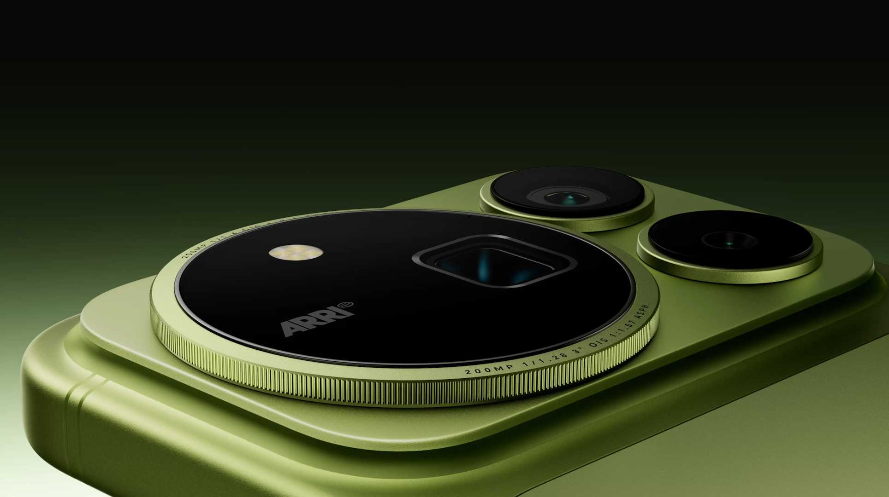
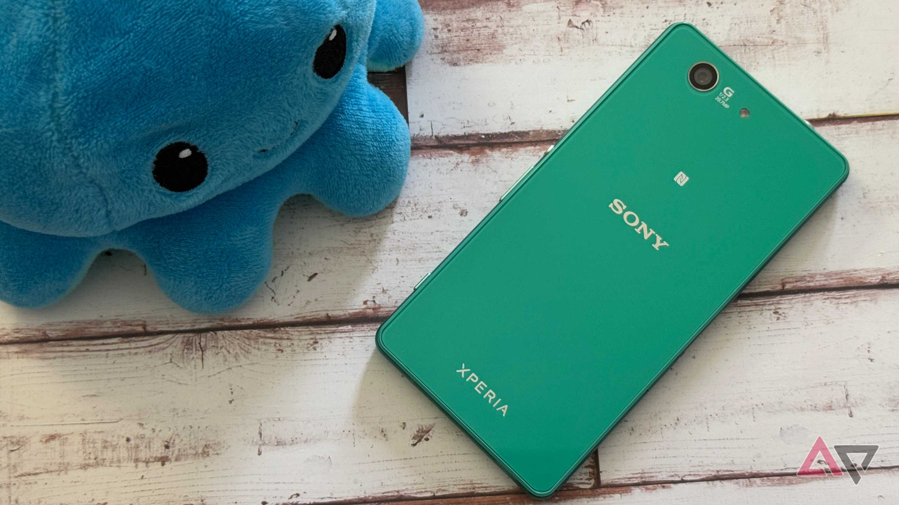

Honor ha convertido el vídeo en el gran argumento de venta de su Honor Magic 9 Pro Max. Junto a ARRI, el fabricante de las cámaras que se utilizan en los rodajes de cine, el teléfono ofrece lo que la marca describe como un flujo de trabajo cinematográfico completo dentro del propio aparato, sin la cámara de cine de gran tamaño que por lo general exige años de experiencia para manejarse. Android Police, que ya probó esta función en el Honor Robot Phone, reconoce que el resultado impresiona, pero se pregunta si ese nivel de exigencia interesa a alguien fuera de un plató.

## El modo de vídeo con ARRI: un flujo de cine dentro del teléfono

Antes de juzgar la propuesta, conviene entender qué hace realmente el sistema. La cámara del Magic 9 Pro Max graba con la curva gamma nativa Log C3 de ARRI: la imagen sale plana y descolorida, pero guarda el detalle y la información necesarios para revelarla después con el espacio de color ARRI Wide Gamut (AWG) y uno de los 14 perfiles LUT de ARRI. La marca ofrece además una biblioteca ampliada de 87 perfiles LUT.

Todo ese proceso se maneja desde una aplicación de cámara conjunta de Honor y ARRI, con una interfaz inspirada en la de las cámaras de cine y de alta complejidad. En el apartado óptico, el teléfono monta una cámara principal de 200 MP, un teleobjetivo de 200 MP y un gran angular de 50 MP. El audio tampoco queda al margen: cuatro micrófonos direccionales de grado cinematográfico, combinados con procesado de software, suprimen los sonidos no deseados y enfocan el audio lejano respecto a la cámara.

La alianza responde a dos intereses paralelos, según recoge Android Police: ARRI quiere ganar presencia en el móvil, y Honor busca un socio de cámara que rivalice con Hasselblad y Leica, los nombres que otras marcas exhiben en sus móviles. A ello se suma un dato de contexto: a juicio del medio, la fotografía fija ya es tan difícil de diferenciar que Oppo y Google tienen ese terreno cubierto en 2026, mientras Apple ha hecho un gran hincapié en el vídeo y su formato ProRes.

## Honor promete enseñar a usarlo, pero sin tutorios estrictos

La primera impresión del propio Android Police es que el modo ARRI luce impresionante, pero también muy complicado. Honor indicó al medio que el Magic 9 Pro Max incluirá algunos elementos educativos para ayudar a las personas a familiarizarse con la grabación cinematográfica, aunque no habrá tutoriales estrictos. Es una decisión delicada: la curva Log y los perfiles LUT son conceptos de rodaje profesional, y un usuario sin formación previa no tiene por qué saber por dónde empezar.

Hay además una barrera práctica que el medio cuantifica: un minuto de vídeo en 4K puede ocupar en torno a 350 MB, y la grabación en LOG ocupa todavía más. Ante eso, muchos usuarios preferirán quedarse en 1080p a 30 fps y dar el asunto por bueno, sobre todo si los términos LUT, LOG y gamut no les dicen nada y los recursos didácticos no llegan a acompañarlos.

El contexto de consumo no juega a favor, tampoco. La gente graba más vídeos que nunca, en especial en China, donde el Magic 9 Pro Max debutará primero, pero la mayoría de esos vídeos no están dirigidos como una película. Para el lector que se pregunte si compensa etalonar a mano cada grabación, la respuesta del medio es que en la mayoría de casos una herramienta rápida como CapCut resulta más práctica y suficiente. Android Police cita asimismo una investigación según la cual el 70 % de las fotos que hacemos con el móvil nunca se vuelven a mirar, y sospecha que el vídeo sufre el mismo problema.

## El precedente de Sony como aviso

El propio historial del sector ofrece una advertencia. Durante años, Sony apoyó la venta de su gama Xperia en la videografía, con modelos como el Xperia XZ2, el Xperia 1V o el Xperia 1. Los Xperia tienen una base de usuarios pequeña pero fiel, y aun así el dominio de Sony en vídeo no consiguió que la marca marcara la diferencia en el mercado global de smartphones. Honor lleva sus modos de vídeo más lejos de lo que llegó Sony, y el nombre de ARRI añade credibilidad ante quien entiende del asunto, pero el riesgo estratégico es el mismo.

La duda que plantea Android Police es qué se gana poniendo el foco en el vídeo por delante del resto de la propuesta: el rendimiento de la cámara fotográfica, el procesador Qualcomm Snapdragon 8 Elite Extreme Gen 6 o la batería de carbono-silicio de 8.800 mAh. El rendimiento del conjunto ya se ha dejado ver en otros frentes: este mismo modelo [anotó 5,52 millones de puntos en AnTuTu](/noticias/honor-magic9-pro-max-antutu/) y superó al OnePlus 16.

## Precio y disponibilidad del Magic 9 Pro Max

El Honor Magic 9 Pro Max se lanzará primero en China, con un precio de alrededor de 1.000 dólares. De momento no hay detalles oficiales sobre una posible salida global, aunque el medio da por probable que llegue con el tiempo. Para enmarcar la cifra, de la familia solo se ha hecho público hasta ahora el precio del Honor Magic 9 estándar, que [arranca en los 6.499 yuanes](/noticias/honor-magic-9-precio/).

Queda por ver si la curva de aprendizaje, el almacenamiento que exige y las ganas de etalonar vídeo convencen a alguien más allá de los profesionales y los entusiastas. Honor tiene un argumento técnico sólido; la pregunta es si es también un argumento de venta.
