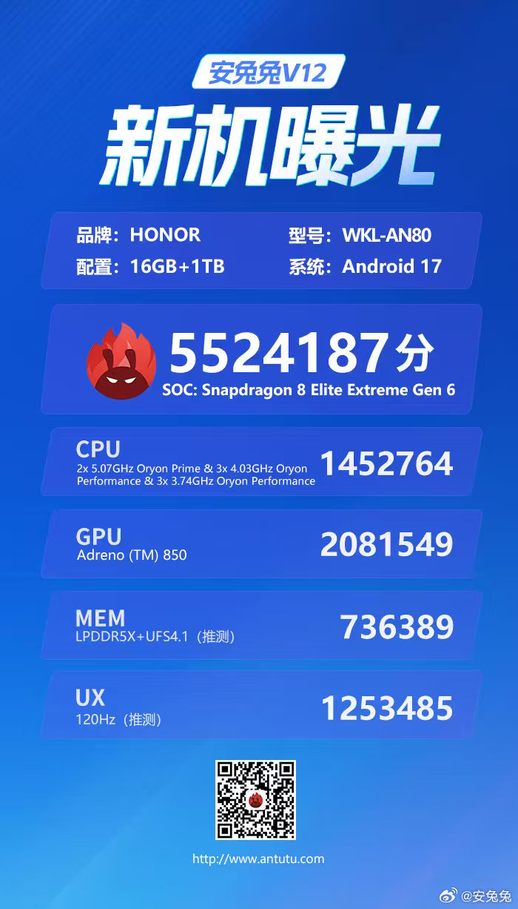

Honor presenta hoy, 28 de septiembre, la serie Magic 9 en China, y el acto llega acompañado de una filtración de última hora: el **Honor Magic 9 Pro Max**, la versión tope de gama de la familia, ha aparecido en un listado de AnTuTu V12 con una puntuación de 5.524.187 puntos. La ficha, que GizmoChina reproduce a partir del registro original, deja a la vista la configuración de prueba y el procesador del aparato, y sitúa al dispositivo por delante de su rival directo.

## El Honor Magic 9 Pro Max anota 5,52 millones de puntos en AnTuTu

La ficha de la prueba identifica el terminal con el número de modelo WKL-AN80, 16 GB de RAM LPDDR5X, 1 TB de almacenamiento UFS 4.1 y Android 17 como sistema operativo. En el apartado de gráfica aparece la Adreno 850, asociada al nuevo **Snapdragon 8 Elite Extreme Gen 6**: dos núcleos Oryon Prime a 5,07 GHz, tres núcleos de rendimiento a 4,03 GHz y otros tres núcleos de rendimiento a 3,74 GHz.

El desglose de los 5.524.187 puntos acumulados es el siguiente:

| Prueba | Puntuación |
| --- | ---: |
| CPU | 1.452.764 |
| GPU | 2.081.549 |
| Memoria | 736.389 |
| UX | 1.253.485 |
| **Total** | **5.524.187** |

Con esa cifra, el Magic 9 Pro Max se coloca por encima del OnePlus 16, que había marcado [5.384.433 puntos en AnTuTu V12](https://www.gizmochina.com/2026/09/23/oneplus-16-antutu-score-snapdragon-8-elite-extreme-gen-6/) con una configuración equivalente de 16 GB y 1 TB, según un listado publicado por el propio GizmoChina unos días antes. La diferencia ronda los 140.000 puntos a favor de Honor.

## La ficha filtrada del tope de gama

Más allá del benchmark, los rumores previos apuntan a una pantalla OLED LTPO de 6,8 pulgadas con resolución 1,5 K y frecuencia de 120 Hz. En fotografía, el aparato montaría un sensor principal de 200 megapíxeles de 1/1,28 pulgadas, un ultra gran angular de 50 megapíxeles y un teleobjetivo periscópico de 200 megapíxeles con zoom óptico de 3,5x; para selfies, un frontal cuadrado de 55 megapíxeles.

La autonomía la marcaría una batería de 8.800 mAh con carga por cable de 100 W y carga inalámbrica de 80 W. Entre los extras filtrados figuran la tecnología de imagen ARRI, reconocimiento facial 3D, sensor de huella ultrasónico 3D y certificación de resistencia IP68, IP69 e IP69K.

## Qué significa para el comprador

El dato interesante no es solo la cifra récord, sino lo que revela sobre la temporada: el Snapdragon 8 Elite Extreme Gen 6 empieza a repartirse entre los tope de gama chinos y las diferencias entre fabricantes se miden ya en ajustes de refrigeración y de software, no en el silicio base. Superar al OnePlus 16 por un margen estrecho es, además, un aviso en una gama donde el rendimiento puro convive con una guerra de baterías y cámaras que ya no se decide en un único número.

De la familia Magic 9, el [Honor Magic 9 de serie ya tiene precio publicado](/noticias/honor-magic-9-precio/) de cara al lanzamiento, mientras que el del Pro Max se confirmará en el evento de hoy. Con esa cifra sobre la mesa, queda por ver si Honor traduce el resultado de laboratorio en un rendimiento sostenido en uso diario.
