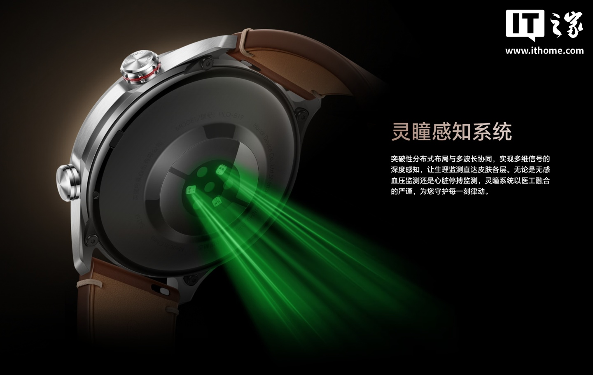
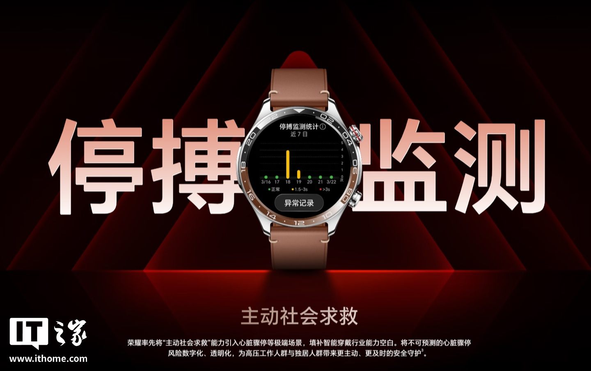
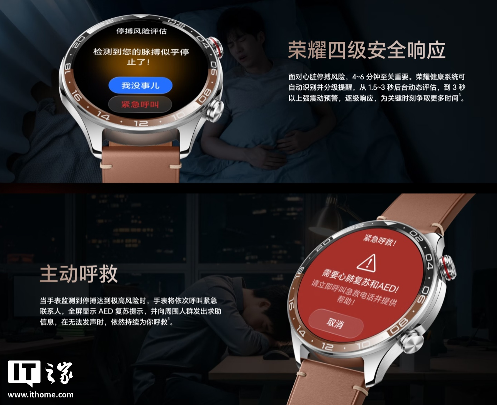
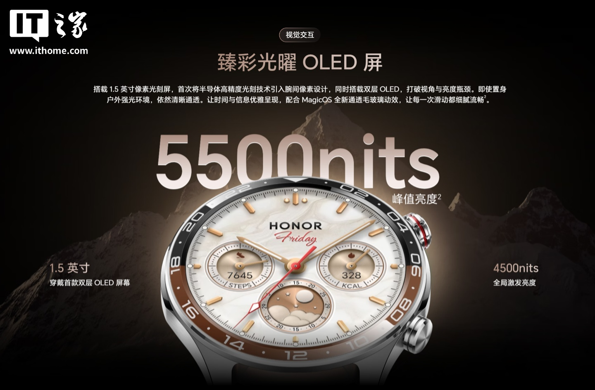
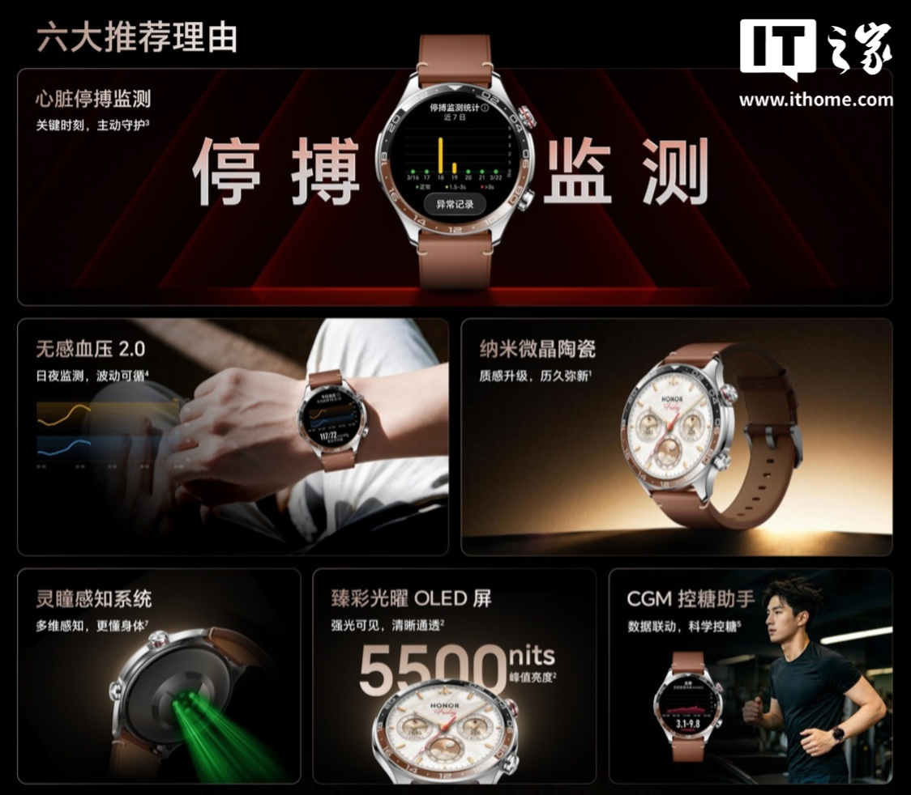
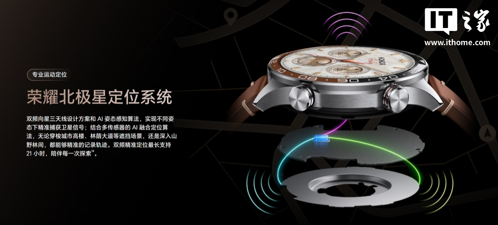
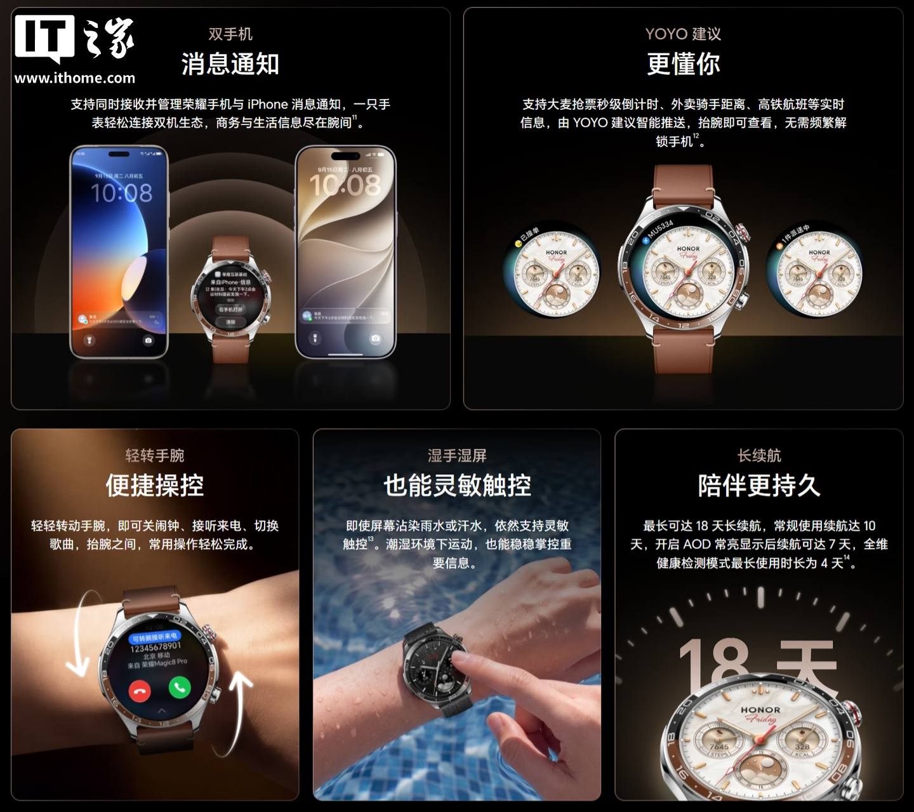
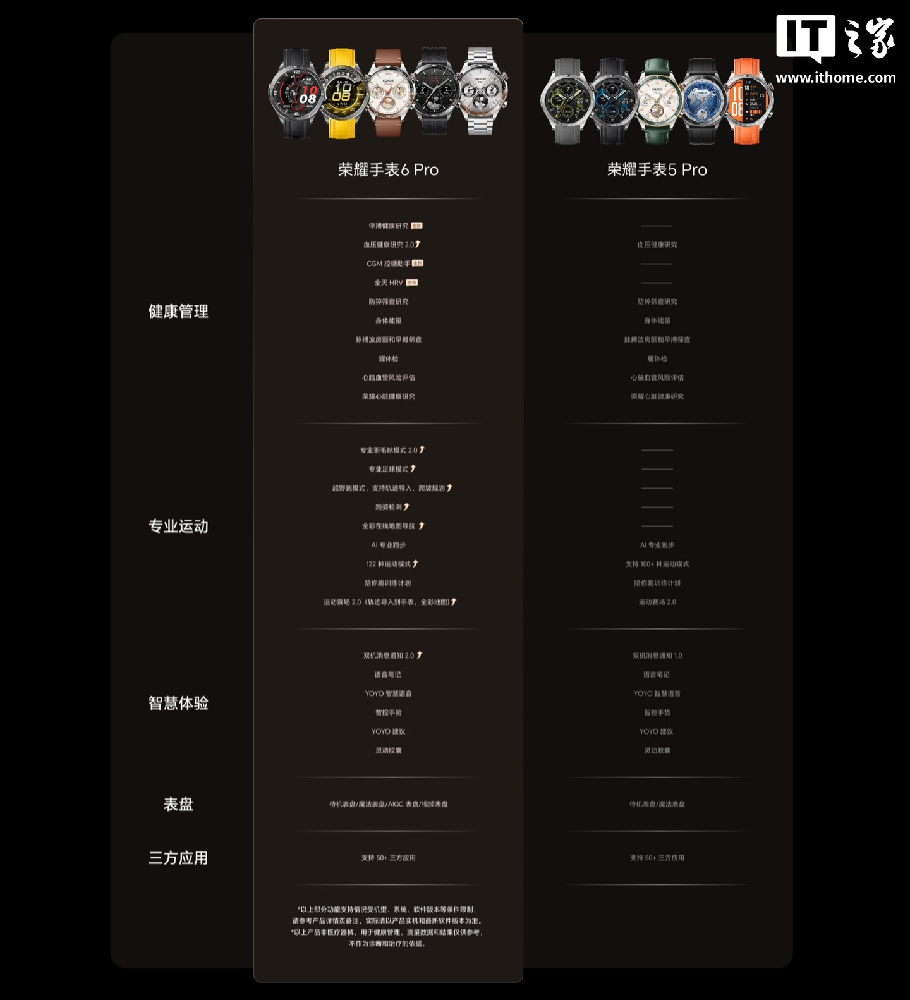
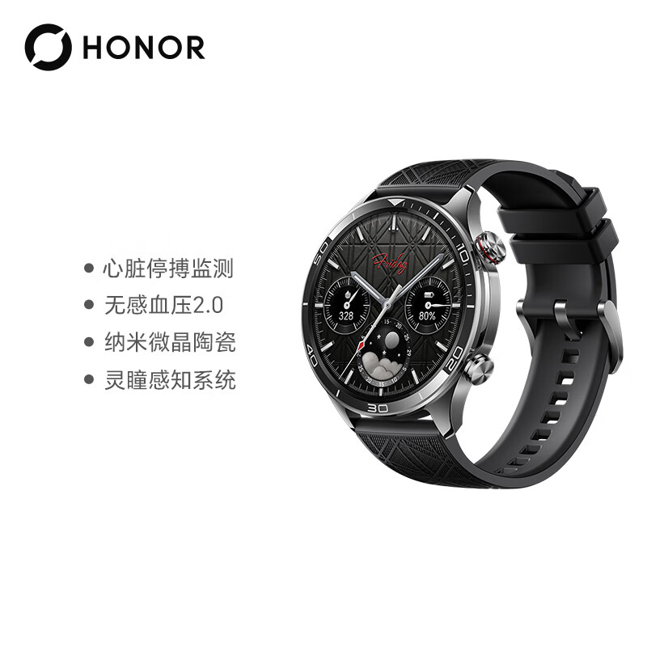

Honor ha puesto este 28 de septiembre a la venta en China su nuevo reloj inteligente, el **Honor Watch 6 Pro**, un modelo que la compañía presenta como «especialista en salud cardíaca y de la presión arterial». Llega con un precio de lanzamiento desde **1.699 yuanes** (en torno a 205 euros al cambio actual, una cifra orientativa) y, de momento, solo para el mercado chino: la marca no ha anunciado un precio en euros ni una fecha para Europa.

El dispositivo se articula en dos series con cinco diseños distintos y combina dos apuestas técnicas poco habituales en el segmento: una caja de **cerámica nanocristalina** y una pantalla **OLED de doble capa** que, según Honor, sería la primera en un dispositivo vestible.

## Salud cardiovascular como bandera

El Watch 6 Pro se apoya en un nuevo sistema de sensores que la marca denomina Lingtong, con un diseño distribuido y varias longitudes de onda para captar señales de forma más profunda. Sobre esa base, Honor añade funciones de seguimiento pensadas para detectar episodios graves.

La más llamativa es la **monitorización de paro cardíaco**: el reloj evalúa el ritmo en segundo plano y responde de forma escalonada, desde una evaluación silenciosa hasta una vibración intensa cuando el episodio se alarga. Si el riesgo es muy alto, el reloj llama de forma automática a los contactos de emergencia, muestra instrucciones de reanimación en pantalla y pide ayuda al entorno, incluso cuando la persona no puede hablar.

A esa función se suman la **medición de presión arterial sin manguito en su versión 2.0**, que ahora incorpora interpretación con IA y cruza los datos con la actividad, el descanso y el estado de ánimo, y la conexión con glucómetros continuos de terceros para consultar la evolución de la glucosa desde la muñeca.

## Cerámica nanocristalina y una pantalla de doble capa

En el apartado visual, Honor recurre a una pantalla de 1,5 pulgadas fabricada con litografía de alta precisión, tecnología que la firma traslada por primera vez al ámbito de los relojes. La doble capa OLED busca ganar ángulo de visión y brillo: la compañía cifra en **4.500 nits el brillo global** y en 5.500 nits el pico en su material promocional. A esto se añade una nueva animación de «cristal esmerilado» de MagicOS.

La caja de cerámica nanocristalina, por su parte, busca transmitir una sensación más premium y resistir mejor el paso del tiempo. Es un enfoque coherente con el del [vivo WATCH 6](/noticias/vivo-watch-6/), otro de los lanzamientos recientes que apuestan por materiales nobles, aunque en aquel caso el protagonismo lo tienen el cristal de zafiro y el titanio.

## Autonomía, conectividad y posicionamiento

Honor promete una autonomía flexible según el uso: **hasta 18 días** en el mejor de los casos, unos 10 días de uso habitual, 7 días si se activa la pantalla siempre encendida (AOD) y 4 días con la monitorización de salud completa en marcha.

En conectividad, el reloj puede recibir y gestionar a la vez las notificaciones de un teléfono Honor y de un iPhone, una función pensada para quien reparte su día entre dos ecosistemas. Para el deporte incorpora el sistema de posicionamiento Polaris, con un diseño de antena de doble frecuencia y algoritmos de IA que mejoran la captura de señal en entornos urbanos o con obstáculos.

## Precio y disponibilidad del Honor Watch 6 Pro

El precio de salida en China arranca en **1.699 yuanes**. Es una cifra de lanzamiento del mercado chino y, por tanto, no equivale a un PVP europeo: Honor no ha confirmado todavía si el reloj llegará a España ni con qué precio, algo habitual en este tipo de lanzamientos que primero se prueban en su país de origen.

Frente a la generación anterior, el Watch 6 Pro refuerza sobre todo el apartado de salud —con la monitorización de paro cardíaco y la presión arterial sin manguito 2.0— y añade funciones deportivas y de conectividad que no estaban presentes en el Watch 5 Pro.

Quien busque alternativas más económicas dentro de este mismo segmento puede mirar propuestas como el [Redmi Watch 6](/noticias/xiaomi-reloj-menos-100-euros/), que prioriza el precio y la autonomía por encima de la sensórica avanzada. En cualquier caso, conviene recordar que estas funciones de salud son herramientas de seguimiento y no sustituyen el diagnóstico de un profesional médico.
