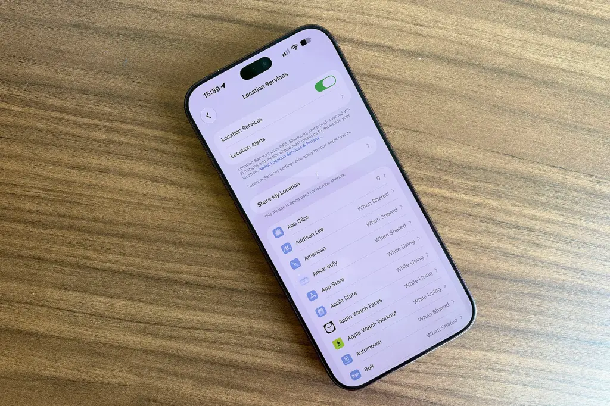
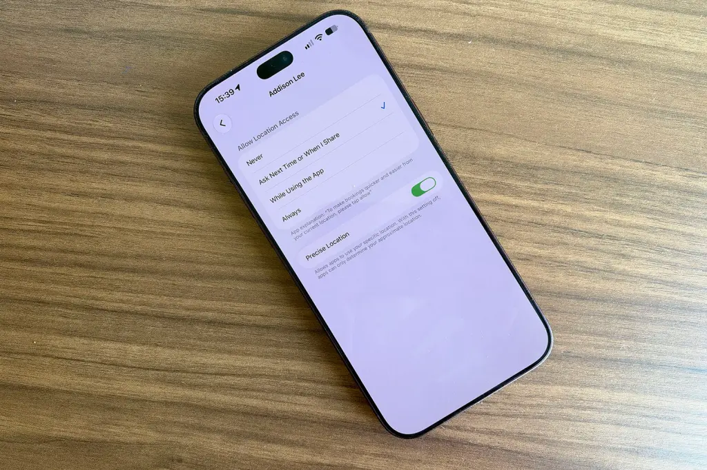
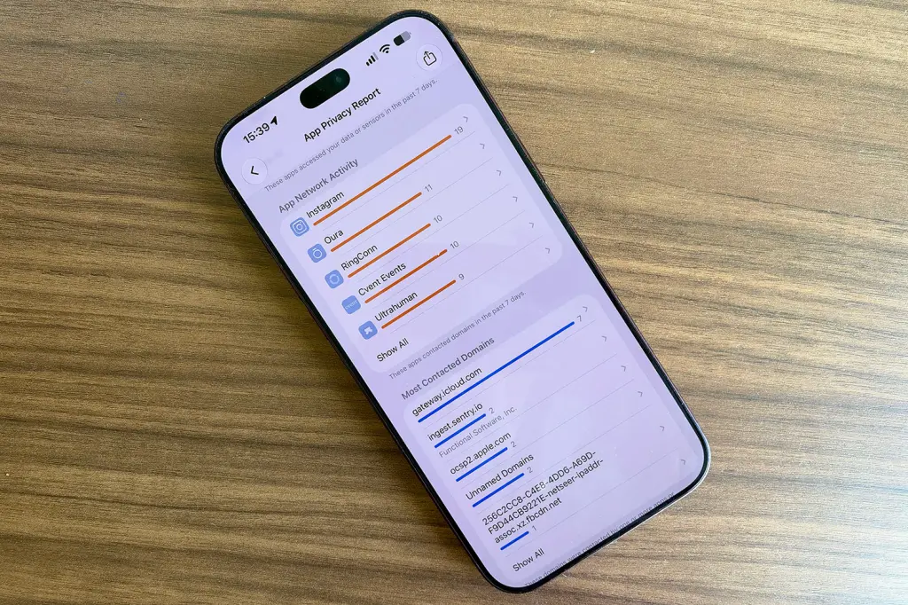
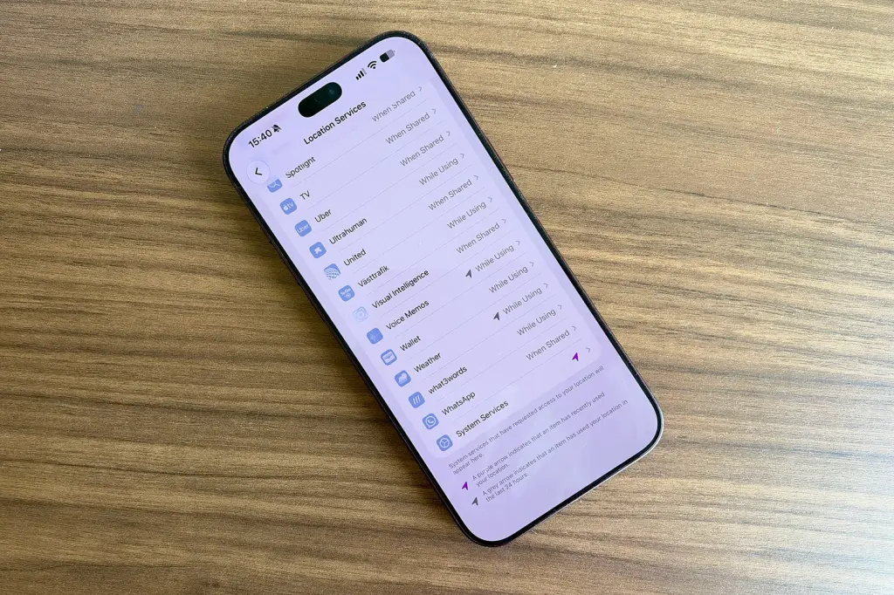
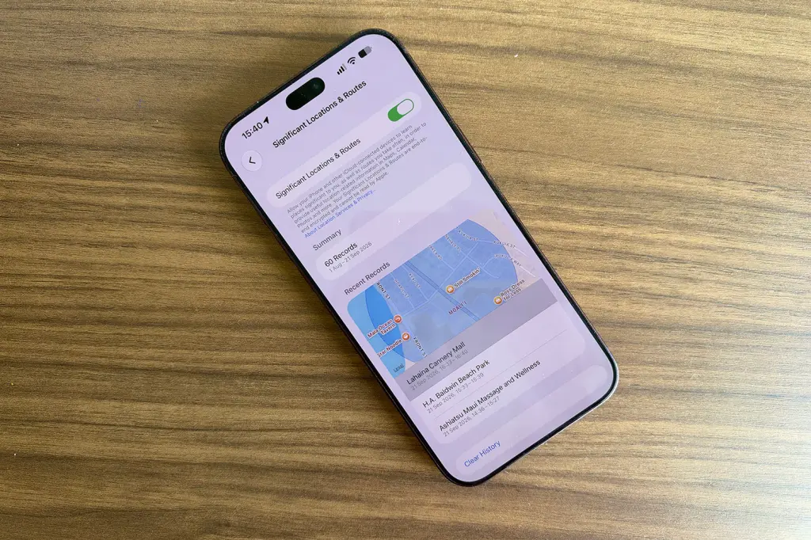

Tu iPhone sabe dónde estás, y eso no tiene por qué ser un problema: una app de mapas no puede darte indicaciones sin esa información y el tiempo no serviría de mucho si creyera que vives en otra ciudad. El problema aparece cuando, entre las decenas de aplicaciones instaladas, alguna consulta tu ubicación en segundo plano sin una razón clara. Esa aerolínea que descargaste hace años y con la que nunca has volado, la tienda que usaste una vez para una oferta o el juego que pusiste para entretener a un niño pueden estar registrando por dónde te mueves sin que lo sepas.

Apple ofrece bastante control sobre quién puede ver tu ubicación, pero los ajustes están enterrados a varios menús de profundidad y la diferencia entre «Siempre», «Al usar la app» y «Ubicación precisa» no es evidente. Esta guía explica cómo ver qué aplicaciones tienen acceso a tu ubicación, cómo interpretar cada permiso y cómo retirar o limitar ese acceso.

> **Nota sobre los nombres de los ajustes:** las capturas corresponden a un iPhone configurado en inglés, por lo que los menús aparecen en ese idioma. Las rutas del texto se indican en español, tal como se ven en un teléfono configurado en ese idioma. La denominación exacta puede variar ligeramente según la versión de iOS y el idioma elegido.

## Antes de empezar

- Un iPhone con una versión reciente de iOS.
- Acceso a los Ajustes del sistema. No hace falta instalar nada ni conectar el teléfono a un ordenador.
- Conviene revisar la lista con calma: algunas aplicaciones sí necesitan la ubicación para funcionar, así que no se trata de desactivarlas todas.

## Paso 1: consultar qué apps tienen acceso a tu ubicación

Abre **Ajustes** y entra en **Privacidad y seguridad > Localización**. Verás la lista de todas las aplicaciones que han pedido tu ubicación, con su ajuste actual al lado.

Fíjate también en las flechas pequeñas que aparecen junto a algunas apps, porque resumen su actividad reciente:

- Una **flecha morada** indica que la aplicación ha usado tu ubicación hace muy poco.
- Una **flecha gris** significa que lo ha hecho en las últimas 24 horas.
- Una **flecha hueca, solo con contorno**, avisa de que la app ha definido un geoperímetro: puede activarse cuando llegas o sales de un lugar concreto, aunque no la hayas abierto.

## Paso 2: entender qué significa cada permiso

Al tocar cualquier aplicación de esa lista verás hasta cuatro opciones. Conviene saber qué implica cada una antes de cambiarla:

- **Nunca**: bloquea por completo el acceso de la app a tu ubicación.
- **Preguntar la próxima vez o cuando lo comparta**: la app te pide permiso cada vez que quiere tu ubicación, para que decidas en el momento.
- **Al usar la app**: solo ve dónde estás cuando está abierta y en pantalla. Para la mayoría de aplicaciones, esta es la opción equilibrada.
- **Siempre**: permite el acceso incluso con la app cerrada y ejecutándose en segundo plano. Muy pocas aplicaciones lo necesitan, así que conviene concederlo con criterio.

Debajo de estas opciones está el interruptor **Ubicación precisa**. Con él activado, la app conoce tu posición exacta; si lo desactivas, recibe solo una ubicación aproximada, suficiente para el tiempo o las noticias locales.

## Paso 3: ver qué apps usan de verdad tu ubicación

Hay un matiz importante: que una aplicación tenga permiso para usar tu ubicación no significa que la esté usando, y algunas que sí lo hacen pueden consultarla más de lo que esperarías. Para averiguarlo, activa el **Informe de privacidad de apps**, que muestra la actividad real de las últimas semanas.

Ve a **Ajustes > Privacidad y seguridad**, desplázate hasta el final y toca **Informe de privacidad de apps**. Actívalo con el interruptor.

Cuando lleve un tiempo funcionando, el informe mostrará con qué frecuencia ha accedido cada aplicación a tu ubicación —y también a la cámara, el micrófono, los contactos y otros datos— durante la última semana. Es la mejor forma de detectar apps que consultan tu ubicación más de lo razonable.

## Paso 4: retirar o ajustar el acceso de cada app

Con la lista a mano, el siguiente paso es decidir qué hacer con cada aplicación. El proceso es el mismo que en el primer paso: **Ajustes > Privacidad y seguridad > Localización**, toca cada app una por una y elige el ajuste que le corresponda. Aprovecha para decidir también si dejas activada la **Ubicación precisa**: las apps de navegación la necesitan, pero la mayoría no.

No todas las aplicaciones necesitan acceso permanente para funcionar, así que toca ser un poco flexible según cuáles no quieras sacrificar.

## Paso 5: revisar los servicios del sistema y las ubicaciones significativas

No solo las apps de terceros usan tu ubicación. En la parte inferior de la página **Localización** toca **Servicios del sistema** y verás una lista de las formas en que el propio iOS utiliza dónde estás. Hay un apartado al que conviene prestar atención especial: **Ubicaciones significativas**.

**Ubicaciones significativas** guarda un registro de los lugares que visitas con frecuencia para que el iPhone pueda ofrecerte sugerencias basadas en la ubicación en apps como Mapas, Calendario o Fotos. Los datos están cifrados y Apple asegura que no puede leerlos, pero si prefieres que el teléfono no lleve un diario de tus movimientos, desde aquí puedes consultar el historial, borrarlo y desactivar la función.

Y la solución más simple de todas: si una aplicación no hace más que ocupar espacio y seguirte, deshazte de ella. Eliminar las apps que no usas libera almacenamiento, despeja la pantalla de inicio y deja una aplicación menos pendiente de dónde estás.

## Cómo verificar que funcionó

- Vuelve a **Ajustes > Privacidad y seguridad > Localización** y comprueba que el ajuste de cada aplicación es el que elegiste.
- Revisa las flechas junto a las apps: si has retirado el acceso, la flecha morada o gris de esa aplicación debería desaparecer con el tiempo.
- Si activaste el **Informe de privacidad de apps**, consulta de nuevo la frecuencia de acceso a la ubicación tras unos días: la app a la que le retiraste el permiso ya no debería aparecer consultándola.

## Advertencias y limitaciones

- **No desactives todo por sistema.** Los mapas y las apps de tiempo necesitan tu ubicación para ser útiles; el objetivo es quitar el acceso a quien no lo justifica.
- **«Siempre» no es igual que «Al usar la app».** Reserva «Siempre» para casos muy concretos, porque permite el seguimiento en segundo plano.
- **La ubicación precisa es opcional.** Desactivarla reduce la exactitud, así que déjala activada en las aplicaciones de navegación y en pocas más.
- **El informe tarda en llenarse.** El Informe de privacidad de apps necesita tiempo para recopilar datos; al principio puede aparecer casi vacío.
- **Los nombres pueden variar.** La denominación exacta de los menús cambia según la versión de iOS y el idioma del sistema. Si buscas el control de ubicación equivalente en Android, la guía para [desactivar el historial de ubicaciones de Google Maps](/noticias/google-location-history-off/) cubre ese caso.
