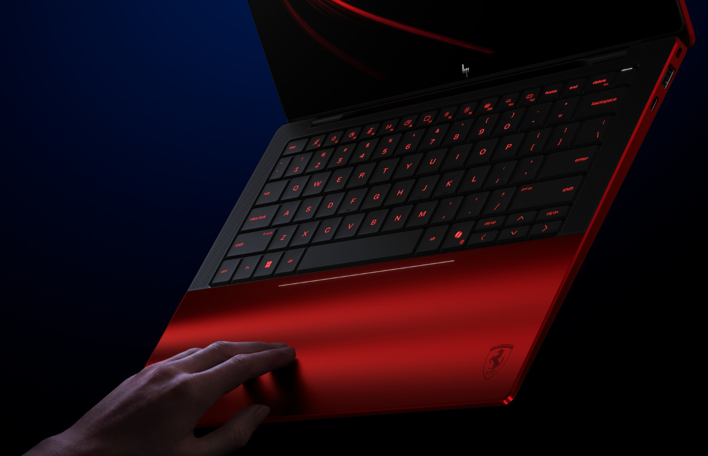
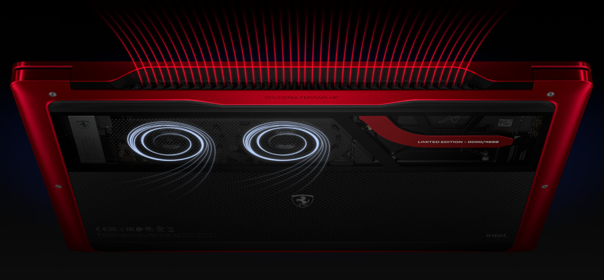
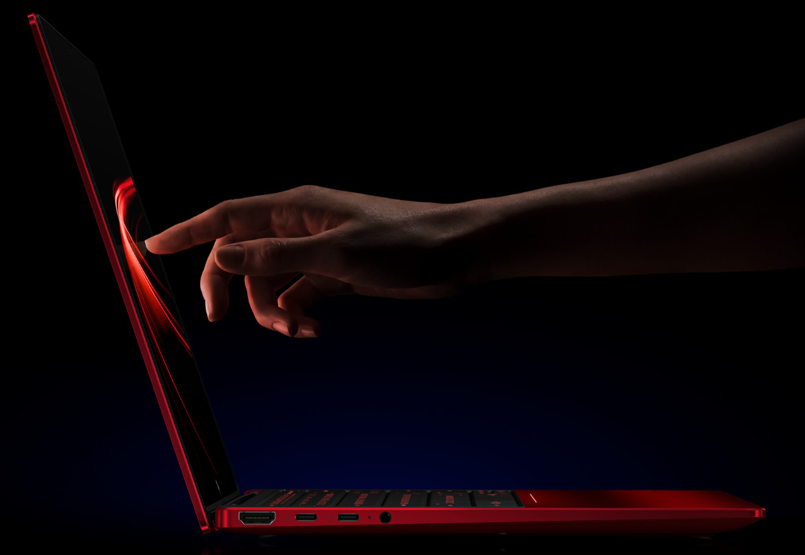

HP y la Scuderia Ferrari han presentado un portátil de edición limitada que nace de dos años de trabajo conjunto entre los equipos de diseño e ingeniería de ambas compañías. El HP Edición Limitada Scuderia Ferrari con IA es la materialización de una idea sencilla de enunciar y difícil de ejecutar: que diseño, inteligencia artificial y rendimiento convivan en un mismo equipo sin que ninguno de los tres salga perdiendo.

La presentación en España corrió a cargo del director de Comunicación de HP Iberia, José Luis Arranz, que puso el acento en el concepto de "ingeniería altamente elevada" que, según la compañía, comparten ambas firmas. El resultado es un dispositivo que traslada al terreno de los AI PC la filosofía que ha hecho de HP y Ferrari referentes en sus respectivos sectores.

## Un diseño que no renuncia a la función

Cada elemento del equipo responde a un principio rector: la forma nunca está separada de la función. El chasis está mecanizado con precisión CNC y acabado en Rosso Magma, el característico rojo de Ferrari, combinado con fibra de carbono y cristal Corning Gorilla Glass. El reposamanos es completamente de cristal, e incorpora un sistema de iluminación personalizable y rejillas de ventilación que siguen el mismo nivel de detalle que la ingeniería de la escudería más laureada de la Fórmula 1.

La pantalla es un panel táctil 3K Tandem OLED+, y el sistema de refrigeración recurre a más de 2.000 microperforaciones para gestionar el calor sin comprometer el perfil del chasis. Son decisiones de ingeniería que, más allá del escaparate, condicionan la experiencia diaria: un equipo delgado, silencioso y con una pantalla pensada para trabajo creativo y consumo de contenido.

## Potencia para IA local y seguridad por hardware

En el apartado técnico, el portátil equipa un procesador Intel Core Ultra X7 358H, gráficos Intel Arc B390i y hasta 180 TOPS de capacidad de procesamiento para inteligencia artificial. Esa cifra es la que marca la diferencia respecto a generaciones anteriores: permite ejecutar modelos y aplicaciones de IA en el propio dispositivo, sin depender de la nube, algo relevante tanto para la privacidad como para la latencia en cargas de trabajo exigentes.

La protección de datos llega de la mano de HP Wolf Security for Business, que incorpora seguridad a nivel de hardware y está diseñada para hacer frente a amenazas modernas. Es un detalle que apunta al público objetivo real del equipo: profesionales y creadores de contenido que manejan información sensible y necesitan garantías más allá del software.

## Una edición limitada a 4.999 unidades

El equipo se presenta en un embalaje exclusivo, numerado individualmente, y su producción está limitada a 4.999 unidades en todo el mundo. La caja incluye una funda de cuero Poltrona Frau, fabricada con el mismo cuero italiano que se emplea en los interiores de los vehículos de la marca. El precio en la web de HP es de 6.049 euros.

## Qué significa para el comprador

Estamos ante un producto de nicho, casi de coleccionista, y conviene decirlo con claridad: 6.049 euros no se justifican por la ficha técnica, sino por el componente de marca y exclusividad. Quien busque el máximo rendimiento por euro encontrará alternativas mucho más racionales. Quien valore un objeto de diseño, con una identidad visual imposible de replicar y una tirada numerada, encontrará aquí una propuesta coherente.

Lo interesante del anuncio es otra cosa: la señal que envía sobre hacia dónde va el mercado de los AI PC. Que un fabricante dedique dos años de colaboración con una escudería de F1 para lanzar un portátil demuestra que la inteligencia artificial local ya no es un argumento de venta secundario, sino el eje sobre el que se construyen los equipos de gama alta. La pregunta, para el resto del sector, es cuánto de este enfoque acabará filtrándose a los portátiles que la mayoría podemos permitirnos.
